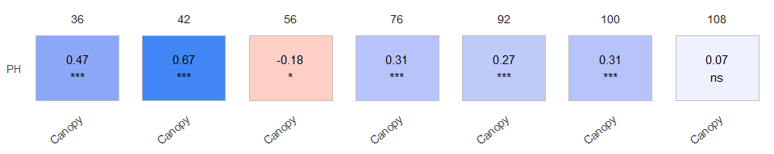

<!-- README.md is generated from README.Rmd. Please edit that file -->

# exploreHTP <a href="https://apariciojohan.github.io/exploreHTP/"></a>

<!-- badges: start -->
<!-- badges: end -->

exploreHTP is designed to assist researchers and plant breeders in
efficiently exploring and analyzing data derived from drone imagery.
This package offers a suite of tools tailored to the unique needs of
plant breeding data, facilitating comprehensive data exploration,
correlation analysis, and data manipulation.

Key functionalities include:

- Data Exploration: Simplified methods for visualizing and manipulating
  large datasets from high throughput phenotyping.
- Correlation Analysis: Tools to calculate correlations between
  different traits and across multiple time points, providing insights
  into trait relationships and temporal dynamics.
- Modeling Canopy Evolution: Advanced functionalities for modeling and
  predicting canopy growth and development over time.

## Installation

You can install the development version of exploreHTP from
[GitHub](https://github.com/) with:

``` r
# install.packages("devtools")
devtools::install_github("AparicioJohan/exploreHTP")
```

## 1. Reading Data

This is a basic example which shows how to use exploreHTP:

``` r
library(exploreHTP)

data(dt_potato)
dt_potato <- dt_potato

results <- read_HTP(
  data = dt_potato,
  genotype = "Gen",
  time = "DAP",
  plot = "Plot",
  traits = c("Canopy", "PH"),
  row = "Row",
  range = "Range"
)

names(results)
#> [1] "summ_traits"      "exp_design_resum" "locals_min_max"   "dt_long"
```

``` r
head(results$summ_traits)
```

    #> # A tibble: 6 × 12
    #>   trait   time   Min  Mean Median   Max    SD     CV     n  miss `miss%` `neg%`
    #>   <chr>  <dbl> <dbl> <dbl>  <dbl> <dbl> <dbl>  <dbl> <dbl> <dbl>   <dbl>  <dbl>
    #> 1 Canopy    29  0     0      0      0    0    NaN      196     0       0      0
    #> 2 Canopy    36  0     2.86   1.77  14.5  3.12   1.09   196     0       0      0
    #> 3 Canopy    42  0.73 22.7   22.3   44.1  9      0.4    196     0       0      0
    #> 4 Canopy    56 32.8  74.0   73.8   99.2 12.2    0.17   196     0       0      0
    #> 5 Canopy    76 89.6  99.7  100    100    1.05   0.01   196     0       0      0
    #> 6 Canopy    92 63.1  97.1   98.5  100.   4.24   0.04   196     0       0      0
    #> # A tibble: 1 × 6
    #>       n n_gen n_row n_range num_of_reps num_of_gen
    #>   <dbl> <dbl> <dbl>   <dbl> <chr>       <chr>     
    #> 1   196   185    14      14 1_2         174_11

## 2. Plotting correlations (1)

``` r
# Trait by Time
table <- plot(results, label_size = 4, signif = TRUE, n_row = 1)
```



``` r
head(table)
```

    #> # A tibble: 7 × 7
    #>    time col    row    corr  p.value     n signi
    #>   <dbl> <fct>  <fct> <dbl>    <dbl> <dbl> <fct>
    #> 1    36 Canopy PH     0.47 7.78e-11   176 ***  
    #> 2    42 Canopy PH     0.67 4.50e-27   196 ***  
    #> 3    56 Canopy PH    -0.18 1.16e- 2   196 *    
    #> 4    76 Canopy PH     0.31 8.89e- 6   196 ***  
    #> 5    92 Canopy PH     0.27 1.32e- 4   196 ***  
    #> 6   100 Canopy PH     0.31 1.38e- 5   196 ***  
    #> 7   108 Canopy PH     0.07 3.37e- 1   196 ns

## 3. Plotting correlations (2)

``` r
# Time by Trait
table <- plot(results, type = "time_by_trait", label_size = 4, signif = TRUE)
```


``` r
head(table)
```

    #> # A tibble: 6 × 7
    #>   trait  col   row    corr  p.value     n signi
    #>   <chr>  <fct> <fct> <dbl>    <dbl> <dbl> <fct>
    #> 1 Canopy 100   108    0.88 2.62e-62   196 ***  
    #> 2 Canopy 36    100   -0.08 1   e+ 0   196 ns   
    #> 3 Canopy 36    108   -0.13 5.73e- 1   196 ns   
    #> 4 Canopy 36    42     0.86 1.65e-57   196 ***  
    #> 5 Canopy 36    56     0.7  1.80e-28   196 ***  
    #> 6 Canopy 36    76     0.17 1.79e- 1   196 ns

## 4. Estimating days to emergence and days to full canopy

``` r
out <- canopy_HTP(results, plot_id = c(22, 169))
plot(out)
```


    #> # A tibble: 2 × 10
    #>    plot genotype    row range    t1    t2   max deltaT slope intercept
    #>   <dbl> <chr>     <dbl> <dbl> <dbl> <dbl> <dbl>  <dbl> <dbl>     <dbl>
    #> 1    22 W17047-5      8     2  39.5  75.6  98.9   36.1  2.74     -108.
    #> 2   169 W17037-57     1    13  38.5  67.0  99.8   28.6  3.49     -134.
