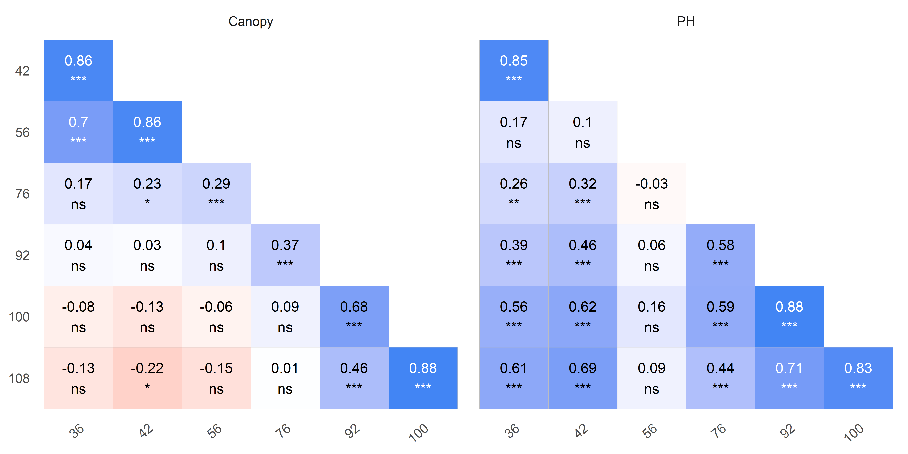
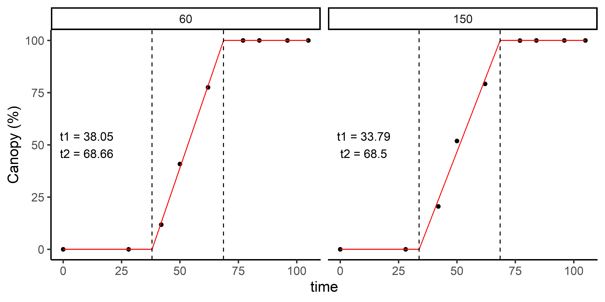
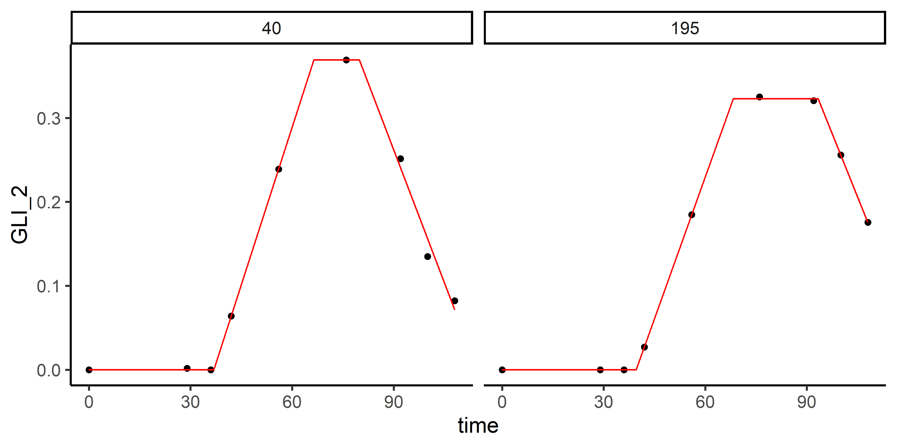

<!-- README.md is generated from README.Rmd. Please edit that file -->

# exploreHTP <a href="https://apariciojohan.github.io/exploreHTP/"></a>

<!-- badges: start -->
<!-- badges: end -->

exploreHTP is designed to assist researchers and plant breeders in
efficiently exploring and analyzing data derived from drone imagery.
This package offers a suite of tools tailored to the unique needs of
plant breeding data, facilitating comprehensive data exploration,
correlation analysis, and data manipulation.

Key functionalities include:

- Data Exploration: Simplified methods for visualizing and manipulating
  large datasets from high throughput phenotyping.
- Correlation Analysis: Tools to calculate correlations between
  different traits and across multiple time points, providing insights
  into trait relationships and temporal dynamics.
- Modeling Canopy Evolution: Advanced functionalities for modeling and
  predicting canopy growth and development over time.

## Installation

You can install the development version of exploreHTP from
[GitHub](https://github.com/) with:

``` r
# install.packages("devtools")
devtools::install_github("AparicioJohan/exploreHTP")
```

## 1. Reading Data

This is a basic example which shows how to use exploreHTP:

``` r
library(exploreHTP)
data(dt_chips)

results <- read_HTP(
  data = dt_chips,
  genotype = "Gen",
  time = "DAP",
  plot = "Plot",
  traits = c("Canopy", "PH"),
  row = "Row",
  range = "Range"
)
names(results)
#> [1] "summ_traits"      "exp_design_resum" "locals_min_max"   "dt_long"
```

``` r
plot(results, type = "evolution")
```


``` r
head(results$summ_traits)
```

| trait  | time |   Min |  Mean | Median |    Max |    SD |   CV |   n | miss | miss% | neg% |
|:-------|-----:|------:|------:|-------:|-------:|------:|-----:|----:|-----:|------:|-----:|
| Canopy |   28 |  0.00 |  0.01 |   0.00 |   0.52 |  0.06 | 4.46 | 196 |    0 |     0 |    0 |
| Canopy |   42 |  1.33 | 19.31 |  19.72 |  41.65 |  8.14 | 0.42 | 196 |    0 |     0 |    0 |
| Canopy |   50 | 18.53 | 52.75 |  53.36 |  82.39 | 11.76 | 0.22 | 196 |    0 |     0 |    0 |
| Canopy |   62 | 52.37 | 85.06 |  86.31 |  99.86 |  9.63 | 0.11 | 196 |    0 |     0 |    0 |
| Canopy |   77 | 94.83 | 99.83 |  99.94 | 100.00 |  0.51 | 0.01 | 196 |    0 |     0 |    0 |
| Canopy |   84 | 95.40 | 99.88 | 100.00 | 100.02 |  0.51 | 0.01 | 196 |    0 |     0 |    0 |

|   n | n_gen | n_row | n_range | num_of_reps | num_of_gen |
|----:|------:|------:|--------:|:------------|:-----------|
| 196 |   178 |    14 |      14 | 1_2_3       | 163_12_3   |

## 2. Plotting correlations (1)

``` r
# Trait by Time
table <- plot(results, label_size = 4, signif = TRUE, n_row = 1)
```


``` r
head(table)
```

| time | col    | row | corr |   p.value |   n | signi  |
|-----:|:-------|:----|-----:|----------:|----:|:-------|
|   42 | Canopy | PH  | 0.77 | 0.0000000 | 196 | \*\*\* |
|   50 | Canopy | PH  | 0.89 | 0.0000000 | 196 | \*\*\* |
|   62 | Canopy | PH  | 0.50 | 0.0000000 | 196 | \*\*\* |
|   77 | Canopy | PH  | 0.28 | 0.0000557 | 196 | \*\*\* |
|   84 | Canopy | PH  | 0.23 | 0.0009829 | 196 | \*\*\* |
|   96 | Canopy | PH  | 0.43 | 0.0000000 | 196 | \*\*\* |
|  105 | Canopy | PH  | 0.52 | 0.0000000 | 196 | \*\*\* |

## 3. Plotting correlations (2)

``` r
# Time by Trait
table <- plot(results, type = "time_by_trait", label_size = 4, signif = TRUE)
```



``` r
head(table)
```

| trait  | col | row |  corr |   p.value |   n | signi |
|:-------|:----|:----|------:|----------:|----:|:------|
| Canopy | 28  | 105 | -0.06 | 1.0000000 | 196 | ns    |
| Canopy | 28  | 42  |  0.21 | 0.0646376 | 196 | ns    |
| Canopy | 28  | 50  |  0.17 | 0.2985603 | 196 | ns    |
| Canopy | 28  | 62  |  0.04 | 1.0000000 | 196 | ns    |
| Canopy | 28  | 77  |  0.06 | 1.0000000 | 196 | ns    |
| Canopy | 28  | 84  |  0.04 | 1.0000000 | 196 | ns    |

## 4. Estimating days to emergence and days to full canopy

``` r
out <- canopy_HTP(
  results = results,
  canopy = "Canopy",
  plot_id = c(60, 150),
  correct_max = TRUE,
  add_zero = TRUE,
  fn = sse_piwise
)
names(out)
#> [1] "param" "dt"
```

``` r
plot(out, plot_id = c(60, 150))
```



| plot | genotype  | row | range |     t1 |     t2 |     max |    sse |
|-----:|:----------|----:|------:|-------:|-------:|--------:|-------:|
|   60 | W19026-15 |   4 |     5 | 38.045 | 68.662 |  99.956 |  4.894 |
|  150 | W19023-21 |  10 |    11 | 33.791 | 68.496 | 100.000 | 40.406 |

## 5. Modelling Plant Height

``` r
ph_1 <- height_HTP(
  results = results,
  canopy = out,
  plant_height = "PH",
  add_zero = TRUE,
  method = c("nlminb", "anms", "mla", "pracmanm", "subplex"),
  return_method = TRUE,
  parameters = c(t2 = 67, alpha = 1 / 600, beta = -1 / 80),
  fn = sse_exp2_exp
)
```

``` r
plot(
  x = ph_1,
  plot_id = c(60, 150),
  fn = quote(fn_exp2_exp(time, t1, t2, alpha, beta))
)
```


| plot | genotype  | row | range |  t2 | alpha |   beta |     t1 | method  |   sse |
|-----:|:----------|----:|------:|----:|------:|-------:|-------:|:--------|------:|
|   60 | W19026-15 |   4 |     5 |  62 | 0.001 | -0.035 | 38.045 | subplex | 0.009 |
|  150 | W19023-21 |  10 |    11 |  62 | 0.001 | -0.018 | 33.791 | subplex | 0.001 |

``` r
ph_2 <- height_HTP(
  results = results,
  canopy = out,
  plant_height = "PH",
  add_zero = TRUE,
  method = c("nlminb", "anms", "mla", "pracmanm", "subplex"),
  return_method = TRUE,
  parameters = c(t2 = 67, alpha = 1 / 600, beta = -1 / 80),
  fn = sse_exp2_lin
)
```

``` r
plot(
  x = ph_2,
  plot_id = c(60, 150),
  fn = quote(fn_exp2_lin(time, t1, t2, alpha, beta))
)
```



| plot | genotype  | row | range |  t2 | alpha |   beta |     t1 | method  |   sse |
|-----:|:----------|----:|------:|----:|------:|-------:|-------:|:--------|------:|
|   60 | W19026-15 |   4 |     5 |  62 | 0.001 | -0.017 | 38.045 | subplex | 0.032 |
|  150 | W19023-21 |  10 |    11 |  62 | 0.001 | -0.011 | 33.791 | subplex | 0.003 |
