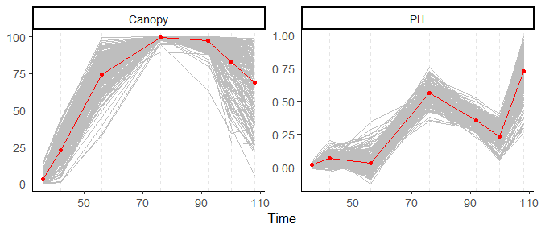
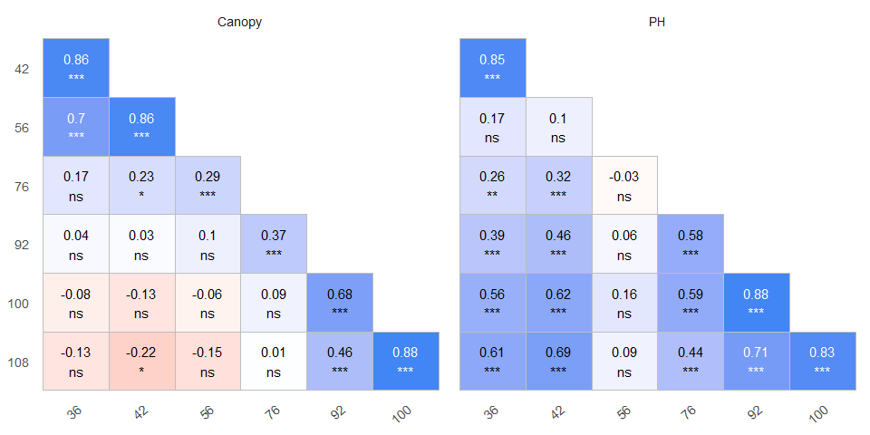
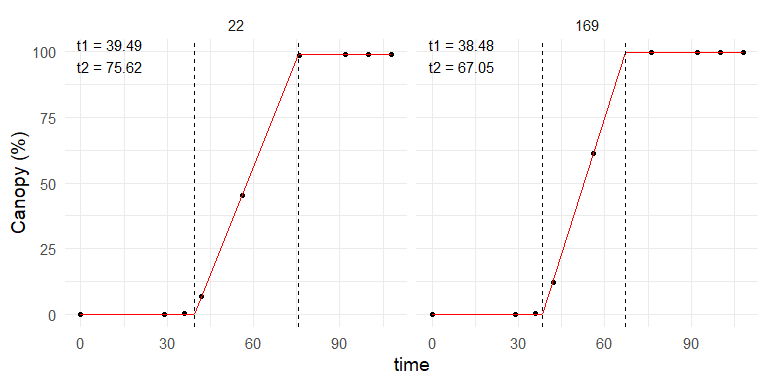
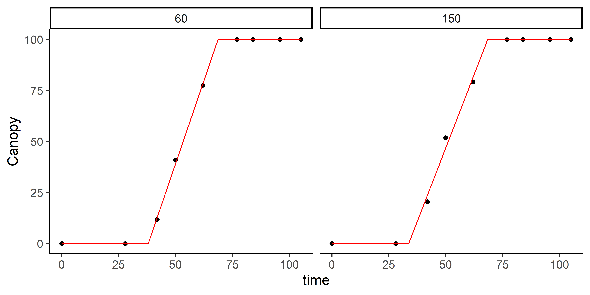

<!-- README.md is generated from README.Rmd. Please edit that file -->

# exploreHTP <a href="https://apariciojohan.github.io/exploreHTP/"></a>

<!-- badges: start -->
<!-- badges: end -->

exploreHTP is designed to assist researchers and plant breeders in
efficiently exploring and analyzing data derived from drone imagery.
This package offers a suite of tools tailored to the unique needs of
plant breeding data, facilitating comprehensive data exploration,
correlation analysis, data manipulation, and flexible data modeling.

## Installation

You can install the development version of exploreHTP from
[GitHub](https://github.com/AparicioJohan/exploreHTP) with:

``` r
# install.packages("devtools")
devtools::install_github("AparicioJohan/exploreHTP")
```

## 1. Reading Data

This is a basic example which shows how to use exploreHTP:

``` r
library(exploreHTP)
data(dt_chips)

results <- dt_chips |>
  read_HTP(
    x = DAP,
    y = c(Canopy, PH),
    id = Plot,
    .keep = c(Gen, Row, Range)
  )
names(results)
[1] "summ_traits"    "metadata"       "locals_min_max" "dt_long"       
[5] ".keep"         
```

``` r
plot(results, type = "evolution")
```



``` r
head(results$summ_traits)
```

| var    |   x |   Min |  Mean | Median |    Max |    SD |   CV |   n | miss | miss% | neg% |
|:-------|----:|------:|------:|-------:|-------:|------:|-----:|----:|-----:|------:|-----:|
| Canopy |  28 |  0.00 |  0.01 |   0.00 |   0.52 |  0.06 | 4.46 | 196 |    0 |     0 |    0 |
| Canopy |  42 |  1.33 | 19.31 |  19.72 |  41.65 |  8.14 | 0.42 | 196 |    0 |     0 |    0 |
| Canopy |  50 | 18.53 | 52.75 |  53.36 |  82.39 | 11.76 | 0.22 | 196 |    0 |     0 |    0 |
| Canopy |  62 | 52.37 | 85.06 |  86.31 |  99.86 |  9.63 | 0.11 | 196 |    0 |     0 |    0 |
| Canopy |  77 | 94.83 | 99.83 |  99.94 | 100.00 |  0.51 | 0.01 | 196 |    0 |     0 |    0 |
| Canopy |  84 | 95.40 | 99.88 | 100.00 | 100.02 |  0.51 | 0.01 | 196 |    0 |     0 |    0 |

| Column | Type      | Unique_Values |
|:-------|:----------|--------------:|
| uid    | numeric   |           196 |
| x      | numeric   |             8 |
| Gen    | character |           178 |
| Row    | numeric   |            14 |
| Range  | numeric   |            14 |

## 2. Estimating days to emergence and days to full canopy

``` r
out <- canopy_HTP(x = results, index = "Canopy", id = c(60, 150))
```

``` r
print(out)

Call:
Canopy ~ fn_piwise(x, t1, t2, k) 

Sum of Squares Error:
   Min. 1st Qu.  Median    Mean 3rd Qu.    Max. 
  4.894  13.772  22.650  22.650  31.528  40.406 

Optimization Results `head()`:
 uid   t1   t2   sse   k  auc   dt slope
  60 38.0 68.7  4.89 100 5162 30.6  3.26
 150 33.8 68.5 40.41 100 5386 34.7  2.88

Metrics:
 Ids      Timing Convergence Iterations
   2 1.1119 secs        100% 273.5 (id)
plot(out, id = c(60, 150))
```



| uid | Gen       | Row | Range |     t1 |     t2 |    sse |       k |      auc |     dt | slope |
|----:|:----------|----:|------:|-------:|-------:|-------:|--------:|---------:|-------:|------:|
|  60 | W19026-15 |   4 |     5 | 38.045 | 68.662 |  4.894 |  99.956 | 5162.344 | 30.617 | 3.265 |
| 150 | W19023-21 |  10 |    11 | 33.791 | 68.496 | 40.406 | 100.000 | 5385.674 | 34.705 | 2.881 |

## 3. Modelling Plant Height

``` r
ph_1 <- height_HTP(
  x = results,
  height = "PH",
  canopy = "Canopy",
  id = c(60, 150),
  fn = "fn_exp2_exp"
)
```

``` r
print(ph_1)

Call:
PH ~ fn_exp2_exp(x, t1, t2, alpha, beta) 

Sum of Squares Error:
    Min.  1st Qu.   Median     Mean  3rd Qu.     Max. 
0.001433 0.003388 0.005343 0.005343 0.007298 0.009253 

Optimization Results `head()`:
 uid t2    alpha    beta     sse   t1  auc
  60 62 0.001168 -0.0346 0.00925 38.0 28.0
 150 62 0.000783 -0.0183 0.00143 33.8 32.9

Metrics:
 Ids      Timing Convergence Iterations
   2 1.2114 secs        100% 964.5 (id)
plot(ph_1, id = c(60, 150))
```



| uid | Gen       | Row | Range |  t2 | alpha |   beta |   sse |     t1 |    auc |
|----:|:----------|----:|------:|----:|------:|-------:|------:|-------:|-------:|
|  60 | W19026-15 |   4 |     5 |  62 | 0.001 | -0.035 | 0.009 | 38.045 | 27.977 |
| 150 | W19023-21 |  10 |    11 |  62 | 0.001 | -0.018 | 0.001 | 33.791 | 32.890 |

## 4. Modelling Maturity

``` r
data(dt_potato)
results <- dt_potato |>
  read_HTP(
    x = DAP,
    y = c(Canopy, GLI_2),
    id = Plot,
    .keep = c(Gen, Row, Range)
  )
mat <- maturity_HTP(
  x = results,
  index = "GLI_2",
  canopy = "Canopy",
  id = c(195, 40, 20)
)
```

``` r
print(mat)

Call:
GLI_2 ~ fn_lin_pl_lin2(x, t1, t2, dt, k, beta) 

Sum of Squares Error:
     Min.   1st Qu.    Median      Mean   3rd Qu.      Max. 
6.229e-06 8.233e-06 1.024e-05 2.310e-04 3.435e-04 6.767e-04 

Optimization Results `head()`:
 uid   t1   t2   dt     k     beta      sse  auc   t3
  20 35.8 68.5 14.5 0.362 -0.00405 6.23e-06 19.0 83.1
  40 36.9 66.4 13.4 0.369 -0.01057 6.77e-04 16.6 79.9
 195 39.6 68.3 25.1 0.323 -0.01005 1.02e-05 16.4 93.3

Metrics:
 Ids      Timing Convergence  Iterations
   3 1.4226 secs        100% 444.33 (id)
plot(mat, id = c(195, 40))
```



| uid | Gen       | Row | Range |     t1 |     t2 |     dt |     k |   beta |   sse |    auc |     t3 |
|----:|:----------|----:|------:|-------:|-------:|-------:|------:|-------:|------:|-------:|-------:|
|  20 | W17067-7  |   6 |     2 | 35.818 | 68.529 | 14.540 | 0.362 | -0.004 | 0.000 | 18.977 | 83.069 |
|  40 | W17043-37 |  12 |     3 | 36.880 | 66.416 | 13.438 | 0.369 | -0.011 | 0.001 | 16.615 | 79.854 |
| 195 | W16219-8  |  13 |    14 | 39.591 | 68.279 | 25.058 | 0.323 | -0.010 | 0.000 | 16.376 | 93.336 |
