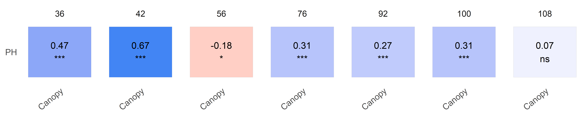
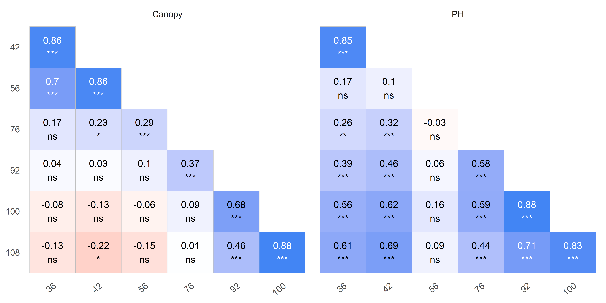
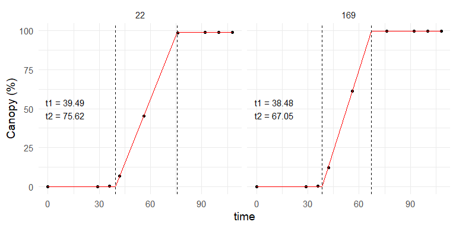

<!-- README.md is generated from README.Rmd. Please edit that file -->

# exploreHTP <a href="https://apariciojohan.github.io/exploreHTP/"></a>

<!-- badges: start -->
<!-- badges: end -->

exploreHTP is designed to assist researchers and plant breeders in
efficiently exploring and analyzing data derived from drone imagery.
This package offers a suite of tools tailored to the unique needs of
plant breeding data, facilitating comprehensive data exploration,
correlation analysis, and data manipulation.

Key functionalities include:

- Data Exploration: Simplified methods for visualizing and manipulating
  large datasets from high throughput phenotyping.
- Correlation Analysis: Tools to calculate correlations between
  different traits and across multiple time points, providing insights
  into trait relationships and temporal dynamics.
- Modeling Canopy Evolution: Advanced functionalities for modeling and
  predicting canopy growth and development over time.

## Installation

You can install the development version of exploreHTP from
[GitHub](https://github.com/) with:

``` r
# install.packages("devtools")
devtools::install_github("AparicioJohan/exploreHTP")
```

## 1. Reading Data

This is a basic example which shows how to use exploreHTP:

``` r
library(exploreHTP)
data(dt_potato)
dt_potato <- dt_potato

results <- read_HTP(
  data = dt_potato,
  genotype = "Gen",
  time = "DAP",
  plot = "Plot",
  traits = c("Canopy", "PH"),
  row = "Row",
  range = "Range"
)
names(results)
#> [1] "summ_traits"      "exp_design_resum" "locals_min_max"   "dt_long"
```

``` r
head(results$summ_traits)
```

<center>

| trait  | time |   Min |  Mean | Median |    Max |    SD |   CV |   n | miss | miss% | neg% |
|:-------|-----:|------:|------:|-------:|-------:|------:|-----:|----:|-----:|------:|-----:|
| Canopy |   29 |  0.00 |  0.00 |   0.00 |   0.00 |  0.00 |  NaN | 196 |    0 |     0 |    0 |
| Canopy |   36 |  0.00 |  2.86 |   1.77 |  14.53 |  3.12 | 1.09 | 196 |    0 |     0 |    0 |
| Canopy |   42 |  0.73 | 22.66 |  22.32 |  44.14 |  9.00 | 0.40 | 196 |    0 |     0 |    0 |
| Canopy |   56 | 32.83 | 74.04 |  73.75 |  99.24 | 12.24 | 0.17 | 196 |    0 |     0 |    0 |
| Canopy |   76 | 89.56 | 99.70 | 100.00 | 100.00 |  1.05 | 0.01 | 196 |    0 |     0 |    0 |
| Canopy |   92 | 63.14 | 97.12 |  98.46 | 100.02 |  4.24 | 0.04 | 196 |    0 |     0 |    0 |

</center>
<center>

|   n | n_gen | n_row | n_range | num_of_reps | num_of_gen |
|----:|------:|------:|--------:|:------------|:-----------|
| 196 |   185 |    14 |      14 | 1_2         | 174_11     |

</center>

## 2. Plotting correlations (1)

``` r
# Trait by Time
table <- plot(results, label_size = 4, signif = TRUE, n_row = 1)
```



``` r
head(table)
```

<center>

| time | col    | row |  corr |   p.value |   n | signi  |
|-----:|:-------|:----|------:|----------:|----:|:-------|
|   36 | Canopy | PH  |  0.47 | 0.0000000 | 176 | \*\*\* |
|   42 | Canopy | PH  |  0.67 | 0.0000000 | 196 | \*\*\* |
|   56 | Canopy | PH  | -0.18 | 0.0116179 | 196 | \*     |
|   76 | Canopy | PH  |  0.31 | 0.0000089 | 196 | \*\*\* |
|   92 | Canopy | PH  |  0.27 | 0.0001317 | 196 | \*\*\* |
|  100 | Canopy | PH  |  0.31 | 0.0000138 | 196 | \*\*\* |
|  108 | Canopy | PH  |  0.07 | 0.3369443 | 196 | ns     |

</center>

## 3. Plotting correlations (2)

``` r
# Time by Trait
table <- plot(results, type = "time_by_trait", label_size = 4, signif = TRUE)
```



``` r
head(table)
```

<center>

| trait  | col | row |  corr |   p.value |   n | signi  |
|:-------|:----|:----|------:|----------:|----:|:-------|
| Canopy | 100 | 108 |  0.88 | 0.0000000 | 196 | \*\*\* |
| Canopy | 36  | 100 | -0.08 | 1.0000000 | 196 | ns     |
| Canopy | 36  | 108 | -0.13 | 0.5731675 | 196 | ns     |
| Canopy | 36  | 42  |  0.86 | 0.0000000 | 196 | \*\*\* |
| Canopy | 36  | 56  |  0.70 | 0.0000000 | 196 | \*\*\* |
| Canopy | 36  | 76  |  0.17 | 0.1786972 | 196 | ns     |

</center>

## 4. Estimating days to emergence and days to full canopy

``` r
out <- canopy_HTP(results, plot_id = c(22, 169))
plot(out)
```



<center>

| plot | genotype  | row | range |    t1 |    t2 |   max | deltaT | slope | intercept |
|-----:|:----------|----:|------:|------:|------:|------:|-------:|------:|----------:|
|   22 | W17047-5  |   8 |     2 | 39.49 | 75.62 | 98.88 |  36.13 |  2.74 |   -108.09 |
|  169 | W17037-57 |   1 |    13 | 38.48 | 67.05 | 99.76 |  28.57 |  3.49 |   -134.36 |

</center>
