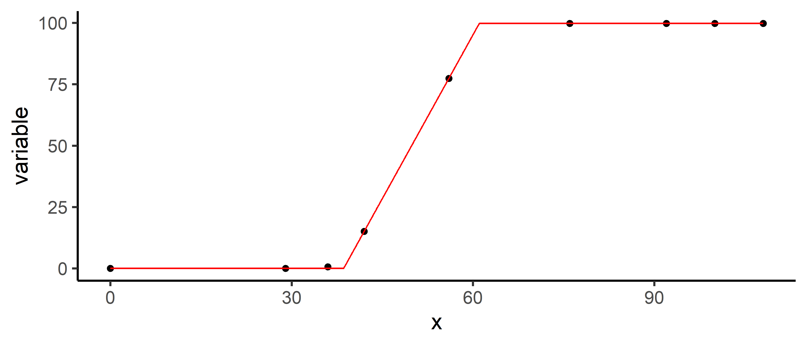

<!-- README.md is generated from README.Rmd. Please edit that file -->

# {flexFitR} 

<!-- badges: start -->

[](https://CRAN.R-project.org/package=flexFitR)
[](https://lifecycle.r-lib.org/articles/stages.html#stable)
<!-- badges: end -->

`{flexFitR}` is an R package designed for efficient modeling and
analysis of large and complex datasets. It offers powerful tools for
parameter estimation, model fitting, and visualization, leveraging the
`{optimx}` package for optimization and the `{future}` package for
parallel processing.

## Installation

Install released version from CRAN:

``` r
install.packages("flexFitR")
```

You can also install the development version of flexFitR from
[GitHub](https://github.com/AparicioJohan/flexFitR) with:

``` r
# install.packages("devtools")
devtools::install_github("AparicioJohan/flexFitR")
```

## Features

- Parameter Estimation: Utilizes `{optimx}` algorithms to solve and
  estimate parameters for a given function.
- Parallelization: Implements parallel processing using the `{future}`
  package, enabling efficient fitting of hundreds of curves
  simultaneously.
- Visualization Tools: Provides a variety of plots to visualize model
  fits, correlations, predictions, derivatives, and more.
- Statistical Rigor: Offers standard errors and p-values for
  coefficients, as well as for predictions, supporting robust
  conclusions and interpretations.
- Prediction: Supports diverse prediction types, including point
  predictions, area under the curve (AUC), first and second derivatives,
  and custom expressions based on model parameters.
- Flexibility: Allows users to fix certain parameters in the model and
  specify different initial values per grouping factor, accepting both
  numerical inputs and expressions.
- Custom Modeling Functions: Equipped with built-in modeling functions
  for common analysis tasks, while also permitting users to supply their
  own custom functions.

## Example

Here’s a simple example to get you started with `{flexFitR}`. This
example demonstrates fitting a piecewise regression model:

``` r
library(flexFitR)

dt <- data.frame(
  time = c(0, 29, 36, 42, 56, 76, 92, 100, 108),
  variable = c(0, 0, 0.67, 15.11, 77.38, 99.81, 99.81, 99.81, 99.81)
)
plot(explorer(dt, time, variable), type = "xy")
```


``` r
fn_lin_plat <- function(t, t1 = 45, t2 = 80, k = 0.9) {
  ifelse(
    test = t < t1,
    yes = 0,
    no = ifelse(t >= t1 & t <= t2, k / (t2 - t1) * (t - t1), k)
  )
}
```

``` r
# Fitting a linear plateau function
mod_1 <- dt |>
  modeler(
    x = time,
    y = variable,
    fn = "fn_lin_plat",
    parameters = c(t1 = 45, t2 = 80, k = 90)
  )
```

``` r
print(mod_1)

Call:
variable ~ fn_lin_plat(time, t1, t2, k) 

Residuals (`Standardized`):
   Min. 1st Qu.  Median    Mean 3rd Qu.    Max. 
 0.0000  0.0000  0.0000  0.2722  0.0000  2.4495 

Optimization Results `head()`:
 uid   t1 t2    k   sse
   1 38.6 61 99.8 0.449

Metrics:
 Groups      Timing Convergence Iterations
      1 0.1074 secs        100%   511 (id)
```

``` r
# Auto plot
plot(mod_1)
```



``` r
# Coefficients
coef(mod_1)
# A tibble: 3 × 7
    uid fn_name     coefficient solution std.error `t value` `Pr(>|t|)`
  <dbl> <chr>       <chr>          <dbl>     <dbl>     <dbl>      <dbl>
1     1 fn_lin_plat t1              38.6    0.0779      496.   4.54e-15
2     1 fn_lin_plat t2              61.0    0.0918      665.   7.82e-16
3     1 fn_lin_plat k               99.8    0.137       730.   4.47e-16
```

``` r
# Variance-Covariance Matrix
vcov(mod_1)
$`1`
              t1           t2            k
t1  6.061705e-03 -0.002940001 1.877072e-07
t2 -2.940001e-03  0.008431400 4.204939e-03
k   1.877072e-07  0.004204939 1.870426e-02
attr(,"fn_name")
[1] "fn_lin_plat"
```

``` r
# Making predictions
predict(mod_1, x = 45)
# A tibble: 1 × 5
    uid fn_name     x_new predicted.value std.error
  <dbl> <chr>       <dbl>           <dbl>     <dbl>
1     1 fn_lin_plat    45            28.5     0.223
```

## Documentation

For detailed documentation and examples, visit
[flexFitR](https://apariciojohan.github.io/flexFitR/reference/index.html)

- Vignette 1: [How to
  start](https://apariciojohan.github.io/flexFitR/articles/how_to_start.html)
- Vignette 2: [Modeling plant emergence and canopy growth using UAV
  data](https://apariciojohan.github.io/flexFitR/articles/canopy-model.html)
- Vignette 3: [Modeling with
  constraints](https://apariciojohan.github.io/flexFitR/articles/maturity-model.html)
- Vignette 4: [Making
  predictions](https://apariciojohan.github.io/flexFitR/articles/predicted_values.html)
- Vignette 5: [Plotting
  options](https://apariciojohan.github.io/flexFitR/articles/plotting.html)

## Contributing

Contributions to flexFitR are welcome! If you’d like to contribute,
please fork the repository and submit a pull request. For significant
changes, please open an issue first to discuss your ideas.

## Code of Conduct

Please note that the flexFitR project is released with a [Contributor
Code of
Conduct](https://apariciojohan.github.io/flexFitR/CODE_OF_CONDUCT.html).
By contributing to this project, you agree to abide by its terms.

## License

flexFitR is licensed under the MIT License. See the
[LICENSE](https://apariciojohan.github.io/flexFitR/LICENSE.html) file
for more details.
