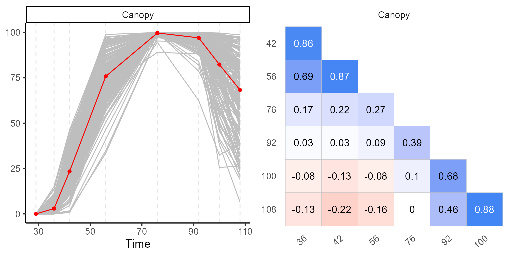
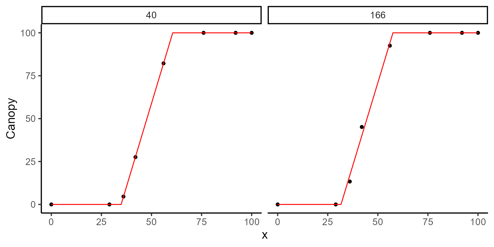
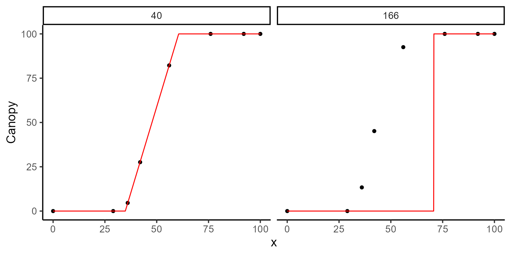
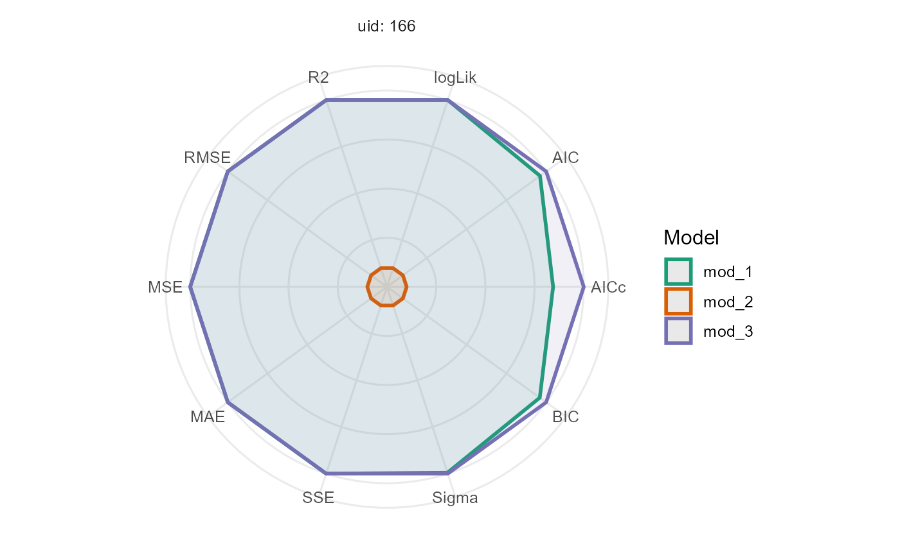

# Modeling

## Modeling plant emergence and canopy growth using UAV data

This vignette demonstrates piecewise regression using canopy data
derived from UAV imagery to estimate two key parameters:

- t1: days to plant emergence.
- t2: days to reach maximum canopy.

The data are from the University of Wisconsin-Madison potato breeding
program, specifically for a partially replicated experiment. The UAV
images were collected in 2020 and processed in 2024.

## Loading libraries

``` r
library(flexFitR)
library(dplyr)
library(kableExtra)
library(ggpubr)
library(purrr)
```

## 1. Exploring data

We begin with the explorer function, which provides basic statistical
summaries and descriptive statistics, as well as visualizations to help
understand the temporal evolution of each plot.

``` r
data(dt_potato)
explorer <- explorer(dt_potato, x = DAP, y = Canopy, id = Plot)
```

``` r
names(explorer)
#> [1] "summ_vars"      "summ_metadata"  "locals_min_max" "dt_long"       
#> [5] "metadata"       "x_var"
```

``` r
p1 <- plot(explorer, type = "evolution", return_gg = TRUE, add_avg = TRUE)
p2 <- plot(explorer, type = "x_by_var", return_gg = TRUE)
ggarrange(p1, p2)
```



To see more about the type of plots visit
[`plot.explorer()`](https://apariciojohan.github.io/flexFitR/reference/plot.explorer.md).

| var    |   x |   Min |  Mean | Median |    Max |    SD |   CV |   n | miss | miss% | neg% |
|:-------|----:|------:|------:|-------:|-------:|------:|-----:|----:|-----:|------:|-----:|
| Canopy |   0 |  0.00 |  0.00 |   0.00 |   0.00 |  0.00 |  NaN | 196 |    0 |     0 |    0 |
| Canopy |  29 |  0.00 |  0.00 |   0.00 |   0.00 |  0.00 |  NaN | 196 |    0 |     0 |    0 |
| Canopy |  36 |  0.00 |  2.95 |   1.84 |  15.09 |  3.22 | 1.09 | 196 |    0 |     0 |    0 |
| Canopy |  42 |  0.76 | 23.38 |  22.91 |  46.23 |  9.31 | 0.40 | 196 |    0 |     0 |    0 |
| Canopy |  56 | 32.51 | 75.20 |  74.96 |  98.62 | 12.26 | 0.16 | 196 |    0 |     0 |    0 |
| Canopy |  76 | 89.06 | 99.72 | 100.00 | 100.00 |  1.04 | 0.01 | 196 |    0 |     0 |    0 |
| Canopy |  92 | 89.06 | 99.75 | 100.00 | 100.04 |  1.02 | 0.01 | 196 |    0 |     0 |    0 |
| Canopy | 100 | 89.06 | 99.75 | 100.00 | 100.04 |  1.02 | 0.01 | 196 |    0 |     0 |    0 |

## 2. Regression Function

Once the data have been explored, we define the expectation function. In
this case, it is a piece-wise regression function with three parameters:
t1, t2, and k. The function can be expressed mathematically as follows:

[`fn_lin_plat()`](https://apariciojohan.github.io/flexFitR/reference/fn_lin_plat.md)

\\\begin{equation} f(t; t_1, t_2, k) = \begin{cases} 0 & \text{if } t \<
t_1 \\ \dfrac{k}{t_2 - t_1} \cdot (t - t_1) & \text{if } t_1 \leq t \leq
t_2 \\ k & \text{if } t \> t_2 \end{cases} \end{equation}\\


## 3. Fitting Models

To fit the model, we use the modeler function. Here:

- x specifies the days after planting (DAP),
- y is the canopy variable to be modeled,
- grp allows us to perform group analysis, e.g., on multiple plots.

In this example, we have 196 plots but will only fit the model for plots
166 and 40 as a subset. We define the piecewise function `fn_lin_plat`
and set initial values for the parameters.

``` r
mod_1 <- dt_potato |>
  modeler(
    x = DAP,
    y = Canopy,
    grp = Plot,
    fn = "fn_lin_plat",
    parameters = c(t1 = 45, t2 = 80, k = 0.9),
    subset = c(166, 40)
  )
mod_1
#> 
#> Call:
#> Canopy ~ fn_lin_plat(DAP, t1, t2, k) 
#> 
#> Residuals (`Standardized`):
#>       Min.    1st Qu.     Median       Mean    3rd Qu.       Max. 
#> -1.779e+00 -4.079e-04  1.000e-08  0.000e+00  8.157e-04  1.779e+00 
#> 
#> Optimization Results `head()`:
#>  uid   t1   t2   k     sse
#>   40 34.8 60.6 100  0.0545
#>  166 31.6 57.5 100 40.9135
#> 
#> Metrics:
#>  Groups      Timing Convergence Iterations
#>       2 0.6005 secs        100% 551.5 (id)
```

After fitting, we can inspect the model summary and visualize the fit
using the plot function:

``` r
plot(mod_1, id = c(166, 40))
```



``` r
kable(mod_1$param)
```

| uid |       t1 |       t2 |        k |        sse | fn_name     |
|----:|---------:|---------:|---------:|-----------:|:------------|
|  40 | 34.84916 | 60.59505 | 100.0000 |  0.0544833 | fn_lin_plat |
| 166 | 31.61374 | 57.54603 | 100.0047 | 40.9134555 | fn_lin_plat |

## 3.1. Extracting model coefficients and uncertainty measures

Once the model is fitted, we can extract key statistical information,
such as coefficients, standard errors, confidence intervals, and the
variance-covariance matrix for each group (plot). These metrics allow us
to draw conclusions about the parameter estimates and assess the
uncertainty around them.

The functions `coef`, `confint`, and `vcov` are used as follows:

- **coef**: Extracts the estimated coefficients for each group.
- **confint**: Provides the confidence intervals for the parameter
  estimates.
- **vcov**: Returns the variance-covariance matrix, which can be used to
  understand the relationships between the estimates and their
  variability.

``` r
coef(mod_1)
#> # A tibble: 6 × 7
#>     uid fn_name     coefficient solution std.error `t value` `Pr(>|t|)`
#>   <dbl> <chr>       <chr>          <dbl>     <dbl>     <dbl>      <dbl>
#> 1    40 fn_lin_plat t1              34.8    0.0240    1453.    2.93e-15
#> 2    40 fn_lin_plat t2              60.6    0.0368    1648.    1.56e-15
#> 3    40 fn_lin_plat k              100.0    0.0603    1659.    1.51e-15
#> 4   166 fn_lin_plat t1              31.6    0.794       39.8   1.89e- 7
#> 5   166 fn_lin_plat t2              57.5    0.902       63.8   1.79e- 8
#> 6   166 fn_lin_plat k              100.     1.65        60.6   2.32e- 8
```

``` r
confint(mod_1)
#> # A tibble: 6 × 7
#>     uid fn_name     coefficient solution std.error ci_lower ci_upper
#>   <dbl> <chr>       <chr>          <dbl>     <dbl>    <dbl>    <dbl>
#> 1    40 fn_lin_plat t1              34.8    0.0240     34.8     34.9
#> 2    40 fn_lin_plat t2              60.6    0.0368     60.5     60.7
#> 3    40 fn_lin_plat k              100.0    0.0603     99.8    100. 
#> 4   166 fn_lin_plat t1              31.6    0.794      29.6     33.7
#> 5   166 fn_lin_plat t2              57.5    0.902      55.2     59.9
#> 6   166 fn_lin_plat k              100.     1.65       95.8    104.
```

``` r
vcov(mod_1)
#> $`40`
#>               t1            t2            k
#> t1  5.755016e-04 -0.0002977975 4.429740e-08
#> t2 -2.977975e-04  0.0013525945 9.350853e-04
#> k   4.429740e-08  0.0009350853 3.632249e-03
#> attr(,"fn_name")
#> [1] "fn_lin_plat"
#> 
#> $`166`
#>              t1         t2            k
#> t1  0.630721491 -0.2613850 -0.002831928
#> t2 -0.261385006  0.8131631  0.711976842
#> k  -0.002831928  0.7119768  2.725671099
#> attr(,"fn_name")
#> [1] "fn_lin_plat"
```

## 4. Providing different initial values

The initial fit may not always be optimal, so we can adjust the initial
parameter values for each plot and even fix certain parameters to
improve the model.

``` r
initials <- data.frame(
  uid = c(166, 40),
  t1 = c(70, 60),
  t2 = c(40, 80),
  k = c(100, 100)
)
```

``` r
kable(initials)
```

| uid |  t1 |  t2 |   k |
|----:|----:|----:|----:|
| 166 |  70 |  40 | 100 |
|  40 |  60 |  80 | 100 |

``` r
mod_2 <- dt_potato |>
  modeler(
    x = DAP,
    y = Canopy,
    grp = Plot,
    fn = "fn_lin_plat",
    parameters = initials,
    subset = c(166, 40)
  )
```

``` r
plot(mod_2, id = c(166, 40))
```



``` r
kable(mod_2$param)
```

| uid |       t1 |       t2 |        k |          sse | fn_name     |
|----:|---------:|---------:|---------:|-------------:|:------------|
|  40 | 34.84916 | 60.59505 | 100.0000 | 5.448330e-02 | fn_lin_plat |
| 166 | 70.75697 | 39.85048 | 100.0047 | 1.077531e+04 | fn_lin_plat |

It’s important to note that providing poor initial guesses for the
parameters can lead to inaccurate or unreliable model fits. For example,
if we mistakenly assign t1 (the day of plant emergence) a value greater
than t2 (the day of maximum canopy), the model fit can fail or produce
nonsensical results.

## 5. Fixing some parameters of the model

In certain cases, we may want to fix specific parameters either because
they are known or because we prefer the model to leave these parameters
unchanged. For example, we can fix the parameter `k`, which represents
the maximum canopy value, as follows:

``` r
fixed_params <- list(k = "max(y)")
```

``` r
mod_3 <- dt_potato |>
  modeler(
    x = DAP,
    y = Canopy,
    grp = Plot,
    fn = "fn_lin_plat",
    parameters = c(t1 = 45, t2 = 80, k = 0.9),
    fixed_params = fixed_params,
    subset = c(166, 40)
  )
```

``` r
plot(mod_3, id = c(166, 40))
```


``` r
kable(mod_3$param)
```

| uid |       t1 |       t2 |        sse |       k | fn_name     |
|----:|---------:|---------:|-----------:|--------:|:------------|
|  40 | 34.84916 | 60.59505 |  0.0544833 | 100.000 | fn_lin_plat |
| 166 | 31.61374 | 57.54663 | 40.9134718 | 100.007 | fn_lin_plat |

By fixing k to 100, we are telling the model that the maximum canopy for
these plots is fixed at 100%. This allows the model to focus on
estimating the other parameters, t1 and t2, potentially improving the
accuracy of their estimates by reducing the complexity of the model.

## 6. Comparing estimations

``` r
rbind.data.frame(
  mutate(mod_1$param, model = "1", .before = uid),
  mutate(mod_2$param, model = "2", .before = uid),
  mutate(mod_3$param, model = "3", .before = uid)
) |>
  filter(uid %in% 166) |>
  kable()
```

| model | uid |       t1 |       t2 |        k |         sse | fn_name     |
|:------|----:|---------:|---------:|---------:|------------:|:------------|
| 1     | 166 | 31.61374 | 57.54603 | 100.0047 |    40.91346 | fn_lin_plat |
| 2     | 166 | 70.75697 | 39.85048 | 100.0047 | 10775.31306 | fn_lin_plat |
| 3     | 166 | 31.61374 | 57.54663 | 100.0070 |    40.91347 | fn_lin_plat |

After fitting multiple models with different initial values, fixed
parameters, and canopy adjustments, we can compare the resulting
coefficients and sum of square errors (`sse`) to evaluate the impact of
these changes.

``` r
comparison <- performance(mod_1, mod_2, mod_3)
comparison |>
  filter(uid %in% 166) |>
  kable()
```

| fn_name | uid | df | nobs | p | logLik | AIC | AICc | BIC | Sigma | SSE | MAE | MSE | RMSE | R2 |
|:---|---:|---:|---:|---:|---:|---:|---:|---:|---:|---:|---:|---:|---:|---:|
| fn_lin_plat_1 | 166 | 4 | 8 | 3 | -17.88 | 43.76 | 57.09 | 44.08 | 2.86 | 40.91 | 1.27 | 5.11 | 2.26 | 1.0 |
| fn_lin_plat_2 | 166 | 4 | 8 | 3 | -40.17 | 88.35 | 101.68 | 88.67 | 46.42 | 10775.31 | 18.88 | 1346.91 | 36.70 | 0.3 |
| fn_lin_plat_3 | 166 | 3 | 8 | 2 | -17.88 | 41.76 | 47.76 | 42.00 | 2.61 | 40.91 | 1.27 | 5.11 | 2.26 | 1.0 |

``` r
plot(comparison, id = 166)
```



## 7. Making predictions

Once the model is fitted and validated as the best representation of our
data, we can proceed to make predictions. The
[`predict.modeler()`](https://apariciojohan.github.io/flexFitR/reference/predict.modeler.md)
function provides a range of flexible prediction options, allowing users
to perform point predictions, calculate the area under the curve (AUC),
compute first or second derivatives, and even evaluate custom functions
of the parameters. Below are some examples demonstrating these
capabilities:

``` r
# Point Prediction
predict(mod_1, x = 45, type = "point", id = 166) |> kable()
```

| uid | fn_name     | x_new | predicted.value | std.error |
|----:|:------------|------:|----------------:|----------:|
| 166 | fn_lin_plat |    45 |        51.62246 |  1.656734 |

``` r
# AUC Prediction
predict(mod_1, x = c(0, 108), type = "auc", id = 166) |> kable()
```

| uid | fn_name     | x_min | x_max | predicted.value | std.error |
|----:|:------------|------:|------:|----------------:|----------:|
| 166 | fn_lin_plat |     0 |   108 |        6342.308 |  93.61781 |

``` r
# Function of the parameters
predict(mod_1, formula = ~ t2 - t1, id = 166) |> kable()
```

| uid | fn_name     | formula | predicted.value | std.error |
|----:|:------------|:--------|----------------:|----------:|
| 166 | fn_lin_plat | t2 - t1 |        25.93229 |  1.402375 |

In each example, the
[`predict.modeler()`](https://apariciojohan.github.io/flexFitR/reference/predict.modeler.md)
function tailors the predictions to the user’s needs, whether it’s
estimating a single value, integrating across a range, or calculating a
parameter-based expression.

## 8. Modelling all plots using parallel processing

Finally, we can apply this method to all 196 plots, leveraging parallel
processing to speed up the computation. To do this, we specify
`parallel = TRUE` in the options argument, and set the number of cores
using the function
[`parallel::detectCores()`](https://rdrr.io/r/parallel/detectCores.html),
which automatically detects the available cores.

``` r
mod <- dt_potato |>
  modeler(
    x = DAP,
    y = Canopy,
    grp = Plot,
    fn = "fn_lin_plat",
    parameters = c(t1 = 45, t2 = 80, k = 0.9),
    fixed_params = list(k = "max(y)"),
    options = list(progress = TRUE, parallel = TRUE, workers = 5)
  )
```

  
