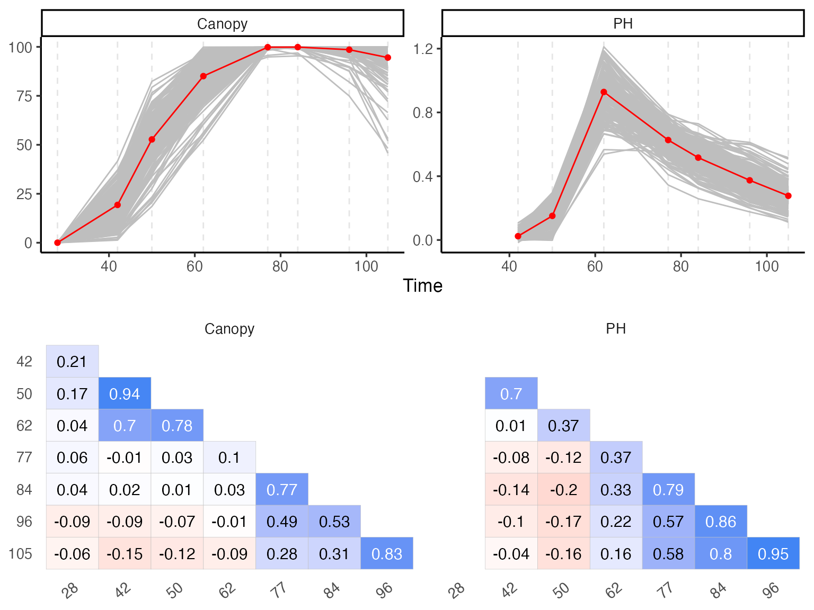
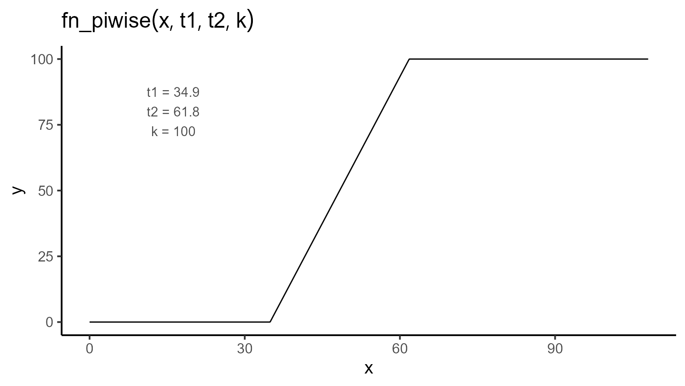
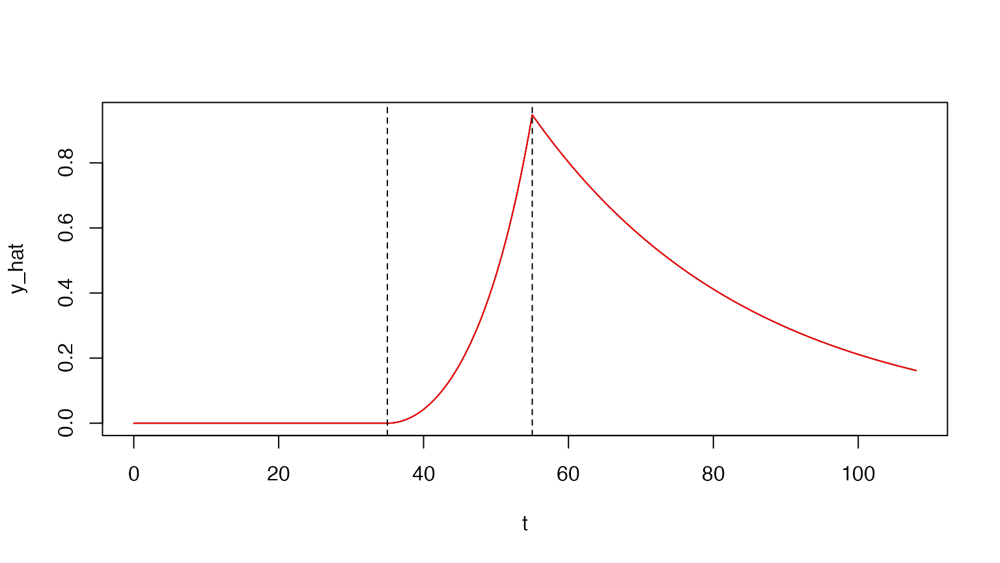
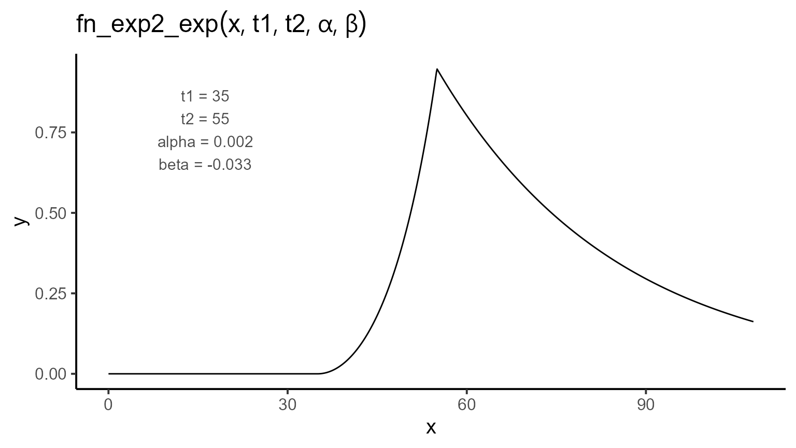
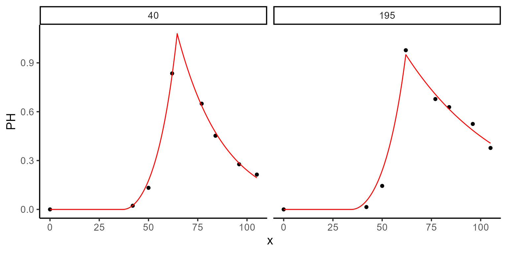

# Modeling plant height

This vignette demonstrates how to use a double exponential model and
plant height data derived from UAV imagery to estimate two key
parameters:

- t2: the number of days it takes to reach the maximum plant height.
- f(t2): the maximum plant height.

Before fitting any model for plant height, we will first reference the
previous vignette [Modeling
Canopy](https://apariciojohan.github.io/flexFitR/articles/canopy-model.html)
to estimate initial values for emergence, which will be used in the
double-exponential model.

The data in this vignette are part of Professor Jeff Endelman’s breeding
program, specifically from a partially replicated experiment. The UAV
images were collected in 2022 and processed in 2024.

## Loading libraries

``` r
library(flexFitR)
library(dplyr)
library(kableExtra)
library(ggpubr)
library(purrr)
```

## 1. Exploring data

We start by exploring the data using the explorer function. This
provides basic statistical summaries and visualizations, which help in
understanding the temporal evolution of the variables for each plot and
their correlations.

``` r
data(dt_potato_22)
results <- explorer(dt_potato_22, x = DAP, y = c(PH, Canopy), id = Plot)
```

``` r
names(results)
#> [1] "summ_vars"      "summ_metadata"  "locals_min_max" "dt_long"       
#> [5] "metadata"       "x_var"
```

``` r
p1 <- plot(results, type = "evolution", return_gg = TRUE, add_avg = TRUE)
p2 <- plot(results, type = "x_by_var", return_gg = TRUE)
ggarrange(p1, p2, nrow = 2)
```



``` r
kable(mutate_if(filter(results$summ_vars, var == "PH"), is.numeric, round, 2))
```

| var |   x |   Min | Mean | Median |  Max |   SD |   CV |   n | miss | miss% | neg% |
|:----|----:|------:|-----:|-------:|-----:|-----:|-----:|----:|-----:|------:|-----:|
| PH  |  28 |  0.00 | 0.00 |   0.00 | 0.00 | 0.00 |  NaN |  16 |  180 |  0.92 | 0.00 |
| PH  |  42 | -0.02 | 0.02 |   0.02 | 0.11 | 0.02 | 0.93 | 196 |    0 |  0.00 | 0.08 |
| PH  |  50 |  0.00 | 0.15 |   0.16 | 0.30 | 0.07 | 0.45 | 196 |    0 |  0.00 | 0.01 |
| PH  |  62 |  0.54 | 0.93 |   0.94 | 1.21 | 0.13 | 0.14 | 196 |    0 |  0.00 | 0.00 |
| PH  |  77 |  0.34 | 0.63 |   0.63 | 0.79 | 0.08 | 0.13 | 196 |    0 |  0.00 | 0.00 |
| PH  |  84 |  0.26 | 0.52 |   0.52 | 0.73 | 0.08 | 0.16 | 196 |    0 |  0.00 | 0.00 |
| PH  |  96 |  0.18 | 0.37 |   0.37 | 0.61 | 0.08 | 0.22 | 196 |    0 |  0.00 | 0.00 |
| PH  | 105 |  0.11 | 0.28 |   0.27 | 0.52 | 0.07 | 0.25 | 196 |    0 |  0.00 | 0.00 |

## 2. Estimating days to emergence

As previously shown in the canopy model vignette, we use a piece-wise
regression function with three parameters: t1, t2, and k. This can be
used to estimate the day of plant emergence (t1), which will later be
used as input for the double-exponential model for plant height.

\\\begin{equation} f(t; t_1, t_2, k) = \begin{cases} 0 & \text{if } t \<
t_1 \\ \dfrac{k}{t_2 - t_1} \cdot (t - t_1) & \text{if } t_1 \leq t \leq
t_2 \\ k & \text{if } t \> t_2 \end{cases} \end{equation}\\



## 2.1. Fitting models for canopy

The parameters find here will serve as fixed parameters in the plant
height model.

``` r
fixed_params <- data.frame(uid = c(195, 40), k = c(100, 100))
```

``` r
mod_1 <- dt_potato_22 |>
  modeler(
    x = DAP,
    y = Canopy,
    grp = Plot,
    fn = "fn_piwise",
    parameters = c(t1 = 45, t2 = 80, k = 0.9),
    fixed_params = fixed_params,
    subset = c(195, 40),
    options = list(add_zero = TRUE, max_as_last = TRUE)
  )
```

``` r
plot(mod_1, id = c(195, 40))
```



``` r
kable(mod_1$param)
```

| uid |       t1 |       t2 |       sse |   k |
|----:|---------:|---------:|----------:|----:|
|  40 | 36.97210 | 64.17621 |  9.550087 | 100 |
| 195 | 34.34827 | 66.50274 | 70.106179 | 100 |

## 3. Expectation function for plant height

Once the data are explored, we define the expectation function for plant
height, which in this case is a double-exponential function with four
parameters: t1, t2, \\\alpha\\, and \\\beta\\. This function models the
growth dynamics of plant height over time:

[`fn_exp2_exp()`](https://apariciojohan.github.io/flexFitR/reference/fn_exp2_exp.md)

\\\begin{equation} f(t; t_1, t_2, \alpha, \beta) = \begin{cases} 0 &
\text{if } t \< t_1 \\ e^{\alpha \cdot (t - t_1)^2} - 1 & \text{if } t_1
\leq t \leq t_2 \\ \left(e^{\alpha \cdot (t_2 - t_1)^2} - 1\right) \cdot
e^{\beta \cdot (t - t_2)} & \text{if } t \> t_2 \end{cases}
\end{equation}\\



## 4. Fixing parameters and providing initial values

Before fitting the plant height model, we take the t1 values from the
canopy model and use them as fixed parameters in the plant height model.
This ensures consistency between the two models.

``` r
fixed_params <- mod_1 |>
  pluck("param") |>
  select(uid, t1)
kable(fixed_params)
```

| uid |       t1 |
|----:|---------:|
|  40 | 36.97210 |
| 195 | 34.34827 |

Additionally, we can specify initial values for the parameters of each
plot to improve the model’s convergence.

``` r
initials <- mod_1 |>
  pluck("param") |>
  select(uid, t1, t2) |>
  mutate(alpha = 1 / 600, beta = -1 / 30)
kable(initials)
```

| uid |       t1 |       t2 |     alpha |       beta |
|----:|---------:|---------:|----------:|-----------:|
|  40 | 36.97210 | 64.17621 | 0.0016667 | -0.0333333 |
| 195 | 34.34827 | 66.50274 | 0.0016667 | -0.0333333 |

## 5. Fitting models for plant height

To fit the model, we use the modeler function. Here:

- x specifies the days after planting (DAP),
- y is the plant height variable to be modeled,
- grp is used for grouping, allowing analysis by plot.

In this example, although there are 196 plots, we will fit the model for
plots 195 and 40 as a subset. The `fn_exp2_exp` function is defined, and
we set initial values for the parameters.

``` r
mod_2 <- dt_potato_22 |>
  modeler(
    x = DAP,
    y = PH,
    grp = Plot,
    fn = "fn_exp2_exp",
    parameters = initials,
    fixed_params = fixed_params,
    subset = c(195, 40),
    options = list(add_zero = TRUE)
  )
```

After fitting, we can inspect the model summary and visualize the fit
using the plot function:

``` r
plot(mod_2, id = c(195, 40))
```



``` r
kable(mod_2$param)
```

| uid |       t2 |     alpha |       beta |       sse |       t1 |
|----:|---------:|----------:|-----------:|----------:|---------:|
|  40 | 64.55506 | 0.0009623 | -0.0424267 | 0.0031173 | 36.97210 |
| 195 | 62.00000 | 0.0008740 | -0.0197663 | 0.0144664 | 34.34827 |

## 6. Extracting model coefficients and uncertainty measures

Once the model is fitted, we can extract key statistical information,
such as the estimated coefficients, standard errors, confidence
intervals, and the variance-covariance matrix for each plot. This helps
evaluate the reliability and uncertainty of the parameter estimates.

The functions `coef`, `confint`, and `vcov` are used as follows:

- **coef**: Extracts the estimated coefficients for each group.
- **confint**: Provides the confidence intervals for the parameter
  estimates.
- **vcov**: Returns the variance-covariance matrix, which can be used to
  understand the relationships between the estimates and their
  variability.

``` r
coef(mod_2)
#> # A tibble: 6 × 6
#>     uid coefficient  solution std.error `t value` `Pr(>|t|)`
#>   <dbl> <chr>           <dbl>     <dbl>     <dbl>      <dbl>
#> 1    40 t2          64.6      0.551        117.     8.57e-10
#> 2    40 alpha        0.000962 0.0000216     44.6    1.07e- 7
#> 3    40 beta        -0.0424   0.00373      -11.4    9.15e- 5
#> 4   195 t2          62        0.569        109.     1.23e- 9
#> 5   195 alpha        0.000874 0.0000391     22.3    3.35e- 6
#> 6   195 beta        -0.0198   0.00282       -7.00   9.16e- 4
```

``` r
confint(mod_2)
#> # A tibble: 6 × 6
#>     uid coefficient  solution std.error  ci_lower  ci_upper
#>   <dbl> <chr>           <dbl>     <dbl>     <dbl>     <dbl>
#> 1    40 t2          64.6      0.551     63.1      66.0     
#> 2    40 alpha        0.000962 0.0000216  0.000907  0.00102 
#> 3    40 beta        -0.0424   0.00373   -0.0520   -0.0328  
#> 4   195 t2          62        0.569     60.5      63.5     
#> 5   195 alpha        0.000874 0.0000391  0.000773  0.000975
#> 6   195 beta        -0.0198   0.00282   -0.0270   -0.0125
```

``` r
vcov(mod_2)
#> $`40`
#>                  t2         alpha          beta
#> t2     3.032779e-01 -4.754961e-06 -1.730619e-03
#> alpha -4.754961e-06  4.649682e-10  3.099682e-10
#> beta  -1.730619e-03  3.099682e-10  1.388935e-05
#> 
#> $`195`
#>                  t2         alpha          beta
#> t2     3.235079e-01 -1.249703e-05 -6.795398e-04
#> alpha -1.249703e-05  1.531915e-09 -3.199694e-08
#> beta  -6.795398e-04 -3.199694e-08  7.969588e-06
```

## 7. Predicting maximun plant height

Once we have estimated t2, which indicates the number of days it takes
to reach maximum plant height, we can use the predict function to
calculate the expected maximum height at that specific time point.

``` r
# Maximum Plant Height
predict(mod_2, x = 64.5550589254, id = 40)
#> # A tibble: 1 × 4
#>     uid x_new predicted.value std.error
#>   <dbl> <dbl>           <dbl>     <dbl>
#> 1    40  64.6            1.08    0.0429
predict(mod_2, x = 62.0000000000, id = 195)
#> # A tibble: 1 × 4
#>     uid x_new predicted.value std.error
#>   <dbl> <dbl>           <dbl>     <dbl>
#> 1   195    62           0.951    0.0483
```

In this example, we predict the maximum plant height for plot 40 at
approximately 64.56 DAP and for plot 195 at 62.00 DAP.

## 8. Modelling all plots using parallel processing

Finally, we can scale up this method to fit models for all 196 plots,
using parallel processing to accelerate the computation. By setting
`parallel = TRUE` in the options argument and specifying the number of
cores with
[`parallel::detectCores()`](https://rdrr.io/r/parallel/detectCores.html),
the process becomes much more efficient.

``` r
mod <- dt_potato_22 |>
  modeler(
    x = DAP,
    y = PH,
    grp = Plot,
    fn = "fn_exp2_exp",
    parameters = initials,
    fixed_params = fixed_params,
    subset = c(195, 40),
    options = list(
      add_zero = TRUE,
      max_as_last = TRUE,
      progress = TRUE,
      parallel = TRUE,
      workers = parallel::detectCores()
    )
  )
```

------------------------------------------------------------------------
