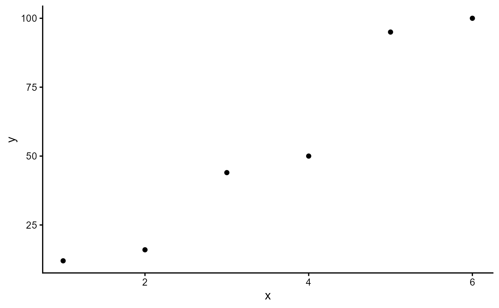
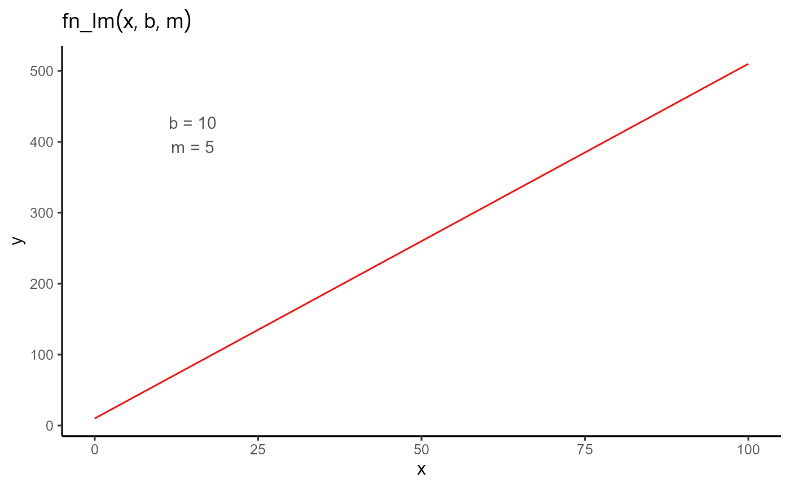
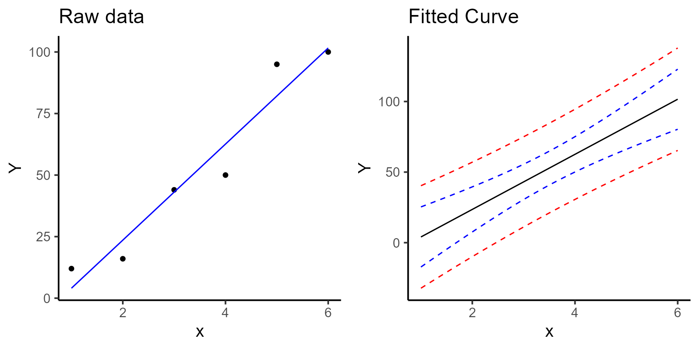
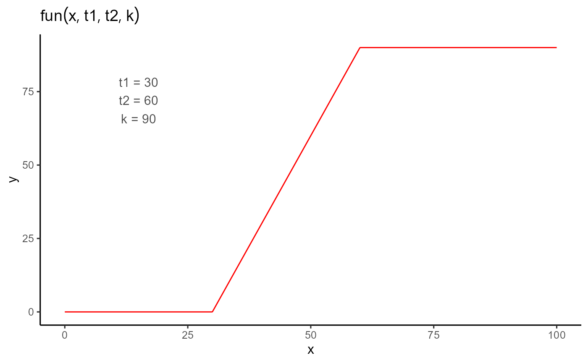
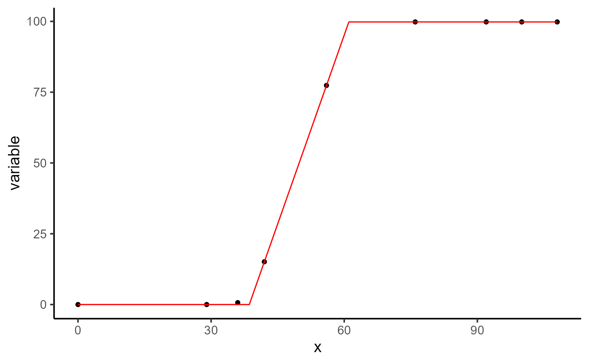
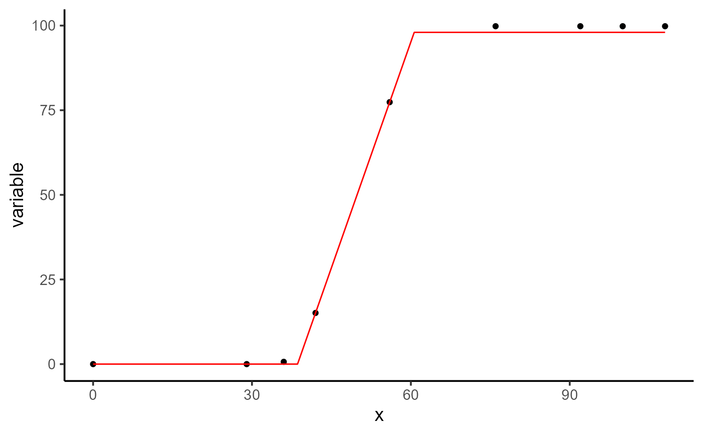

# How to start

## Getting started

The basic idea of this vignette is to illustrate to users how to use the
flexFitR package. We’ll start with a very basic example: a simple linear
regression. Although this example is not the primary focus of the
package, it will serve to demonstrate its use.

## 1. Simple linear regression

In this example, we’ll work with a small dataset consisting of 6
observations, where X is the independent variable and Y is the dependent
variable.

``` r
library(flexFitR)
library(dplyr)
library(ggpubr)
```

``` r
dt <- data.frame(X = 1:6, Y = c(12, 16, 44, 50, 95, 100))
plot(explorer(dt, X, Y), type = "xy")
```



First, we define an objective function. In this case, the function
`fn_lm` will represent the linear regression, where b is the intercept
and m is the slope of the regression.

``` r
fn_lm <- function(x, b, m) {
  y <- b + m * x
  return(y)
}
```

The `plot_fn` function, which is integrated into the package, allows us
to plot any function with the parameters provided. This is useful for
visualizing the shape of the function before fitting the model to the
data.

``` r
plot_fn(fn = "fn_lm", params = c(b = 10, m = 5))
```



To fit the model, we use the `modeler` function. In this function, we
pass x as the independent variable, y as the dependent variable, and
then a vector of parameters where we assign initial values to our
coefficient b and coefficient m.

``` r
mod <- dt |>
  modeler(
    x = X,
    y = Y,
    fn = "fn_lm",
    parameters = c(b = -5, m = 10)
  )
mod
#> 
#> Call:
#> Y ~ fn_lm(X, b, m) 
#> 
#> Residuals (`Standardized`):
#>     Min.  1st Qu.   Median     Mean  3rd Qu.     Max. 
#> -1.18875 -0.57369 -0.03282  0.00000  0.58494  1.21753 
#> 
#> Optimization Results `head()`:
#>  uid     b    m sse
#>    1 -15.5 19.5 449
#> 
#> Metrics:
#>  Groups   Timing Convergence Iterations
#>       1 0.4 secs        100%   354 (id)
```

Once the model is fitted, we can examine the output, extract the
estimated parameters, make some plots, and predict new x values.

``` r
a <- plot(mod, color = "blue", title = "Raw data")
b <- plot(mod, type = 4, n_points = 200, color = "black")
ggarrange(a, b)
#> Ignoring unknown labels:
#> • colour : "Model"
#> • fill : "Model"
#> • linetype : "Model"
```



In order to get the coefficients with their variance-covariance matrix
we make use of the `coef` and `vcov` function, which only takes the
model object as an argument.

``` r
coef(mod)
#> # A tibble: 2 × 7
#>     uid fn_name coefficient solution std.error `t value` `Pr(>|t|)`
#>   <dbl> <chr>   <chr>          <dbl>     <dbl>     <dbl>      <dbl>
#> 1     1 fn_lm   b              -15.5      9.86     -1.57    0.192  
#> 2     1 fn_lm   m               19.5      2.53      7.71    0.00152
```

``` r
vcov(mod)
#> $`1`
#>           b          m
#> b  97.21937 -22.435238
#> m -22.43524   6.410068
#> attr(,"fn_name")
#> [1] "fn_lm"
```

Finally, we can make predictions using the predict function, which takes
the fitted model as an object and X as the value for which we want to
make the prediction.

``` r
predict(mod, x = 4.5)
#> # A tibble: 1 × 5
#>     uid fn_name x_new predicted.value std.error
#>   <dbl> <chr>   <dbl>           <dbl>     <dbl>
#> 1     1 fn_lm     4.5            72.3      5.01
```

We can compare this with the lm function in R, which will give results
similar to those obtained with our package.

### Comparison with `lm`

``` r
mo <- lm(Y ~ X, data = dt)
```

``` r
summary(mo)$coefficients
#>              Estimate Std. Error   t value    Pr(>|t|)
#> (Intercept) -15.46667   9.859988 -1.568629 0.191812151
#> X            19.51429   2.531811  7.707639 0.001524882
```

``` r
vcov(mo)
#>             (Intercept)          X
#> (Intercept)    97.21937 -22.435238
#> X             -22.43524   6.410068
predict(mo, newdata = data.frame(X = 4.5), se.fit = TRUE)
#> $fit
#>        1 
#> 72.34762 
#> 
#> $se.fit
#> [1] 5.010599
#> 
#> $df
#> [1] 4
#> 
#> $residual.scale
#> [1] 10.59133
```

While the previous example was fairly simple, we can consider a more
complex scenario where we need to fit not just one function, but
hundreds of functions for several groups. This can be achieved using the
`grp` argument in the `modeler` function. Additionally, we can
parallelize these processes by setting the `parallel` argument to `TRUE`
and defining the number of cores to use.

It’s important to note that depending on the functions defined by the
user, some parameters may need to be constrained, such as being required
to be greater than or less than zero. In other cases, certain parameters
might need to be fixed at known values. In these more complex
situations, where we have many curves to fit and are working with
complex functions—whether non linear regressions with specific parameter
constraints or cases where some parameters are fixed for each
group—modeler offers extensive flexibility.

## 2. Piece-wise regression

The following example, although still simple, represents a slightly more
complex function with a greater number of parameters. In this case, we
have a piece-wise regression, parameterized by `t1`, `t2`, and `k`, and
defined by the following expression:

``` r
fun <- function(t, t1 = 45, t2 = 80, k = 0.9) {
  ifelse(
    test = t < t1,
    yes = 0,
    no = ifelse(
      test = t >= t1 & t <= t2,
      yes = k / (t2 - t1) * (t - t1),
      no = k
    )
  )
}
```

Before fitting the model, let’s take a look at the example dataset.

``` r
dt <- data.frame(
  time = c(0, 29, 36, 42, 56, 76, 92, 100, 108),
  variable = c(0, 0, 0.67, 15.11, 77.38, 99.81, 99.81, 99.81, 99.81)
)
plot(explorer(dt, time, variable), type = "xy")
```



We can make a plot of the piecewise function and then fit the model
using the `modeler` function.

``` r
plot_fn(fn = "fun", params = c(t1 = 25, t2 = 70, k = 90))
```


``` r
mod_1 <- dt |>
  modeler(
    x = time,
    y = variable,
    fn = "fun",
    parameters = c(t1 = 40, t2 = 70, k = 100)
  )
mod_1
#> 
#> Call:
#> variable ~ fun(time, t1, t2, k) 
#> 
#> Residuals (`Standardized`):
#>       Min.    1st Qu.     Median       Mean    3rd Qu.       Max. 
#> -1.000e-08  0.000e+00  0.000e+00  2.722e-01  0.000e+00  2.449e+00 
#> 
#> Optimization Results `head()`:
#>  uid   t1 t2    k   sse
#>    1 38.6 61 99.8 0.449
#> 
#> Metrics:
#>  Groups      Timing Convergence Iterations
#>       1 0.3193 secs        100%   473 (id)
```

After fitting the model, we can examine the results, plot the fitted
curve, extract the coefficients and their associated p-values, obtain
the variance-covariance matrix, and make predictions for unknown values
of x.

``` r
plot(mod_1)
```



``` r
# Coefficients
coef(mod_1)
#> # A tibble: 3 × 7
#>     uid fn_name coefficient solution std.error `t value` `Pr(>|t|)`
#>   <dbl> <chr>   <chr>          <dbl>     <dbl>     <dbl>      <dbl>
#> 1     1 fun     t1              38.6    0.0779      496.   4.54e-15
#> 2     1 fun     t2              61.0    0.0918      665.   7.82e-16
#> 3     1 fun     k               99.8    0.137       730.   4.47e-16
```

``` r
# Variance-Covariance Matrix
vcov(mod_1)
#> $`1`
#>               t1           t2            k
#> t1  6.061705e-03 -0.002940001 1.877076e-07
#> t2 -2.940001e-03  0.008431400 4.204939e-03
#> k   1.877076e-07  0.004204939 1.870426e-02
#> attr(,"fn_name")
#> [1] "fun"
```

``` r
# Making predictions
predict(mod_1, x = 45)
#> # A tibble: 1 × 5
#>     uid fn_name x_new predicted.value std.error
#>   <dbl> <chr>   <dbl>           <dbl>     <dbl>
#> 1     1 fun        45            28.5     0.223
```

### Comparison with `nls`

``` r
mod_nls <- dt |>
  nls(
    formula = variable ~ fun(time, t1, t2, k),
    start = c(t1 = 40, t2 = 70, k = 100),
    algorithm = "default"
  )
summary(mod_nls)
#> 
#> Formula: variable ~ fun(time, t1, t2, k)
#> 
#> Parameters:
#>    Estimate Std. Error t value Pr(>|t|)    
#> t1 38.60286    0.07786   495.8 4.54e-15 ***
#> t2 61.04288    0.09183   664.7 7.82e-16 ***
#> k  99.81000    0.13676   729.8 4.47e-16 ***
#> ---
#> Signif. codes:  0 '***' 0.001 '**' 0.01 '*' 0.05 '.' 0.1 ' ' 1
#> 
#> Residual standard error: 0.2735 on 6 degrees of freedom
#> 
#> Number of iterations to convergence: 4 
#> Achieved convergence tolerance: 3.927e-06
coef(mod_nls)
#>       t1       t2        k 
#> 38.60286 61.04288 99.81000
vcov(mod_nls)
#>               t1           t2             k
#> t1  6.062452e-03 -0.002940973 -6.025873e-13
#> t2 -2.940973e-03  0.008433026  4.205209e-03
#> k  -6.025873e-13  0.004205209  1.870417e-02
predict(mod_nls, newdata = data.frame(time = 45))
#> [1] 28.45357
```

As we can see, we get very similar results when compared to `nls`.

Finally, we will illustrate how to provide different initial values to
the function when dealing with multiple groups, and we will also show
how to fix some parameters of the objective function.

### Providing Initial values

In this example, we don’t have a grouping variable. However, by default,
the function assigns a unique identifier (`uid`) to the dataset. Because
of this, we need to specify `uid = 1` for the initial values and fixed
parameters. If there is only one group, you only need to modify the
parameters argument accordingly. This approach is primarily for
illustrative purposes.

``` r
init <- data.frame(uid = 1, t1 = 20, t2 = 30, k = 0.8)

mod_2 <- dt |>
  modeler(
    x = time,
    y = variable,
    fn = "fun",
    parameters = init
  )
mod_2
#> 
#> Call:
#> variable ~ fun(time, t1, t2, k) 
#> 
#> Residuals (`Standardized`):
#>       Min.    1st Qu.     Median       Mean    3rd Qu.       Max. 
#> -1.000e-08  0.000e+00  0.000e+00  2.722e-01  0.000e+00  2.449e+00 
#> 
#> Optimization Results `head()`:
#>  uid   t1 t2    k   sse
#>    1 38.6 61 99.8 0.449
#> 
#> Metrics:
#>  Groups     Timing Convergence Iterations
#>       1 0.536 secs        100%   567 (id)
coef(mod_2)
#> # A tibble: 3 × 7
#>     uid fn_name coefficient solution std.error `t value` `Pr(>|t|)`
#>   <dbl> <chr>   <chr>          <dbl>     <dbl>     <dbl>      <dbl>
#> 1     1 fun     t1              38.6    0.0779      496.   4.54e-15
#> 2     1 fun     t2              61.0    0.0918      665.   7.82e-16
#> 3     1 fun     k               99.8    0.137       730.   4.47e-16
```

### Fixing parameters

``` r
fix <- data.frame(uid = 1, k = 98)

mod_3 <- dt |>
  modeler(
    x = time,
    y = variable,
    fn = "fun",
    parameters = c(t1 = 40, t2 = 70, k = 100),
    fixed_params = fix
  )
mod_3
#> 
#> Call:
#> variable ~ fun(time, t1, t2, k) 
#> 
#> Residuals (`Standardized`):
#>    Min. 1st Qu.  Median    Mean 3rd Qu.    Max. 
#>  0.0000  0.0000  0.4815  0.6316  1.3008  1.3008 
#> 
#> Optimization Results `head()`:
#>  uid   t1   t2  sse  k
#>    1 38.6 60.6 13.6 98
#> 
#> Metrics:
#>  Groups      Timing Convergence Iterations
#>       1 0.2901 secs        100%   313 (id)
coef(mod_3)
#> # A tibble: 2 × 7
#>     uid fn_name coefficient solution std.error `t value` `Pr(>|t|)`
#>   <dbl> <chr>   <chr>          <dbl>     <dbl>     <dbl>      <dbl>
#> 1     1 fun     t1              38.6     0.396      97.5   3.15e-12
#> 2     1 fun     t2              60.6     0.429     141.    2.34e-13
plot(mod_3)
```



``` r
performance(mod_1, mod_2, mod_3)
#>   fn_name uid df nobs p logLik   AIC  AICc   BIC Sigma   SSE  MAE  MSE RMSE R2
#> 1   fun_1   1  4    9 3   0.72  6.56 16.56  7.35  0.27  0.45 0.07 0.05 0.22  1
#> 2   fun_2   1  4    9 3   0.72  6.56 16.56  7.35  0.27  0.45 0.07 0.05 0.22  1
#> 3   fun_3   1  3    9 2 -14.61 35.23 40.03 35.82  1.39 13.55 0.88 1.51 1.23  1
```

This vignette provided a basic introduction to using the flexFitR
package, starting with simple examples such as linear regression and
piecewise regression. The goal was to demonstrate the fundamental
features and flexibility of the package. However, more complex
situations can arise when working with high-throughput phenotypic (HTP)
data, which involve multiple groups, parameter constraints, and advanced
modeling scenarios. These more complex situations are illustrated in the
other vignettes, which use real HTP data to showcase the full
capabilities of the flexFitR package.
