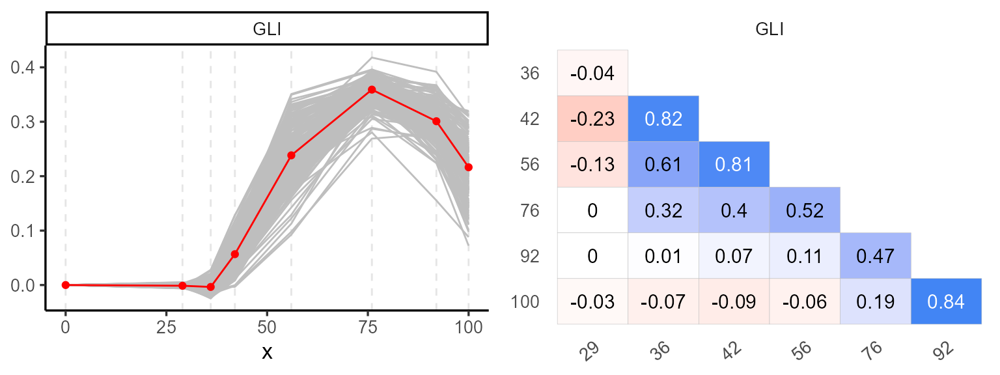
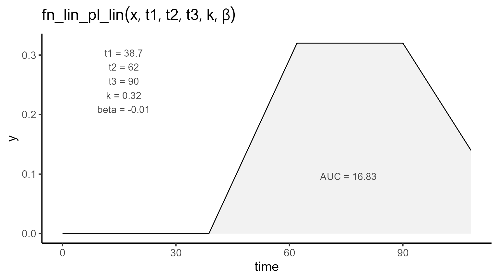
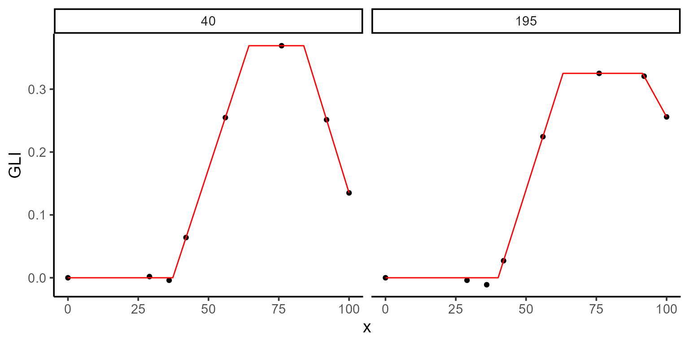
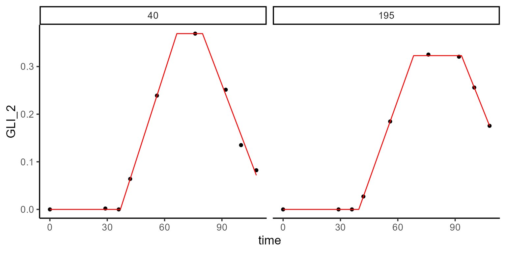

# Modeling with constraints

This vignette demonstrates how to apply parameter constraints when
modeling biological processes using {flexFitR}. Constraints can help
ensure that parameter estimates remain within realistic or biologically
meaningful ranges, improving both the interpretability and reliability
of model outcomes.

## Introduction to Modeling with Constraints

In many biological models, certain relationships between parameters are
expected. For example:

- Some parameters should not exceed certain values (e.g., maximum growth
  rates).
- Some parameters should maintain specific relationships with each other
  (e.g., one stage occurring before another in time).

This vignette demonstrates how to apply these types of constraints in
{flexFitR} to guide the optimization process.

### Example Case

For this example, we use the Green Leaf Index (GLI) derived from UAV
imagery to model plant emergence, canopy closure, and senescence. The
parameters we are interested in include:

- t1: Emergence time
- t2: Canopy closure time
- t3: Senescence onset

Our expectation is that \\0 \< t1 \< t2 \< t3\\. We will apply
constraints to ensure this relationship hold.

## Loading libraries

``` r
library(flexFitR)
library(dplyr)
library(kableExtra)
library(ggpubr)
library(purrr)
```

## 1. Exploring data

We begin with the `explorer` function, which provides basic statistical
summaries and visualizations to help understand the temporal evolution
of each plot.

``` r
data(dt_potato)
explorer <- explorer(dt_potato, x = DAP, y = c(GLI), id = Plot)
```

``` r
p1 <- plot(explorer, type = "evolution", return_gg = TRUE, add_avg = TRUE)
p2 <- plot(explorer, type = "x_by_var", return_gg = TRUE)
ggarrange(p1, p2, nrow = 1)
```



``` r
kable(mutate_if(explorer$summ_vars, is.numeric, round, 2))
```

| var |   x |   Min | Mean | Median |  Max |   SD |    CV |   n | miss | miss% | neg% |
|:----|----:|------:|-----:|-------:|-----:|-----:|------:|----:|-----:|------:|-----:|
| GLI |   0 |  0.00 | 0.00 |   0.00 | 0.00 | 0.00 |   NaN | 196 |    0 |     0 | 0.00 |
| GLI |  29 | -0.01 | 0.00 |   0.00 | 0.01 | 0.00 | -2.01 | 196 |    0 |     0 | 0.69 |
| GLI |  36 | -0.02 | 0.00 |   0.00 | 0.03 | 0.01 | -2.90 | 196 |    0 |     0 | 0.69 |
| GLI |  42 |  0.00 | 0.06 |   0.05 | 0.13 | 0.03 |  0.46 | 196 |    0 |     0 | 0.02 |
| GLI |  56 |  0.09 | 0.24 |   0.24 | 0.35 | 0.05 |  0.21 | 196 |    0 |     0 | 0.00 |
| GLI |  76 |  0.27 | 0.36 |   0.36 | 0.42 | 0.02 |  0.06 | 196 |    0 |     0 | 0.00 |
| GLI |  92 |  0.16 | 0.30 |   0.31 | 0.39 | 0.03 |  0.11 | 196 |    0 |     0 | 0.00 |
| GLI | 100 |  0.07 | 0.22 |   0.22 | 0.32 | 0.05 |  0.23 | 196 |    0 |     0 | 0.00 |

## 2. Regression function

After exploring the data, we define the regression function. Here we use
a linear-plateau-linear function with five parameters: t1, t2, t3, k,
and \\\beta\\. The function can be expressed mathematically as follows:

[`fn_lin_pl_lin()`](https://apariciojohan.github.io/flexFitR/reference/fn_lin_pl_lin.md)

\\\begin{equation} f(t; t_1, t_2, t_3, k, \beta) = \begin{cases} 0 &
\text{if } t \< t_1 \\ \dfrac{k}{t_2 - t_1} \cdot (t - t_1) & \text{if }
t_1 \leq t \leq t_2 \\ k & \text{if } t_2 \leq t \leq t_3 \\ k + \beta
\cdot (t - t_3) & \text{if } t \> t_3 \end{cases} \end{equation}\\

``` r
plot_fn(
  fn = "fn_lin_pl_lin",
  params = c(t1 = 38.7, t2 = 62, t3 = 90, k = 0.32, beta = -0.01),
  interval = c(0, 108),
  color = "black",
  base_size = 15
)
```



To impose constraints, we can reformulate the function. For instance, if
we want to ensure that \\t3 \geq t2\\, we introduce dt as the difference
between t3 and t2:

\\\begin{equation} f(t; t_1, t_2, dt, k, \beta) = \begin{cases} 0 &
\text{if } t \< t_1 \\ \dfrac{k}{t_2 - t_1} \cdot (t - t_1) & \text{if }
t_1 \leq t \leq t_2 \\ k & \text{if } t_2 \leq t \leq (t_2 + dt) \\ k +
\beta \cdot (t - (t_2 + dt)) & \text{if } t \> (t_2 + dt) \end{cases}
\end{equation}\\

To enforce \\dt \> 0\\ and \\\beta \< 0\\ (i.e., a non-positive slope at
the end of the curve), we specify bounds in the modeler function as
follows:

``` r
# Define constraints and bounds for the model
lower_bounds <- c(t1 = 0, t2 = 0, dt = 0, k = 0, beta = -Inf)
upper_bounds <- c(t1 = Inf, t2 = Inf, dt = Inf, k = Inf, beta = 0)
# Initial values
initial_vals <- c(t1 = 38, t2 = 62, dt = 28, k = 0.32, beta = -0.01)
```

## 3. Fitting Models with Constraints

We fit the model with these constraints by passing lower and upper
arguments to `modeler`. In this vignette, we fit the model for plots 195
and 40 as a `subset` of the total 196 plots.

``` r
mod_1 <- dt_potato |>
  modeler(
    x = DAP,
    y = GLI,
    grp = Plot,
    fn = "fn_lpl",
    parameters = initial_vals,
    lower = lower_bounds,
    upper = upper_bounds,
    method = c("nlminb", "L-BFGS-B"),
    subset = c(195, 40)
  )
```

Here:

- x specifies the days after planting (DAP),
- y is the GLI variable to be modeled
- grp enables group analysis across multiple plots
- parameters are the initial parameter values
- method specifies the optimization methods to evaluate

After fitting, we can inspect the model summary and visualize the fit
using the `plot` function:

``` r
print(mod_1)
#> 
#> Call:
#> GLI ~ fn_lpl(DAP, t1, t2, dt, k, beta) 
#> 
#> Residuals (`Standardized`):
#>       Min.    1st Qu.     Median       Mean    3rd Qu.       Max. 
#> -1.629e+00 -5.100e-07 -1.000e-08 -1.907e-01  3.000e-08  7.348e-01 
#> 
#> Optimization Results `head()`:
#>  uid   t1   t2   dt     k     beta      sse
#>   40 37.3 64.4 19.5 0.369 -0.01454 1.96e-05
#>  195 40.1 63.1 28.3 0.325 -0.00809 1.39e-04
#> 
#> Metrics:
#>  Groups      Timing Convergence Iterations
#>       2 0.7303 secs        100%   311 (id)
```

``` r
plot(mod_1, id = c(195, 40))
```



``` r
kable(mod_1$param)
```

| uid |       t1 |       t2 |       dt |         k |       beta |       sse | fn_name |
|----:|---------:|---------:|---------:|----------:|-----------:|----------:|:--------|
|  40 | 37.30529 | 64.38853 | 19.51168 | 0.3691396 | -0.0145414 | 0.0000196 | fn_lpl  |
| 195 | 40.07586 | 63.14681 | 28.29370 | 0.3251456 | -0.0080876 | 0.0001388 | fn_lpl  |

## 3.1. Extracting model coefficients and uncertainty measures

Once the model is fitted, we can extract key statistical information,
such as coefficients, standard errors, confidence intervals, and the
variance-covariance matrix for each plot. These metrics help evaluate
parameter reliability and assess uncertainty.

The functions `coef`, `confint`, and `vcov` are used as follows:

- **coef**: Extracts the estimated coefficients for each group.
- **confint**: Provides the confidence intervals for the parameter
  estimates.
- **vcov**: Returns the variance-covariance matrix, which can be used to
  understand the relationships between the estimates and their
  variability.

``` r
coef(mod_1, id = 40)
#> # A tibble: 5 × 7
#>     uid fn_name coefficient solution std.error `t value`  `Pr(>|t|)`
#>   <dbl> <chr>   <chr>          <dbl>     <dbl>     <dbl>       <dbl>
#> 1    40 fn_lpl  t1           37.3     0.258        145.  0.000000727
#> 2    40 fn_lpl  t2           64.4     0.371        174.  0.000000422
#> 3    40 fn_lpl  dt           19.5     0.626         31.2 0.0000725  
#> 4    40 fn_lpl  k             0.369   0.00256      144.  0.000000733
#> 5    40 fn_lpl  beta         -0.0145  0.000452     -32.2 0.0000660
```

``` r
confint(mod_1, id = 40)
#> # A tibble: 5 × 7
#>     uid fn_name coefficient solution std.error ci_lower ci_upper
#>   <dbl> <chr>   <chr>          <dbl>     <dbl>    <dbl>    <dbl>
#> 1    40 fn_lpl  t1           37.3     0.258     36.5     38.1   
#> 2    40 fn_lpl  t2           64.4     0.371     63.2     65.6   
#> 3    40 fn_lpl  dt           19.5     0.626     17.5     21.5   
#> 4    40 fn_lpl  k             0.369   0.00256    0.361    0.377 
#> 5    40 fn_lpl  beta         -0.0145  0.000452  -0.0160  -0.0131
```

``` r
vcov(mod_1, id = 40)
#> $`40`
#>                 t1            t2            dt             k          beta
#> t1    6.640964e-02 -4.684756e-02  0.0468605417 -7.841952e-08 -8.219226e-09
#> t2   -4.684756e-02  1.377112e-01 -0.1707231494  4.797169e-04  2.416003e-08
#> dt    4.686054e-02 -1.707231e-01  0.3915152910 -9.292910e-04 -1.699689e-04
#> k    -7.841952e-08  4.797169e-04 -0.0009292910  6.536323e-06  8.415252e-11
#> beta -8.219226e-09  2.416003e-08 -0.0001699689  8.415252e-11  2.042313e-07
#> attr(,"fn_name")
#> [1] "fn_lpl"
```

## 4. Plotting options

Using `type = 2` in the `plot` function generates a coefficients plot.
This allows us to view the estimated coefficients and their associated
confidence intervals for each group.

``` r
plot(mod_1, type = 2, id = c(195, 40), label_size = 8)
```



Another option (`type = 4`) shows the fitted curve (black line),
confidence interval (blue-dashed line), and prediction interval
(red-dashed line). Additionally, setting type = 5 displays the first
derivative, indicating the rate of change over time.

``` r
a <- plot(mod_1, type = 4, color = "black", title = "Fitted Curve + CIs & PIs")
b <- plot(mod_1, type = 5, color = "black")
ggarrange(a, b)
#> Ignoring unknown labels:
#> • colour : "Model"
#> • fill : "Model"
#> • linetype : "Model"
#> Ignoring unknown labels:
#> • colour : "Model"
#> • fill : "Model"
#> • linetype : "Model"
```


## 5. Conclusion

This vignette showed how to apply constraints in {flexFitR} models to
better capture biological realities and improve parameter estimation.
Constraints can be an essential tool for ensuring that models produce
interpretable and meaningful results.
