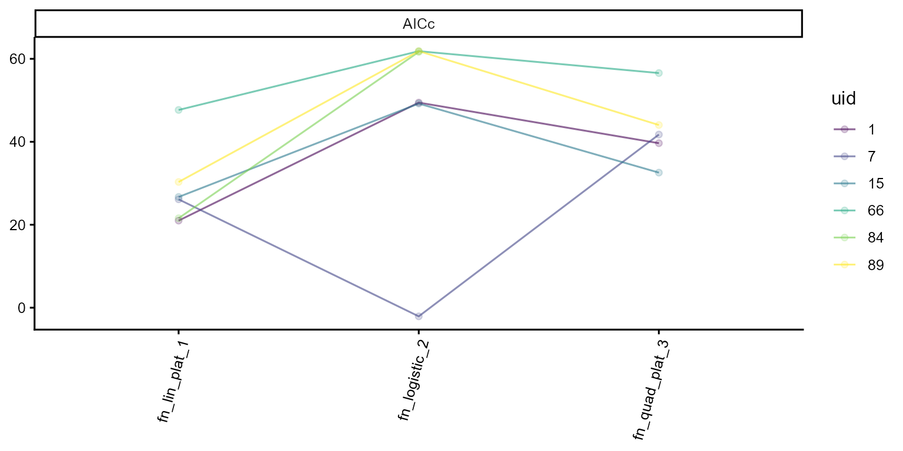

# Model selection

## Choosing a different model for every plot

Canopy development can vary considerably among plots. Some follow an
approximately linear pattern, whereas others show a more sigmoidal
response. As a result, a single functional form may describe some plots
well but provide a poor fit for others.

The
[`model_selection()`](https://apariciojohan.github.io/flexFitR/reference/model_selection.md)
function allows a different model to be selected for each plot.
Candidate models are fitted to the same data, and the best-fitting model
is selected according to a specified criterion. The results are returned
as a single `modeler` object containing the selected fit for each plot.

We use canopy cover data derived from UAV imagery collected by the
University of Wisconsin–Madison Potato Breeding Program. The dataset
includes eight flights conducted between 0 and 100 days after planting
(DAP).

``` r

library(flexFitR)
library(dplyr)
library(kableExtra)
library(ggplot2)
```

## 1. Exploring data

``` r

data(dt_potato)
explorer <- explorer(dt_potato, x = DAP, y = Canopy, id = Plot)
```

``` r

plot(explorer, type = "evolution", add_avg = TRUE)
```


Canopy cover increases rapidly between approximately 30 and 60 DAP,
before approaching a plateau near 100%. The individual trajectories show
some variation in the timing and shape of this increase.

## 2. Candidate models

We consider three models: linear-plateau, logistic, and
quadratic-plateau. Each describes an increase in canopy cover toward a
maximum value, but they differ in how they represent the growth phase
and the transition to the plateau.

**Linear-plateau** — This three-parameter model describes a linear
increase in canopy cover from (\\t_1\\) to (\\t_2\\), followed by a
constant plateau at (\\k\\):

\\\begin{equation} f(t; t_1, t_2, k) = \begin{cases} 0 & \text{if } t \<
t_1 \\ \dfrac{k}{t_2 - t_1} \cdot (t - t_1) & \text{if } t_1 \leq t \leq
t_2 \\ k & \text{if } t \> t_2 \end{cases} \end{equation}\\

**Logistic** — This three-parameter model describes sigmoidal growth,
with a gradual increase followed by a slowdown as canopy cover
approaches the asymptote (\\k\\). The parameter (\\t_0\\) represents the
inflection point, and (\\a\\) controls the growth rate:

\\\begin{equation} f(t; a, t_0, k) = \dfrac{k}{1 + e^{-a (t - t_0)}}
\end{equation}\\

**Quadratic-plateau** — This four-parameter model describes a quadratic
increase in canopy cover from (\\t_1\\) to (\\t_2\\), followed by a
constant plateau at (\\k\\). The parameter (\\b\\) represents the
initial slope of the growth phase.:

\\\begin{equation} f(t; t_1, t_2, b, k) = \begin{cases} 0 & \text{if } t
\< t_1 \\ b (t - t_1) + \dfrac{k - b (t_2 - t_1)}{(t_2 - t_1)^2} (t -
t_1)^2 & \text{if } t_1 \leq t \leq t_2 \\ k & \text{if } t \> t_2
\end{cases} \end{equation}\\

We use
[`plot_fn()`](https://apariciojohan.github.io/flexFitR/reference/plot_fn.md)
to visualize each model with the starting parameter values that will be
used for fitting:

``` r

plot_fn("fn_lin_plat", params = c(t1 = 45, t2 = 80, k = 90), interval = c(0, 100))
```


``` r

plot_fn("fn_logistic", params = c(a = 0.199, t0 = 47.7, k = 100), interval = c(0, 100))
```


``` r

plot_fn("fn_quad_plat", params = c(t1 = 45, t2 = 80, b = 5, k = 100), interval = c(0, 100))
```


## 3. Fitting the candidates

For this example, we fit the three models to a subset of six plots. The
`subset` argument can be omitted to fit the models to the entire trial.

``` r

ids <- c(1, 7, 15, 66, 84, 89)
mod_1 <- dt_potato |>
  modeler(
    x = DAP, 
    y = Canopy,
    grp = Plot,
    fn = "fn_lin_plat",
    parameters = c(t1 = 45, t2 = 80, k = 90), 
    subset = ids
  )
mod_2 <- dt_potato |>
  modeler(
    x = DAP,
    y = Canopy,
    grp = Plot, 
    fn = "fn_logistic",
    parameters = c(a = 0.199, t0 = 47.7, k = 100), 
    subset = ids
  )
mod_3 <- dt_potato |>
  modeler(
    x = DAP, 
    y = Canopy,
    grp = Plot,
    fn = "fn_quad_plat",
    parameters = c(t1 = 45, t2 = 80, b = 1, k = 100),
    subset = ids
  )
```

## 4. Comparing by hand with `performance()`

We use
[`performance()`](https://apariciojohan.github.io/flexFitR/reference/performance.md)
to compare the candidate models using AIC, AICc, and BIC in this
example.

``` r

comparison <- performance(mod_1, mod_2, mod_3, metrics = c("AIC", "AICc", "BIC"))

comparison |>
  filter(uid %in% c(1, 7)) |>
  kable(caption = "Information criteria for the first two plots")
```

| fn_name        | uid |  df | nobs |   p |    AIC |  AICc |    BIC |
|:---------------|----:|----:|-----:|----:|-------:|------:|-------:|
| fn_lin_plat_1  |   1 |   4 |    8 |   3 |   7.66 | 20.99 |   7.98 |
| fn_logistic_2  |   1 |   4 |    8 |   3 |  36.12 | 49.45 |  36.43 |
| fn_quad_plat_3 |   1 |   5 |    8 |   4 |   9.66 | 39.66 |  10.06 |
| fn_lin_plat_1  |   7 |   4 |    8 |   3 |  12.79 | 26.13 |  13.11 |
| fn_logistic_2  |   7 |   4 |    8 |   3 | -15.42 | -2.09 | -15.10 |
| fn_quad_plat_3 |   7 |   5 |    8 |   4 |  11.74 | 41.74 |  12.14 |

Information criteria for the first two plots {.table}

The quadratic-plateau model has four curve parameters, compared with
three for the linear-plateau and logistic models. Including the residual
variance, the corresponding parameter counts used for AIC and AICc are
five and four, respectively. With only eight observations per plot, the
small-sample correction in AICc is substantial: it adds 30 to the AIC of
the quadratic-plateau model and 13.3 to the other two models. As a
result, AICc may favor a simpler model even when the more complex model
has a lower AIC.

The radar plot rescales every metric within a plot, so the outer edge is
always the best model:

``` r

plot(comparison, id = c(1, 7), type = 1)
```


Comparing models individually becomes impractical when the number of
plots is large. The
[`model_selection()`](https://apariciojohan.github.io/flexFitR/reference/model_selection.md)
function automates this process.

## 5. Automatic selection

The fitted models are supplied along with the selection criterion, which
in this example is “AICc”.

``` r

best <- model_selection(mod_1, mod_2, mod_3, metrics = "AICc")
#> Warning: No usable metric for 1 group(s): 84. They are not present in the
#> output.
best
#> 
#> Call:
#> Canopy ~ fn_lin_plat(DAP, t1, t2, k) | uid (4) 
#> Canopy ~ fn_logistic(DAP, a, t0, k) | uid (1) 
#> 
#> Residuals (`Standardized`):
#>       Min.    1st Qu.     Median       Mean    3rd Qu.       Max. 
#> -1.923e+00 -1.225e-05  0.000e+00  1.851e-02  1.000e-08  2.236e+00 
#> 
#> Optimization Results `head()`:
#>  uid coefficient solution std.error t value Pr(>|t|)
#>    1          t1   38.492   0.08871   433.9 1.23e-12
#>    1          t2   61.661   0.10929   564.2 3.32e-13
#>    1           k   99.811   0.17299   577.0 2.97e-13
#>    7           a    0.294   0.00495    59.4 2.57e-08
#> 
#> Metrics:
#>  Groups Timing Convergence Iterations
#>       5 2.9006        100% 458.8 (id)
```

The function returns a single `modeler` object containing the selected
fit for each plot. `attr(best, "selection")` records which model was
selected for each plot, along with its selection score.

``` r

attr(best, "selection") |>
  kable(caption = "Best model per plot, with its score")
```

| uid | fn_name       | score | n_metrics | model       | order |
|----:|:--------------|------:|----------:|:------------|------:|
|   1 | fn_lin_plat_1 |     1 |         1 | fn_lin_plat |     1 |
|   7 | fn_logistic_2 |     1 |         1 | fn_logistic |     2 |
|  15 | fn_lin_plat_1 |     1 |         1 | fn_lin_plat |     1 |
|  66 | fn_lin_plat_1 |     1 |         1 | fn_lin_plat |     1 |
|  89 | fn_lin_plat_1 |     1 |         1 | fn_lin_plat |     1 |

Best model per plot, with its score {.table}

The `score` column summarizes the model’s performance across the
selected criteria. Each criterion is rescaled from 0.1 to 1, with higher
values indicating better performance, and the scores are averaged when
multiple criteria are used. With a single criterion, the selected model
receives a score of 1, so the score is mainly useful when combining
several criteria. The `n_metrics` column indicates how many criteria
contributed to the score, which is relevant when a criterion cannot be
calculated for a particular plot.

Use `return_table` if you want the table rather than the refitted
object:

``` r

model_selection(mod_1, mod_2, mod_3, metrics = "AICc", return_table = TRUE) |>
  count(model, name = "groups") |>
  kable(caption = "How often each candidate won")
#> Warning: No usable metric for 1 group(s): 84. They are not present in the
#> output.
```

| model       | groups |
|:------------|-------:|
| fn_lin_plat |      4 |
| fn_logistic |      1 |

How often each candidate won {.table}

The linear-plateau model was selected for four of the six plots, while
the remaining plots favored other models. This illustrates that the
preferred model can vary among plots within the same trial, and that
fitting a single functional form to all plots may not adequately
describe their individual growth trajectories.

The complete comparison across candidate models is also stored in the
performance attribute of the returned object and can be accessed or
plotted directly.

``` r

plot(attr(best, "performance"), type = 3, id = ids)
```



## 6. The selected object behaves like any other fit

Because
[`model_selection()`](https://apariciojohan.github.io/flexFitR/reference/model_selection.md)
returns a `modeler` object, the usual methods can be applied directly to
the selected fits.

``` r

predict(best, x = 60) |>
  head(6) |>
  kable(caption = "Predicted canopy at 60 DAP, each plot from its own model")
```

| uid | fn_name     | x_new | predicted.value | std.error |
|----:|:------------|------:|----------------:|----------:|
|   1 | fn_lin_plat |    60 |        92.65543 | 0.3946193 |
|   7 | fn_logistic |    60 |        60.38949 | 0.4610391 |
|  15 | fn_lin_plat |    60 |        67.92657 | 0.5636425 |
|  66 | fn_lin_plat |    60 |       100.00000 | 0.9166382 |
|  89 | fn_lin_plat |    60 |        83.91613 | 0.6426118 |

Predicted canopy at 60 DAP, each plot from its own model {.table}

``` r

plot(best, id = c(1, 7, 66)) + theme(legend.position = "top")
```


## 7. Which criterion should you rank on?

`AICc` is used as the default selection criterion. In this example, each
plot contains only eight observations, so the small-sample correction
can have a substantial effect on model ranking. To illustrate this, we
compare the models selected using AIC and AICc.

``` r

by_aic <- model_selection(mod_1, mod_2, mod_3, metrics = "AIC", return_table = TRUE)
by_aicc <- model_selection(mod_1, mod_2, mod_3, metrics = "AICc", return_table = TRUE)

inner_join(by_aic, by_aicc, by = "uid", suffix = c("_aic", "_aicc")) |>
  count(model_aic, model_aicc, name = "plots") |>
  kable(caption = "AIC against AICc: where the two criteria disagree")
```

| model_aic    | model_aicc  | plots |
|:-------------|:------------|------:|
| fn_lin_plat  | fn_lin_plat |     1 |
| fn_logistic  | fn_logistic |     1 |
| fn_quad_plat | fn_lin_plat |     3 |

AIC against AICc: where the two criteria disagree {.table}

In this example, the disagreements occur when AIC selects the more
flexible quadratic-plateau model, whereas AICc selects a simpler
alternative. With only eight observations per plot, the additional
small-sample penalty in AICc has a strong influence on model selection.
For this reason, AICc is more appropriate than AIC for these data.

Multiple selection criteria can also be used simultaneously. In that
case, each metric is rescaled within a plot and the resulting values are
averaged to obtain an overall score for each candidate model.

``` r

model_selection(mod_1, mod_2, mod_3, metrics = c("AICc", "BIC")) |>
  attr("selection") |>
  count(model, name = "plots") |>
  kable(caption = "Ranking on AICc and BIC together")
```

| model        | plots |
|:-------------|------:|
| fn_lin_plat  |     3 |
| fn_logistic  |     1 |
| fn_quad_plat |     1 |

Ranking on AICc and BIC together {.table}

The option `metrics = "all"` should be used with care because several of
the available metrics contain overlapping information. For example, SSE,
MSE, RMSE, and \\R^2\\ produce equivalent rankings within a plot, while
AIC, AICc, and BIC are all derived from the likelihood with different
penalties for model complexity. Including all metrics therefore gives
greater influence to aspects of model performance that are represented
by several related criteria. When combining metrics, it is preferable to
select a subset that reflects the aspects of model performance relevant
to the analysis.

## 8. When a plot cannot be compared

For a given plot, model selection requires at least one criterion that
can be evaluated across the candidate models. If a metric is unavailable
for one of the candidates, that metric is excluded from the comparison
for that plot. If no valid criteria remain, the plot is omitted from the
selection results and a warning is returned.

``` r

dropped <- setdiff(unique(mod_1$param$uid), attr(best, "selection")$uid)
dropped
#> [1] 84

performance(mod_1, mod_2, mod_3, metrics = c("logLik", "AIC", "AICc", "SSE")) |>
  filter(uid %in% dropped) |>
  kable(caption = "The candidate fits for the dropped plot")
```

| fn_name        | uid |  df | nobs |   p | logLik |   AIC |  AICc |   SSE |
|:---------------|----:|----:|-----:|----:|-------:|------:|------:|------:|
| fn_lin_plat_1  |  84 |   4 |    8 |   3 |  -0.12 |  8.24 | 21.57 |  0.48 |
| fn_logistic_2  |  84 |   4 |    8 |   3 | -20.17 | 48.33 | 61.67 | 72.46 |
| fn_quad_plat_3 |  84 |   5 |    8 |   4 |    Inf |  -Inf |  -Inf |  0.00 |

The candidate fits for the dropped plot {.table}

For this plot, the quadratic-plateau model reproduces all eight
observations exactly, resulting in an SSE of zero. Under the Gaussian
likelihood used here, this causes the log-likelihood to approach
\\+\infty\\, while AIC, AICc, and BIC approach \\-\infty\\. These values
should not be interpreted as evidence of an exceptionally good model;
rather, they indicate that the model has interpolated the observed data
exactly.

``` r

model_selection(mod_1, mod_2, mod_3, metrics = "RMSE", return_table = TRUE) |>
  filter(uid %in% dropped) |>
  kable(caption = "The same plot, ranked on RMSE")
```

| uid | fn_name        | score | n_metrics | model        | order |
|----:|:---------------|------:|----------:|:-------------|------:|
|  84 | fn_quad_plat_3 |     1 |         1 | fn_quad_plat |     3 |

The same plot, ranked on RMSE {.table}

Residual-based metrics remain finite for this plot, so the candidates
can still be ranked using a criterion such as RMSE. However, because
RMSE does not penalize model complexity, the exactly interpolating
quadratic-plateau model will be favored. This example therefore also
illustrates why the choice of selection criterion should consider both
goodness of fit and model complexity.

## Summary

- Fit each candidate model first, then use
  [`model_selection()`](https://apariciojohan.github.io/flexFitR/reference/model_selection.md)
  to select the preferred model separately for each plot.
- [`model_selection()`](https://apariciojohan.github.io/flexFitR/reference/model_selection.md)
  returns a `modeler` object, so methods such as
  [`predict()`](https://rdrr.io/r/stats/predict.html),
  [`coef()`](https://rdrr.io/r/stats/coef.html),
  [`vcov()`](https://rdrr.io/r/stats/vcov.html),
  [`confint()`](https://rdrr.io/r/stats/confint.html),
  [`inverse_predict()`](https://apariciojohan.github.io/flexFitR/reference/inverse_predict.md),
  [`augment()`](https://apariciojohan.github.io/flexFitR/reference/augment.md),
  [`compute_tangent()`](https://apariciojohan.github.io/flexFitR/reference/compute_tangent.md),
  and [`plot()`](https://rdrr.io/r/graphics/plot.default.html) can be
  applied directly to the selected fits.
- The `selection` attribute records the model selected for each plot,
  while the `performance` attribute retains the complete comparison
  among candidate models.
- When the number of observations per plot is small relative to the
  number of estimated parameters, AICc is generally more appropriate
  than AIC. When combining several criteria, select metrics carefully
  because some provide overlapping information.
- If a criterion cannot be evaluated across the candidate models for a
  plot, it is excluded from that comparison. If no valid criteria
  remain, the plot is omitted from the selection results and a warning
  is returned.
