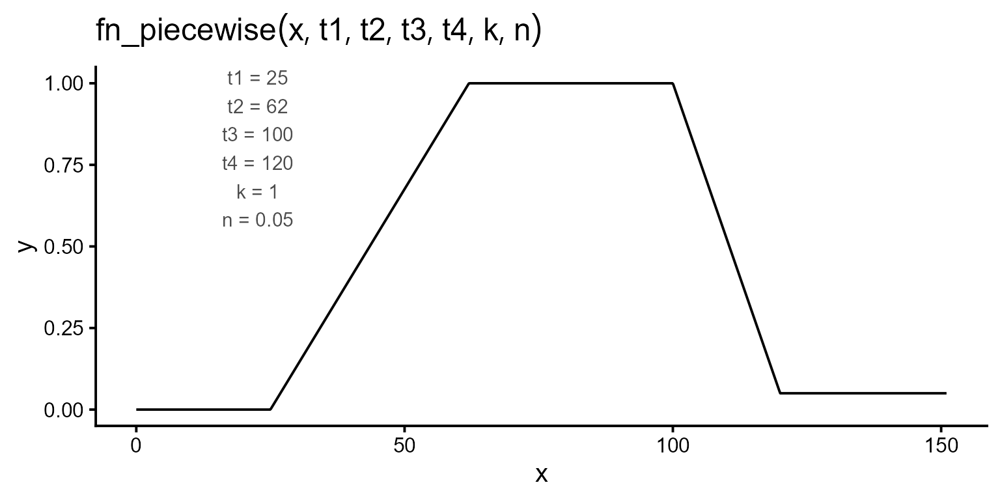
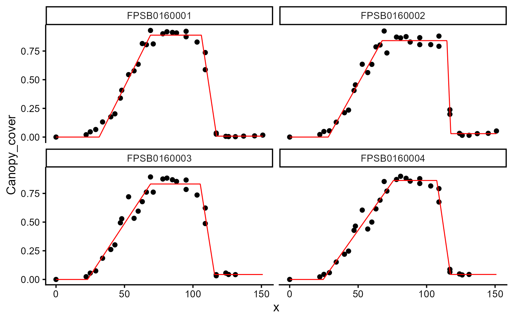

# Modeling soybean canopy cover

## Estimating soybean canopy development phases

We use canopy-cover data from the 2022 soybean season collected with ETH
Zurich’s Field Phenotyping Platform (Keller et al., 2026). The dataset
contains 78 plots measured on 30 dates, with canopy cover expressed as a
proportion from 0 to 1. The seasonal trajectories include canopy
expansion, a period of maximum cover, and canopy decline. We use a
piecewise function to estimate four transition times: `t1`, the onset of
canopy expansion; `t2`, the start of the maximum-cover plateau; `t3`,
the onset of canopy decline; and `t4`, the end of canopy decline. The
parameters `k` and `n` represent maximum and terminal canopy cover,
respectively.

``` r

library(flexFitR)
library(dplyr)
library(ggpubr)
library(ggplot2)
```

``` r

data(dt_soybean_22)
head(dt_soybean_22)
#> # A tibble: 6 × 7
#>   location  Year sowing_date harvest_date plot.UID    time_since_sowing
#>   <chr>    <dbl> <date>      <date>       <chr>                   <dbl>
#> 1 Eschikon  2022 2022-04-21  2022-09-23   FPSB0160001                 0
#> 2 Eschikon  2022 2022-04-21  2022-09-23   FPSB0160001                22
#> 3 Eschikon  2022 2022-04-21  2022-09-23   FPSB0160001                25
#> 4 Eschikon  2022 2022-04-21  2022-09-23   FPSB0160001                29
#> 5 Eschikon  2022 2022-04-21  2022-09-23   FPSB0160001                34
#> 6 Eschikon  2022 2022-04-21  2022-09-23   FPSB0160001                40
#> # ℹ 1 more variable: Canopy_cover <dbl>
```

## 1. Exploring data

We start with
[`explorer()`](https://apariciojohan.github.io/flexFitR/reference/explorer.md),
which summarizes the series and lets us look at the temporal evolution
of every plot before model fitting.

``` r

ex <- explorer(dt_soybean_22, x = time_since_sowing, y = Canopy_cover, id = plot.UID)
names(ex)
#> [1] "summ_vars"      "summ_metadata"  "locals_min_max" "dt_long"       
#> [5] "metadata"       "x_var"
```

``` r

plot(ex, type = "evolution", add_avg = TRUE)
#> Warning: Removed 32 rows containing missing values or values outside the scale range
#> (`geom_line()`).
```

 The
curve starts flat, rises steeply, plateaus near 0.87, then declines
through senescence but stops above zero. The curve does not return
completely to zero, indicating that some green canopy cover remains at
the end of the observed period. This remaining cover is represented by
the parameter `n`.

## 2. Regression function

The function takes time (`t`) first and the parameters after:

\\\begin{equation} f(t; t_1, t_2, t_3, t_4, k, n) = \begin{cases} 0 &
\text{if } t \< t_1 \\ \dfrac{k}{t_2 - t_1} \cdot (t - t_1) & \text{if }
t_1 \leq t \leq t_2 \\ k & \text{if } t_2 \< t \leq t_3 \\ n + (k - n)
\cdot \dfrac{t_4 - t}{t_4 - t_3} & \text{if } t_3 \< t \leq t_4 \\ n &
\text{if } t \> t_4 \end{cases} \end{equation}\\

``` r

fn_piecewise <- function(t, t1, t2, t3, t4, k, n) {
  ifelse(
    test = t < t1, yes = 0,
    no = ifelse(
      test = t <= t2, yes = k / (t2 - t1) * (t - t1),
      no = ifelse(
        test = t <= t3, yes = k,
        no = ifelse(
          test = t <= t4, yes = n + (k - n) * (t4 - t) / (t4 - t3),
          no = n
        )
      )
    )
  )
}
```

Before fitting anything,
[`plot_fn()`](https://apariciojohan.github.io/flexFitR/reference/plot_fn.md)
lets us draw the function at our proposed initial values.

``` r

initial_vals <- c(t1 = 25, t2 = 62, t3 = 100, t4 = 120, k = 1, n = 0.05)

plot_fn(
  fn = "fn_piecewise",
  params = initial_vals,
  interval = c(0, 151),
  color = "black",
  base_size = 15
)
```


That is a good starting guess: it reproduces the four breakpoints seen
in the evolution plot.

## 3. Fitting models

We fit 10 plots first. Scaling to the full trial will be shown at the
end.

``` r

plots_ids <- unique(dt_soybean_22$plot.UID)[1:10]

mod_1 <- dt_soybean_22 |>
  modeler(
    x = time_since_sowing,
    y = Canopy_cover,
    grp = plot.UID,
    fn = "fn_piecewise",
    parameters = initial_vals,
    subset = plots_ids,
    method = c("BFGS", "subplex")
  )
print(mod_1)
#> 
#> Call:
#> Canopy_cover ~ fn_piecewise(time_since_sowing, t1, t2, t3, t4, k, n) 
#> 
#> Residuals (`Standardized`):
#>     Min.  1st Qu.   Median     Mean  3rd Qu.     Max. 
#> -2.74326 -0.41092  0.03308  0.06519  0.63805  2.74532 
#> 
#> Optimization Results `head()`:
#>          uid   t1   t2  t3  t4     k       n    sse
#>  FPSB0160001 31.5 69.0 106 117 0.888 0.00815 0.0529
#>  FPSB0160002 28.2 67.6 115 118 0.841 0.02974 0.0615
#>  FPSB0160003 23.0 69.0 105 116 0.832 0.04308 0.1012
#>  FPSB0160004 24.5 75.8 107 117 0.863 0.04366 0.0763
#> 
#> Metrics:
#>  Groups      Timing Convergence  Iterations
#>      10 2.8407 secs        100% 2149.7 (id)
```

Passing more than one optimizer to `method` makes
[`modeler()`](https://apariciojohan.github.io/flexFitR/reference/modeler.md)
try each and keep the best solution per plot. Use
[`list_methods()`](https://apariciojohan.github.io/flexFitR/reference/list_methods.md)
to see the full set of available optimizers.

``` r

plot(mod_1, id = plots_ids[1:4])
```



``` r

knitr::kable(mutate_if(mod_1$param, is.numeric, round, 2))
```

| uid         |    t1 |    t2 |     t3 |     t4 |    k |    n |  sse | fn_name      |
|:------------|------:|------:|-------:|-------:|-----:|-----:|-----:|:-------------|
| FPSB0160001 | 31.51 | 69.00 | 106.13 | 117.28 | 0.89 | 0.01 | 0.05 | fn_piecewise |
| FPSB0160002 | 28.17 | 67.55 | 114.84 | 117.66 | 0.84 | 0.03 | 0.06 | fn_piecewise |
| FPSB0160003 | 23.05 | 69.00 | 105.33 | 115.79 | 0.83 | 0.04 | 0.10 | fn_piecewise |
| FPSB0160004 | 24.50 | 75.78 | 107.42 | 117.40 | 0.86 | 0.04 | 0.08 | fn_piecewise |
| FPSB0160005 | 26.77 | 69.00 | 108.24 | 119.43 | 0.84 | 0.03 | 0.08 | fn_piecewise |
| FPSB0160006 | 36.96 | 75.33 | 108.23 | 125.35 | 0.92 | 0.03 | 0.07 | fn_piecewise |
| FPSB0160007 | 31.22 | 67.95 | 107.02 | 117.27 | 0.88 | 0.02 | 0.05 | fn_piecewise |
| FPSB0160008 | 32.49 | 70.43 | 108.59 | 121.57 | 0.88 | 0.02 | 0.05 | fn_piecewise |
| FPSB0160009 | 32.89 | 74.62 | 107.50 | 119.37 | 0.87 | 0.02 | 0.05 | fn_piecewise |
| FPSB0160010 | 30.23 | 67.98 | 107.21 | 117.06 | 0.88 | 0.02 | 0.06 | fn_piecewise |

## 3.1. Extracting model coefficients and uncertainty measures

[`coef()`](https://rdrr.io/r/stats/coef.html),
[`confint()`](https://rdrr.io/r/stats/confint.html), and
[`vcov()`](https://rdrr.io/r/stats/vcov.html) return the parameter
estimates, confidence intervals, and variance-covariance matrices,
respectively.

``` r

coef(mod_1, id = plots_ids[1])
#> # A tibble: 6 × 7
#>   uid         fn_name      coefficient  solution std.error `t value` `Pr(>|t|)`
#>   <chr>       <chr>        <chr>           <dbl>     <dbl>     <dbl>      <dbl>
#> 1 FPSB0160001 fn_piecewise t1           31.5        1.20      26.2     9.59e-21
#> 2 FPSB0160001 fn_piecewise t2           69          0.879     78.5     2.12e-33
#> 3 FPSB0160001 fn_piecewise t3          106.         0.648    164.      5.25e-42
#> 4 FPSB0160001 fn_piecewise t4          117.         0.702    167.      2.98e-42
#> 5 FPSB0160001 fn_piecewise k             0.888      0.0141    63.0     7.69e-31
#> 6 FPSB0160001 fn_piecewise n             0.00815    0.0172     0.474   6.39e- 1
```

``` r

confint(mod_1, id = plots_ids[1])
#> # A tibble: 6 × 7
#>   uid         fn_name      coefficient  solution std.error ci_lower ci_upper
#>   <chr>       <chr>        <chr>           <dbl>     <dbl>    <dbl>    <dbl>
#> 1 FPSB0160001 fn_piecewise t1           31.5        1.20    29.0     34.0   
#> 2 FPSB0160001 fn_piecewise t2           69          0.879   67.2     70.8   
#> 3 FPSB0160001 fn_piecewise t3          106.         0.648  105.     107.    
#> 4 FPSB0160001 fn_piecewise t4          117.         0.702  116.     119.    
#> 5 FPSB0160001 fn_piecewise k             0.888      0.0141   0.860    0.917 
#> 6 FPSB0160001 fn_piecewise n             0.00815    0.0172  -0.0271   0.0434
```

``` r

vcov(mod_1, id = plots_ids[1])$FPSB0160001 |> round(digits = 3)
#>        t1     t2     t3     t4      k      n
#> t1  1.443 -0.354 -0.029  0.001  0.002  0.000
#> t2 -0.354  0.773 -0.059  0.001  0.005  0.000
#> t3 -0.029 -0.059  0.420 -0.204 -0.003  0.001
#> t4  0.001  0.001 -0.204  0.492  0.000 -0.005
#> k   0.002  0.005 -0.003  0.000  0.000  0.000
#> n   0.000  0.000  0.001 -0.005  0.000  0.000
#> attr(,"fn_name")
#> [1] "fn_piecewise"
```

``` r

knitr::kable(mutate_if(metrics(mod_1), is.numeric, round, 2))
```

| uid         | fn_name      | var          |  SSE |  MAE | MSE | RMSE |   R2 |   n |
|:------------|:-------------|:-------------|-----:|-----:|----:|-----:|-----:|----:|
| FPSB0160001 | fn_piecewise | Canopy_cover | 0.05 | 0.03 |   0 | 0.04 | 0.99 |  33 |
| FPSB0160002 | fn_piecewise | Canopy_cover | 0.06 | 0.03 |   0 | 0.04 | 0.99 |  33 |
| FPSB0160003 | fn_piecewise | Canopy_cover | 0.10 | 0.05 |   0 | 0.06 | 0.97 |  30 |
| FPSB0160004 | fn_piecewise | Canopy_cover | 0.08 | 0.04 |   0 | 0.05 | 0.98 |  30 |
| FPSB0160005 | fn_piecewise | Canopy_cover | 0.08 | 0.04 |   0 | 0.05 | 0.98 |  31 |
| FPSB0160006 | fn_piecewise | Canopy_cover | 0.07 | 0.03 |   0 | 0.05 | 0.98 |  32 |
| FPSB0160007 | fn_piecewise | Canopy_cover | 0.05 | 0.03 |   0 | 0.04 | 0.99 |  33 |
| FPSB0160008 | fn_piecewise | Canopy_cover | 0.05 | 0.03 |   0 | 0.04 | 0.99 |  33 |
| FPSB0160009 | fn_piecewise | Canopy_cover | 0.05 | 0.03 |   0 | 0.04 | 0.99 |  33 |
| FPSB0160010 | fn_piecewise | Canopy_cover | 0.06 | 0.03 |   0 | 0.04 | 0.99 |  33 |

## 4. Plotting options

`type = 2` shows the coefficients with their confidence intervals.
Restricting `parm` to the four time parameters keeps them on a common
scale:

``` r

mod_1 |>
  plot(type = 2, id = plots_ids, parm = c("t1", "t2", "t3", "t4"), label_size = 10) +
  theme(axis.text.x = element_text(angle = 65, hjust = 1))
```

`type = 3`
overlays every fitted curve, which is a good way to spot a plot that
behaved differently from the rest:

``` r

plot(mod_1, type = 3, id = plots_ids)
```


`type = 4` adds confidence (blue) and prediction (red) intervals, and
`type = 5` plots the first derivative. For this function, the canopy
expansion and senescence rates appear as two flat steps:

``` r

a <- plot(mod_1, type = 4, id = plots_ids[1], color = "black")
b <- plot(mod_1, type = 5, id = plots_ids[1], color = "black")
ggarrange(a, b)
```


## 5. Deriving canopy development traits

The fitted parameters are already stage estimates, but some other
interesting quantities we usually compare are *differences* between
them.
[`predict.modeler()`](https://apariciojohan.github.io/flexFitR/reference/predict.modeler.md)
accepts a formula involving the fitted parameters and propagates their
uncertainty:

``` r

durations <- rbind(
  predict(mod_1, formula = ~ t2 - t1, id = plots_ids),
  predict(mod_1, formula = ~ t3 - t2, id = plots_ids),
  predict(mod_1, formula = ~ t4 - t3, id = plots_ids)
)
```

``` r

durations |>
  mutate_if(is.numeric, round, 2) |>
  filter(uid %in% "FPSB0160001") |>
  select(-fn_name) |>
  knitr::kable()
```

| uid         | formula | predicted.value | std.error |
|:------------|:--------|----------------:|----------:|
| FPSB0160001 | t2 - t1 |           37.49 |      1.71 |
| FPSB0160001 | t3 - t2 |           37.13 |      1.15 |
| FPSB0160001 | t4 - t3 |           11.15 |      1.15 |

These three read as the duration of canopy expansion, the length of the
full-canopy plateau, and the duration of senescence.

We can also get rates rather than durations — the slope of the expansion
phase is `k / (t2 - t1)`:

``` r

predict(mod_1, formula = ~ k / (t2 - t1), id = plots_ids[1:2]) |>
  mutate_if(is.numeric, round, 3) |>
  knitr::kable()
```

| uid         | fn_name      | formula     | predicted.value | std.error |
|:------------|:-------------|:------------|----------------:|----------:|
| FPSB0160001 | fn_piecewise | k/(t2 - t1) |           0.024 |     0.001 |
| FPSB0160002 | fn_piecewise | k/(t2 - t1) |           0.021 |     0.001 |

Integrating the fitted curve provides the area under the canopy-cover
curve, expressed in canopy-cover days:

``` r

predict(mod_1, x = c(0, 151), type = "auc", id = plots_ids[1:3]) |>
  mutate_if(is.numeric, round, 2) |>
  knitr::kable()
```

| uid         | fn_name      | x_min | x_max | predicted.value | std.error |
|:------------|:-------------|------:|------:|----------------:|----------:|
| FPSB0160001 | fn_piecewise |     0 |   151 |           54.92 |      0.99 |
| FPSB0160002 | fn_piecewise |     0 |   151 |           58.52 |      1.09 |
| FPSB0160003 | fn_piecewise |     0 |   151 |           55.45 |      1.46 |

## 6. Modeling all plots using parallel processing

Finally, the same call scales to all 78 plots by adding the `options`
argument.

``` r

mod <- dt_soybean_22 |>
  modeler(
    x = time_since_sowing,
    y = Canopy_cover,
    grp = plot.UID,
    keep = c(location, Year),
    fn = "fn_piecewise",
    parameters = initial_vals,
    method = c("BFGS", "subplex"),
    options = list(progress = TRUE, parallel = TRUE, workers = 5)
  )
```

## 7. Conclusion

Using the publicly available soybean ground cover dataset from Keller et
al. (2026), we demonstrated how flexFitR can transform time-series
observations into interpretable growth parameters. We thank the authors
for making the dataset publicly available.

## References

Keller, B., Kirchgessner, N., Oppliger, C., Kronenberg, L., Roth, L.,
Zumsteg, O., Corrado, S., Liebisch, F., Aasen, H., Storni, N., Tschurr,
F., Zellweger, H., Betrix, C. A., Barendregt, C., Hund, A., & Walter, A.
(2026). FIP 1.0 soybean data: Insights on soybean growth from eight
years of high-throughput image field phenotyping. *Scientific Data*,
13(1), 476. <https://doi.org/10.1038/s41597-026-06663-z>

  
