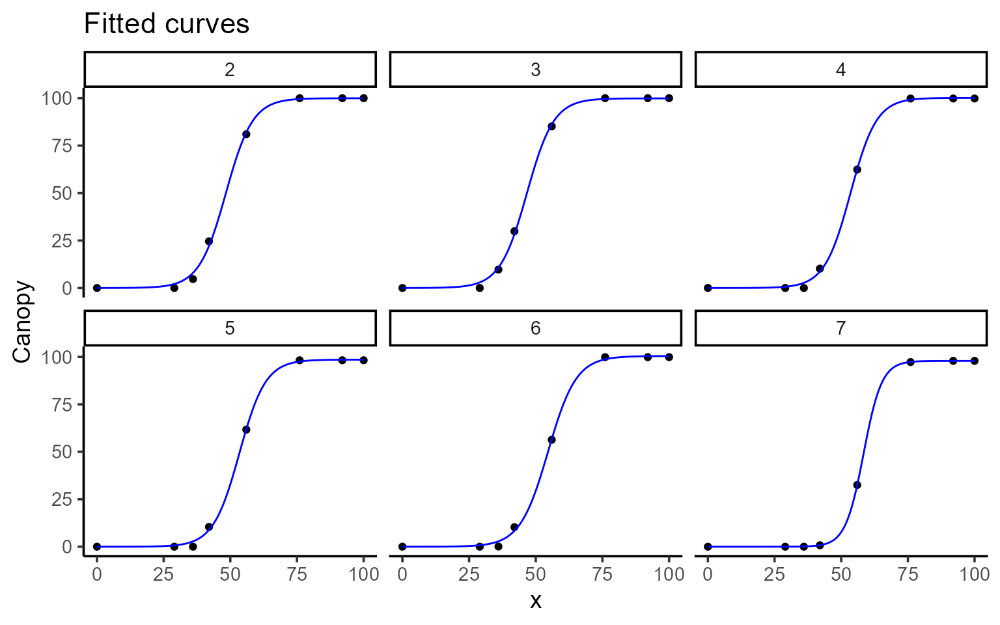
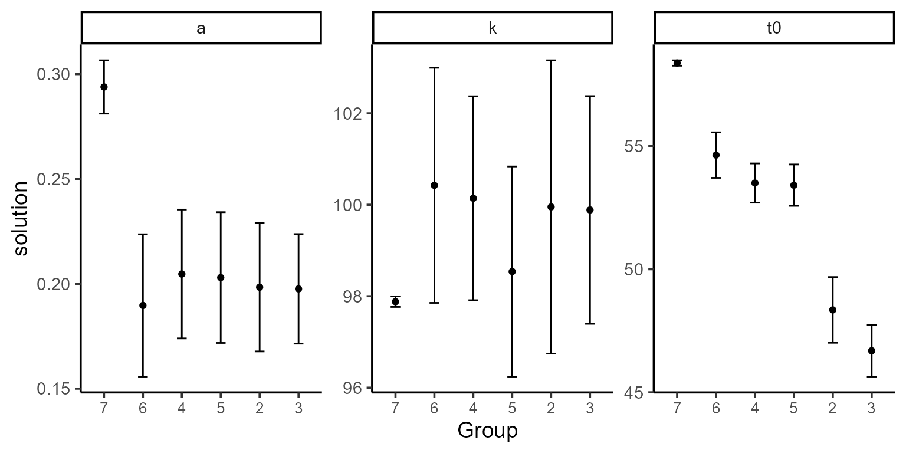
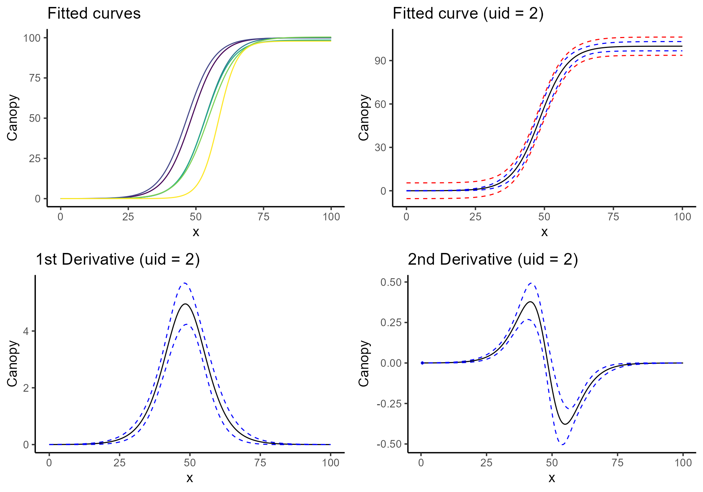

# Plotting options

## Loading dataset and libraries

``` r
library(flexFitR)
library(dplyr)
library(kableExtra)
library(ggpubr)
library(purrr)
data(dt_potato)
head(dt_potato) |> kable()
```

| Trial        | Plot | Row | Range | gid       | DAP | Canopy |        GLI |
|:-------------|-----:|----:|------:|:----------|----:|-------:|-----------:|
| HARS20_chips |    1 |   1 |     1 | W17037-24 |   0 |  0.000 |  0.0000000 |
| HARS20_chips |    1 |   1 |     1 | W17037-24 |  29 |  0.000 |  0.0027216 |
| HARS20_chips |    1 |   1 |     1 | W17037-24 |  36 |  0.670 | -0.0008966 |
| HARS20_chips |    1 |   1 |     1 | W17037-24 |  42 | 15.114 |  0.0322547 |
| HARS20_chips |    1 |   1 |     1 | W17037-24 |  56 | 75.424 |  0.2326896 |
| HARS20_chips |    1 |   1 |     1 | W17037-24 |  76 | 99.811 |  0.3345619 |

## Modeling

``` r
plots <- 2:7
mod <- dt_potato |>
  modeler(
    x = DAP,
    y = Canopy,
    grp = Plot,
    fn = "fn_logistic",
    parameters = c(a = 4, t0 = 40, k = 100),
    subset = plots
  )
```

## Plotting predictions and derivatives

``` r
# Raw data with fitted curves
plot(mod, type = 1, color = "blue", id = plots, title = "Fitted curves")
```



``` r
# Model coefficients
plot(mod, type = 2, color = "blue", id = plots, label_size = 10)
```



``` r
# Fitted curves only
c <- plot(mod, type = 3, color = "blue", id = plots, title = "Fitted curves")
```

``` r
# Fitted curves with confidence intervals
d <- plot(mod, type = 4, n_points = 200, title = "Fitted curve (uid = 2)")
```

``` r
# First derivative with confidence intervals
e <- plot(mod, type = 5, n_points = 200, title = "1st Derivative (uid = 2)")
```

``` r
# Second derivative with confidence intervals
f <- plot(mod, type = 6, n_points = 200, title = "2nd Derivative (uid = 2)")
ggarrange(c, d, e, f)
```


