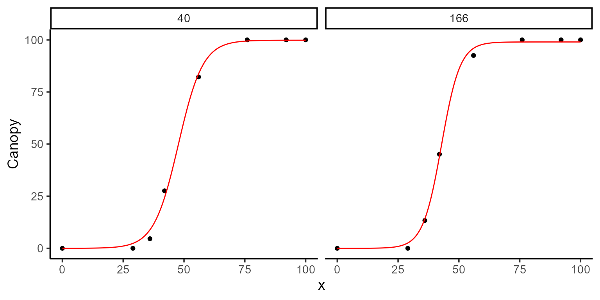
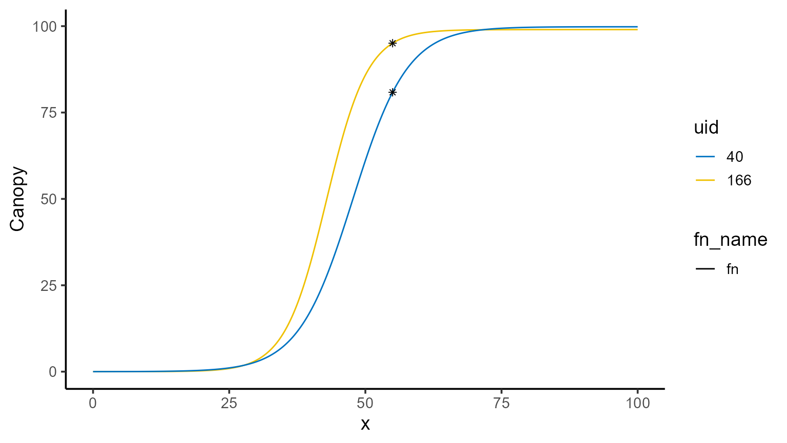
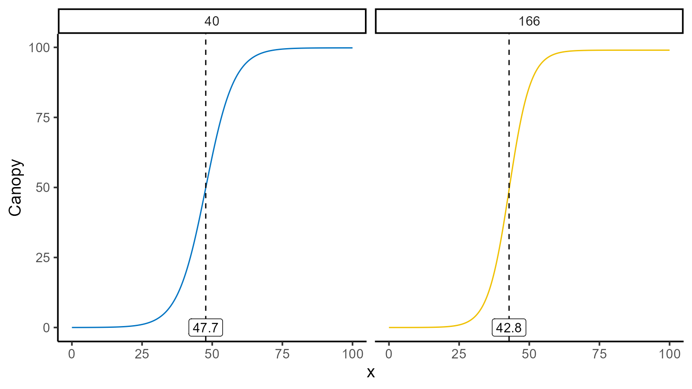

# Predicted values

This vignette demonstrates the versatility and utility of the
[`predict.modeler()`](https://apariciojohan.github.io/flexFitR/reference/predict.modeler.md)
function when applied to a fitted model. This function is designed to
handle models of class `modeler` and provides several prediction types,
outlined as follows:

- **“point”**: Computes the value of the fitted function \\\hat{f}(x)\\
  for a given vector of \\x\\ values.  
- **“auc”**: Calculates the area under the fitted curve (AUC) over a
  specified interval by approximating the integral using the trapezoidal
  rule.  
- **“fd”**: Provides the first derivative \\\hat{f}'(x)\\ for a given
  vector of \\x\\ values using numerical approximation.  
- **“sd”**: Computes the second derivative \\\hat{f}''(x)\\ for a given
  vector of \\x\\ values using numerical approximation.  
- **“formula”**: Evaluates a user-defined function of the model
  parameters, returning both the predicted value and its standard error.

Each type of prediction includes corresponding standard errors, which
are calculated using the delta method.

``` r
library(flexFitR)
library(dplyr)
library(kableExtra)
library(ggpubr)
library(purrr)
data(dt_potato)
head(dt_potato) |> kable()
```

| Trial        | Plot | Row | Range | gid       | DAP | Canopy |        GLI |
|:-------------|-----:|----:|------:|:----------|----:|-------:|-----------:|
| HARS20_chips |    1 |   1 |     1 | W17037-24 |   0 |  0.000 |  0.0000000 |
| HARS20_chips |    1 |   1 |     1 | W17037-24 |  29 |  0.000 |  0.0027216 |
| HARS20_chips |    1 |   1 |     1 | W17037-24 |  36 |  0.670 | -0.0008966 |
| HARS20_chips |    1 |   1 |     1 | W17037-24 |  42 | 15.114 |  0.0322547 |
| HARS20_chips |    1 |   1 |     1 | W17037-24 |  56 | 75.424 |  0.2326896 |
| HARS20_chips |    1 |   1 |     1 | W17037-24 |  76 | 99.811 |  0.3345619 |

## 0. Model fitting

To illustrate the functionality of
[`predict()`](https://rdrr.io/r/stats/predict.html), we use a potato
dataset to fit logistic models of the form:

\\f(t) = \frac{L}{1 + e^{-k(t - t_0)}}\\

``` r
fun_logistic <- function(t, L, k, t0) L / (1 + exp(-k * (t - t0)))
```

For simplicity, we’ll focus on just two plots from the dataset (plot 40
and plot 166) out of the total 196 plots available. After fitting the
model, we’ll take a closer look at the parameter estimates, visualize
the fitted curves, and start making predictions.

``` r
plots <- c(40, 166)
```

``` r
mod_1 <- dt_potato |>
  modeler(
    x = DAP,
    y = Canopy,
    grp = Plot,
    fn = "fun_logistic",
    parameters = c(L = 100, k = 4, t0 = 40),
    subset = plots
  )
```

``` r
print(mod_1)
#> 
#> Call:
#> Canopy ~ fun_logistic(DAP, L, k, t0) 
#> 
#> Residuals (`Standardized`):
#>    Min. 1st Qu.  Median    Mean 3rd Qu.    Max. 
#> -1.5910 -0.6313  0.0326 -0.1693  0.4665  1.2007 
#> 
#> Optimization Results `head()`:
#>  uid    L     k   t0  sse
#>   40 99.8 0.199 47.7 37.4
#>  166 99.0 0.262 42.8 23.2
#> 
#> Metrics:
#>  Groups      Timing Convergence Iterations
#>       2 0.6741 secs        100%   712 (id)
```

``` r
plot(mod_1, id = plots)
```



## 1. Point prediction

To make point predictions, we use the
[`predict()`](https://rdrr.io/r/stats/predict.html) function and specify
the \\x\\ value(s) for which we want to compute \\\hat{f}(x)\\. By
default, the prediction type is set to `"point"`, so it is unnecessary
to explicitly include `type = "point"`.

``` r
points <- predict(mod_1, x = 55, type = "point", se_interval = "confidence")
points |> kable()
```

| uid | fn_name      | x_new | predicted.value | std.error |
|----:|:-------------|------:|----------------:|----------:|
|  40 | fun_logistic |    55 |        80.85282 |  2.912364 |
| 166 | fun_logistic |    55 |        95.06255 |  1.625402 |

A great way to visualize this is by plotting the fitted curve and
overlaying the predicted points.

``` r
mod_1 |>
  plot(id = plots, type = 3) +
  color_palette(palette = "jco") +
  geom_point(data = points, aes(x = x_new, y = predicted.value), shape = 8)
```



You’ll also notice that predictions come with standard errors, which can
be adjusted using the `se_interval` argument to choose between
`"confidence"` or `"prediction"` intervals, depending on the type of
intervals you want to generate (sometimes referred to as narrow vs. wide
intervals).

``` r
points <- predict(mod_1, x = 55, type = "point", se_interval = "prediction")
points |> kable()
```

| uid | fn_name      | x_new | predicted.value | std.error |
|----:|:-------------|------:|----------------:|----------:|
|  40 | fun_logistic |    55 |        80.85282 |  3.994805 |
| 166 | fun_logistic |    55 |        95.06255 |  2.697961 |

## 2. Integral of the function (area under the curve)

The area under the fitted curve is another common calculation,
especially when trying to summarize the overall behavior of a function
over a specific range. To compute the AUC, set `type = "auc"` and
provide the interval of interest in the `x` argument. You can also
specify the number of subintervals for the trapezoidal rule
approximation using `n_points` (e.g., `n_points = 500` provides a
high-resolution approximation here).

\\ \text{Area} = \int\_{0}^{T} \frac{L}{1 + e^{-k(t - t_0)}} \\ dt \\

``` r
predict(mod_1, x = c(0, 108), type = "auc", n_points = 500) |> kable()
```

| uid | fn_name      | x_min | x_max | predicted.value | std.error |
|----:|:-------------|------:|------:|----------------:|----------:|
|  40 | fun_logistic |     0 |   108 |        6018.833 |  89.57456 |
| 166 | fun_logistic |     0 |   108 |        6450.840 |  69.71235 |

## 3. Function of the parameters

In many cases, interest lies not in the parameters themselves but in
functions of these parameters. By using the `formula` argument, we can
compute user-defined functions of the estimated parameters along with
their standard errors. No additional arguments are required for this
functionality.

``` r
predict(mod_1, formula = ~ k / L * 100) |> kable()
```

| uid | fn_name      | formula    | predicted.value | std.error |
|----:|:-------------|:-----------|----------------:|----------:|
|  40 | fun_logistic | k/L \* 100 |       0.1990757 | 0.0173468 |
| 166 | fun_logistic | k/L \* 100 |       0.2644616 | 0.0312821 |

``` r
predict(mod_1, formula = ~ (k * L) / 4) |> kable()
```

| uid | fn_name      | formula    | predicted.value | std.error |
|----:|:-------------|:-----------|----------------:|----------:|
|  40 | fun_logistic | (k \* L)/4 |        4.959301 | 0.3761384 |
| 166 | fun_logistic | (k \* L)/4 |        6.480310 | 0.7140117 |

## 4. Derivatives

For those interested in the derivatives of the fitted function,
[`predict.modeler()`](https://apariciojohan.github.io/flexFitR/reference/predict.modeler.md)
provides tools to compute both the first (\\f'(x)\\) and second order
(\\f''(x)\\) derivatives at specified points or over intervals. While
derivatives for logistic functions are straightforward to compute
analytically, this is not true for many other functions. To address
this, [`predict()`](https://rdrr.io/r/stats/predict.html) employs a
numerical approximation using the “Richardson” method.

For the logistic function, the first derivative has the following form:

\\ f'(t) = \frac{k L e^{-k(t - t_0)}}{\left(1 + e^{-k(t -
t_0)}\right)^2} \\

And the second derivative the following:

\\f''(t) = \frac{k^2 L e^{-k(t - t_0)} \left(1 - e^{-k(t -
t_0)}\right)}{\left(1 + e^{-k(t - t_0)}\right)^3}\\ Here the first
derivative tells us the growth rate, while the second derivative reveals
how the growth rate is accelerating or decelerating.

### 4.1. First derivative

To compute the first derivative, set `type = "fd"` in the
[`predict()`](https://rdrr.io/r/stats/predict.html) function and provide
points or intervals in the `x` argument. In case we just want to
visualize the first derivative we can use the
[`plot()`](https://rdrr.io/r/graphics/plot.default.html) function.

``` r
plot(mod_1, id = plots, type = 5, color = "blue", add_ci = FALSE)
```


The \\x\\-coordinate where the maximum occurs can be found
programmatically, and the corresponding value of \\\hat{f}(x)\\ can be
computed using point predictions as follows:

``` r
interval <- seq(0, 100, by = 0.1)
points_fd <- mod_1 |>
  predict(x = interval, type = "fd") |>
  group_by(uid) |>
  summarise(
    max_fd = max(predicted.value),
    argmax_fd = x_new[which.max(predicted.value)]
  )
points_fd |> kable()
```

| uid |   max_fd | argmax_fd |
|----:|---------:|----------:|
|  40 | 4.959300 |      47.7 |
| 166 | 6.480117 |      42.8 |

``` r
mod_1 |>
  plot(id = plots, type = 3) +
  color_palette(palette = "jco") +
  geom_vline(data = points_fd, aes(xintercept = argmax_fd), linetype = 2) +
  geom_label(data = points_fd, aes(x = argmax_fd, y = 0, label = argmax_fd)) +
  facet_wrap(~uid) +
  theme(legend.position = "none")
```



``` r
points_fd$y_hat <- sapply(
  X = plots,
  FUN = \(i) {
    mod_1 |>
      predict(x = points_fd[points_fd$uid == i, "argmax_fd"], id = i) |>
      pull(predicted.value)
  }
)
points_fd |> kable()
```

| uid |   max_fd | argmax_fd |    y_hat |
|----:|---------:|----------:|---------:|
|  40 | 4.959300 |      47.7 | 49.88846 |
| 166 | 6.480117 |      42.8 | 49.23131 |

``` r
mod_1 |>
  plot(id = plots, type = 3) +
  color_palette(palette = "jco") +
  geom_point(data = points_fd, aes(x = argmax_fd, y = y_hat), shape = 8)
```


### 4.2. Second derivative

Similarly, the second derivative can be calculated by setting
`type = "sd"`. This derivative shows how the growth rate itself is
changing, helping to determine when growth starts to slow down or speed
up.

``` r
plot(mod_1, id = plots, type = 6, color = "blue", add_ci = FALSE)
```


We can also identify where the second derivative reaches its maximum and
minimum values, and plot these changes for a deeper understanding of the
growth dynamics.

``` r
points_sd <- mod_1 |>
  predict(x = interval, type = "sd") |>
  group_by(uid) |>
  summarise(
    max_sd = max(predicted.value),
    argmax_sd = x_new[which.max(predicted.value)],
    min_sd = min(predicted.value),
    argmin_sd = x_new[which.min(predicted.value)]
  )
points_sd |> kable()
```

| uid |    max_sd | argmax_sd |     min_sd | argmin_sd |
|----:|----------:|----------:|-----------:|----------:|
|  40 | 0.3793269 |      41.1 | -0.3793232 |      54.3 |
| 166 | 0.6530569 |      37.8 | -0.6530419 |      47.9 |

``` r
mod_1 |>
  plot(id = plots, type = 3) +
  color_palette(palette = "jco") +
  geom_vline(data = points_sd, aes(xintercept = argmax_sd), linetype = 2) +
  geom_vline(data = points_sd, aes(xintercept = argmin_sd), linetype = 2) +
  facet_wrap(~uid) +
  theme(legend.position = "none")
```


## 5. Conclusions

The
[`predict.modeler()`](https://apariciojohan.github.io/flexFitR/reference/predict.modeler.md)
function, as part of the modeling toolkit, offers a range of useful
predictions that can be tailored to various needs—whether it’s making
point estimates, exploring the area under a curve, or analyzing
derivatives. While the examples presented here showcase the flexibility
and power of the function, they are just the beginning. Every dataset
and research question brings its own unique challenges, and we hope this
vignette demonstrates how
[`predict.modeler()`](https://apariciojohan.github.io/flexFitR/reference/predict.modeler.md)
can help address those.
