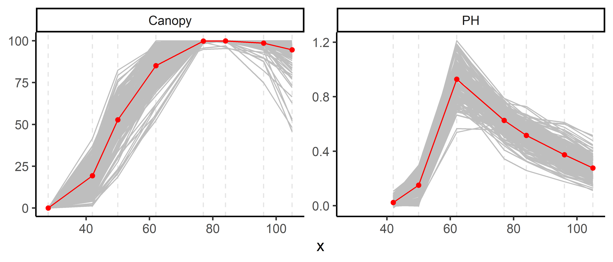
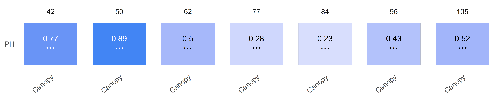

<!-- README.md is generated from README.Rmd. Please edit that file -->

# exploreHTP <a href="https://apariciojohan.github.io/exploreHTP/"></a>

<!-- badges: start -->
<!-- badges: end -->

exploreHTP is designed to assist researchers and plant breeders in
efficiently exploring and analyzing data derived from drone imagery.
This package offers a suite of tools tailored to the unique needs of
plant breeding data, facilitating comprehensive data exploration,
correlation analysis, and data manipulation.

Key functionalities include:

- Data Exploration: Simplified methods for visualizing and manipulating
  large datasets from high throughput phenotyping.
- Correlation Analysis: Tools to calculate correlations between
  different traits and across multiple time points, providing insights
  into trait relationships and temporal dynamics.
- Modeling Canopy Evolution: Advanced functionalities for modeling and
  predicting canopy growth and development over time.

## Installation

You can install the development version of exploreHTP from
[GitHub](https://github.com/) with:

``` r
# install.packages("devtools")
devtools::install_github("AparicioJohan/exploreHTP")
```

## 1. Reading Data

This is a basic example which shows how to use exploreHTP:

``` r
library(exploreHTP)
data(dt_potato)
dt_potato <- dt_potato

results <- read_HTP(
  data = dt_potato,
  genotype = "Gen",
  time = "DAP",
  plot = "Plot",
  traits = c("Canopy", "PH"),
  row = "Row",
  range = "Range"
)
names(results)
#> [1] "summ_traits"      "exp_design_resum" "locals_min_max"   "dt_long"
```

``` r
plot(results, type = "evolution")
```



``` r
head(results$summ_traits)
```

<div id="cyypvjrxzw" style="padding-left:0px;padding-right:0px;padding-top:10px;padding-bottom:10px;overflow-x:auto;overflow-y:auto;width:auto;height:auto;">
<style>#cyypvjrxzw table {
  font-family: system-ui, 'Segoe UI', Roboto, Helvetica, Arial, sans-serif, 'Apple Color Emoji', 'Segoe UI Emoji', 'Segoe UI Symbol', 'Noto Color Emoji';
  -webkit-font-smoothing: antialiased;
  -moz-osx-font-smoothing: grayscale;
}
&#10;#cyypvjrxzw thead, #cyypvjrxzw tbody, #cyypvjrxzw tfoot, #cyypvjrxzw tr, #cyypvjrxzw td, #cyypvjrxzw th {
  border-style: none;
}
&#10;#cyypvjrxzw p {
  margin: 0;
  padding: 0;
}
&#10;#cyypvjrxzw .gt_table {
  display: table;
  border-collapse: collapse;
  line-height: normal;
  margin-left: auto;
  margin-right: auto;
  color: #333333;
  font-size: 16px;
  font-weight: normal;
  font-style: normal;
  background-color: #FFFFFF;
  width: auto;
  border-top-style: solid;
  border-top-width: 2px;
  border-top-color: #A8A8A8;
  border-right-style: none;
  border-right-width: 2px;
  border-right-color: #D3D3D3;
  border-bottom-style: solid;
  border-bottom-width: 2px;
  border-bottom-color: #A8A8A8;
  border-left-style: none;
  border-left-width: 2px;
  border-left-color: #D3D3D3;
}
&#10;#cyypvjrxzw .gt_caption {
  padding-top: 4px;
  padding-bottom: 4px;
}
&#10;#cyypvjrxzw .gt_title {
  color: #333333;
  font-size: 125%;
  font-weight: initial;
  padding-top: 4px;
  padding-bottom: 4px;
  padding-left: 5px;
  padding-right: 5px;
  border-bottom-color: #FFFFFF;
  border-bottom-width: 0;
}
&#10;#cyypvjrxzw .gt_subtitle {
  color: #333333;
  font-size: 85%;
  font-weight: initial;
  padding-top: 3px;
  padding-bottom: 5px;
  padding-left: 5px;
  padding-right: 5px;
  border-top-color: #FFFFFF;
  border-top-width: 0;
}
&#10;#cyypvjrxzw .gt_heading {
  background-color: #FFFFFF;
  text-align: center;
  border-bottom-color: #FFFFFF;
  border-left-style: none;
  border-left-width: 1px;
  border-left-color: #D3D3D3;
  border-right-style: none;
  border-right-width: 1px;
  border-right-color: #D3D3D3;
}
&#10;#cyypvjrxzw .gt_bottom_border {
  border-bottom-style: solid;
  border-bottom-width: 2px;
  border-bottom-color: #D3D3D3;
}
&#10;#cyypvjrxzw .gt_col_headings {
  border-top-style: solid;
  border-top-width: 2px;
  border-top-color: #D3D3D3;
  border-bottom-style: solid;
  border-bottom-width: 2px;
  border-bottom-color: #D3D3D3;
  border-left-style: none;
  border-left-width: 1px;
  border-left-color: #D3D3D3;
  border-right-style: none;
  border-right-width: 1px;
  border-right-color: #D3D3D3;
}
&#10;#cyypvjrxzw .gt_col_heading {
  color: #333333;
  background-color: #FFFFFF;
  font-size: 100%;
  font-weight: normal;
  text-transform: inherit;
  border-left-style: none;
  border-left-width: 1px;
  border-left-color: #D3D3D3;
  border-right-style: none;
  border-right-width: 1px;
  border-right-color: #D3D3D3;
  vertical-align: bottom;
  padding-top: 5px;
  padding-bottom: 6px;
  padding-left: 5px;
  padding-right: 5px;
  overflow-x: hidden;
}
&#10;#cyypvjrxzw .gt_column_spanner_outer {
  color: #333333;
  background-color: #FFFFFF;
  font-size: 100%;
  font-weight: normal;
  text-transform: inherit;
  padding-top: 0;
  padding-bottom: 0;
  padding-left: 4px;
  padding-right: 4px;
}
&#10;#cyypvjrxzw .gt_column_spanner_outer:first-child {
  padding-left: 0;
}
&#10;#cyypvjrxzw .gt_column_spanner_outer:last-child {
  padding-right: 0;
}
&#10;#cyypvjrxzw .gt_column_spanner {
  border-bottom-style: solid;
  border-bottom-width: 2px;
  border-bottom-color: #D3D3D3;
  vertical-align: bottom;
  padding-top: 5px;
  padding-bottom: 5px;
  overflow-x: hidden;
  display: inline-block;
  width: 100%;
}
&#10;#cyypvjrxzw .gt_spanner_row {
  border-bottom-style: hidden;
}
&#10;#cyypvjrxzw .gt_group_heading {
  padding-top: 8px;
  padding-bottom: 8px;
  padding-left: 5px;
  padding-right: 5px;
  color: #333333;
  background-color: #FFFFFF;
  font-size: 100%;
  font-weight: initial;
  text-transform: inherit;
  border-top-style: solid;
  border-top-width: 2px;
  border-top-color: #D3D3D3;
  border-bottom-style: solid;
  border-bottom-width: 2px;
  border-bottom-color: #D3D3D3;
  border-left-style: none;
  border-left-width: 1px;
  border-left-color: #D3D3D3;
  border-right-style: none;
  border-right-width: 1px;
  border-right-color: #D3D3D3;
  vertical-align: middle;
  text-align: left;
}
&#10;#cyypvjrxzw .gt_empty_group_heading {
  padding: 0.5px;
  color: #333333;
  background-color: #FFFFFF;
  font-size: 100%;
  font-weight: initial;
  border-top-style: solid;
  border-top-width: 2px;
  border-top-color: #D3D3D3;
  border-bottom-style: solid;
  border-bottom-width: 2px;
  border-bottom-color: #D3D3D3;
  vertical-align: middle;
}
&#10;#cyypvjrxzw .gt_from_md > :first-child {
  margin-top: 0;
}
&#10;#cyypvjrxzw .gt_from_md > :last-child {
  margin-bottom: 0;
}
&#10;#cyypvjrxzw .gt_row {
  padding-top: 8px;
  padding-bottom: 8px;
  padding-left: 5px;
  padding-right: 5px;
  margin: 10px;
  border-top-style: solid;
  border-top-width: 1px;
  border-top-color: #D3D3D3;
  border-left-style: none;
  border-left-width: 1px;
  border-left-color: #D3D3D3;
  border-right-style: none;
  border-right-width: 1px;
  border-right-color: #D3D3D3;
  vertical-align: middle;
  overflow-x: hidden;
}
&#10;#cyypvjrxzw .gt_stub {
  color: #333333;
  background-color: #FFFFFF;
  font-size: 100%;
  font-weight: initial;
  text-transform: inherit;
  border-right-style: solid;
  border-right-width: 2px;
  border-right-color: #D3D3D3;
  padding-left: 5px;
  padding-right: 5px;
}
&#10;#cyypvjrxzw .gt_stub_row_group {
  color: #333333;
  background-color: #FFFFFF;
  font-size: 100%;
  font-weight: initial;
  text-transform: inherit;
  border-right-style: solid;
  border-right-width: 2px;
  border-right-color: #D3D3D3;
  padding-left: 5px;
  padding-right: 5px;
  vertical-align: top;
}
&#10;#cyypvjrxzw .gt_row_group_first td {
  border-top-width: 2px;
}
&#10;#cyypvjrxzw .gt_row_group_first th {
  border-top-width: 2px;
}
&#10;#cyypvjrxzw .gt_summary_row {
  color: #333333;
  background-color: #FFFFFF;
  text-transform: inherit;
  padding-top: 8px;
  padding-bottom: 8px;
  padding-left: 5px;
  padding-right: 5px;
}
&#10;#cyypvjrxzw .gt_first_summary_row {
  border-top-style: solid;
  border-top-color: #D3D3D3;
}
&#10;#cyypvjrxzw .gt_first_summary_row.thick {
  border-top-width: 2px;
}
&#10;#cyypvjrxzw .gt_last_summary_row {
  padding-top: 8px;
  padding-bottom: 8px;
  padding-left: 5px;
  padding-right: 5px;
  border-bottom-style: solid;
  border-bottom-width: 2px;
  border-bottom-color: #D3D3D3;
}
&#10;#cyypvjrxzw .gt_grand_summary_row {
  color: #333333;
  background-color: #FFFFFF;
  text-transform: inherit;
  padding-top: 8px;
  padding-bottom: 8px;
  padding-left: 5px;
  padding-right: 5px;
}
&#10;#cyypvjrxzw .gt_first_grand_summary_row {
  padding-top: 8px;
  padding-bottom: 8px;
  padding-left: 5px;
  padding-right: 5px;
  border-top-style: double;
  border-top-width: 6px;
  border-top-color: #D3D3D3;
}
&#10;#cyypvjrxzw .gt_last_grand_summary_row_top {
  padding-top: 8px;
  padding-bottom: 8px;
  padding-left: 5px;
  padding-right: 5px;
  border-bottom-style: double;
  border-bottom-width: 6px;
  border-bottom-color: #D3D3D3;
}
&#10;#cyypvjrxzw .gt_striped {
  background-color: rgba(128, 128, 128, 0.05);
}
&#10;#cyypvjrxzw .gt_table_body {
  border-top-style: solid;
  border-top-width: 2px;
  border-top-color: #D3D3D3;
  border-bottom-style: solid;
  border-bottom-width: 2px;
  border-bottom-color: #D3D3D3;
}
&#10;#cyypvjrxzw .gt_footnotes {
  color: #333333;
  background-color: #FFFFFF;
  border-bottom-style: none;
  border-bottom-width: 2px;
  border-bottom-color: #D3D3D3;
  border-left-style: none;
  border-left-width: 2px;
  border-left-color: #D3D3D3;
  border-right-style: none;
  border-right-width: 2px;
  border-right-color: #D3D3D3;
}
&#10;#cyypvjrxzw .gt_footnote {
  margin: 0px;
  font-size: 90%;
  padding-top: 4px;
  padding-bottom: 4px;
  padding-left: 5px;
  padding-right: 5px;
}
&#10;#cyypvjrxzw .gt_sourcenotes {
  color: #333333;
  background-color: #FFFFFF;
  border-bottom-style: none;
  border-bottom-width: 2px;
  border-bottom-color: #D3D3D3;
  border-left-style: none;
  border-left-width: 2px;
  border-left-color: #D3D3D3;
  border-right-style: none;
  border-right-width: 2px;
  border-right-color: #D3D3D3;
}
&#10;#cyypvjrxzw .gt_sourcenote {
  font-size: 90%;
  padding-top: 4px;
  padding-bottom: 4px;
  padding-left: 5px;
  padding-right: 5px;
}
&#10;#cyypvjrxzw .gt_left {
  text-align: left;
}
&#10;#cyypvjrxzw .gt_center {
  text-align: center;
}
&#10;#cyypvjrxzw .gt_right {
  text-align: right;
  font-variant-numeric: tabular-nums;
}
&#10;#cyypvjrxzw .gt_font_normal {
  font-weight: normal;
}
&#10;#cyypvjrxzw .gt_font_bold {
  font-weight: bold;
}
&#10;#cyypvjrxzw .gt_font_italic {
  font-style: italic;
}
&#10;#cyypvjrxzw .gt_super {
  font-size: 65%;
}
&#10;#cyypvjrxzw .gt_footnote_marks {
  font-size: 75%;
  vertical-align: 0.4em;
  position: initial;
}
&#10;#cyypvjrxzw .gt_asterisk {
  font-size: 100%;
  vertical-align: 0;
}
&#10;#cyypvjrxzw .gt_indent_1 {
  text-indent: 5px;
}
&#10;#cyypvjrxzw .gt_indent_2 {
  text-indent: 10px;
}
&#10;#cyypvjrxzw .gt_indent_3 {
  text-indent: 15px;
}
&#10;#cyypvjrxzw .gt_indent_4 {
  text-indent: 20px;
}
&#10;#cyypvjrxzw .gt_indent_5 {
  text-indent: 25px;
}
</style>
<table class="gt_table" data-quarto-disable-processing="false" data-quarto-bootstrap="false">
  <thead>
    <tr class="gt_col_headings">
      <th class="gt_col_heading gt_columns_bottom_border gt_center" rowspan="1" colspan="1" scope="col" id="trait">trait</th>
      <th class="gt_col_heading gt_columns_bottom_border gt_center" rowspan="1" colspan="1" scope="col" id="time">time</th>
      <th class="gt_col_heading gt_columns_bottom_border gt_center" rowspan="1" colspan="1" scope="col" id="Min">Min</th>
      <th class="gt_col_heading gt_columns_bottom_border gt_center" rowspan="1" colspan="1" scope="col" id="Mean">Mean</th>
      <th class="gt_col_heading gt_columns_bottom_border gt_center" rowspan="1" colspan="1" scope="col" id="Median">Median</th>
      <th class="gt_col_heading gt_columns_bottom_border gt_center" rowspan="1" colspan="1" scope="col" id="Max">Max</th>
      <th class="gt_col_heading gt_columns_bottom_border gt_center" rowspan="1" colspan="1" scope="col" id="SD">SD</th>
      <th class="gt_col_heading gt_columns_bottom_border gt_center" rowspan="1" colspan="1" scope="col" id="CV">CV</th>
      <th class="gt_col_heading gt_columns_bottom_border gt_center" rowspan="1" colspan="1" scope="col" id="n">n</th>
      <th class="gt_col_heading gt_columns_bottom_border gt_center" rowspan="1" colspan="1" scope="col" id="miss">miss</th>
      <th class="gt_col_heading gt_columns_bottom_border gt_center" rowspan="1" colspan="1" scope="col" id="miss%">miss%</th>
      <th class="gt_col_heading gt_columns_bottom_border gt_center" rowspan="1" colspan="1" scope="col" id="neg%">neg%</th>
    </tr>
  </thead>
  <tbody class="gt_table_body">
    <tr><td headers="trait" class="gt_row gt_center">Canopy</td>
<td headers="time" class="gt_row gt_center">29</td>
<td headers="Min" class="gt_row gt_center">0.00</td>
<td headers="Mean" class="gt_row gt_center">0.00</td>
<td headers="Median" class="gt_row gt_center">0.00</td>
<td headers="Max" class="gt_row gt_center">0.00</td>
<td headers="SD" class="gt_row gt_center">0.00</td>
<td headers="CV" class="gt_row gt_center">NaN</td>
<td headers="n" class="gt_row gt_center">196</td>
<td headers="miss" class="gt_row gt_center">0</td>
<td headers="miss%" class="gt_row gt_center">0</td>
<td headers="neg%" class="gt_row gt_center">0</td></tr>
    <tr><td headers="trait" class="gt_row gt_center">Canopy</td>
<td headers="time" class="gt_row gt_center">36</td>
<td headers="Min" class="gt_row gt_center">0.00</td>
<td headers="Mean" class="gt_row gt_center">2.86</td>
<td headers="Median" class="gt_row gt_center">1.77</td>
<td headers="Max" class="gt_row gt_center">14.53</td>
<td headers="SD" class="gt_row gt_center">3.12</td>
<td headers="CV" class="gt_row gt_center">1.09</td>
<td headers="n" class="gt_row gt_center">196</td>
<td headers="miss" class="gt_row gt_center">0</td>
<td headers="miss%" class="gt_row gt_center">0</td>
<td headers="neg%" class="gt_row gt_center">0</td></tr>
    <tr><td headers="trait" class="gt_row gt_center">Canopy</td>
<td headers="time" class="gt_row gt_center">42</td>
<td headers="Min" class="gt_row gt_center">0.73</td>
<td headers="Mean" class="gt_row gt_center">22.66</td>
<td headers="Median" class="gt_row gt_center">22.32</td>
<td headers="Max" class="gt_row gt_center">44.14</td>
<td headers="SD" class="gt_row gt_center">9.00</td>
<td headers="CV" class="gt_row gt_center">0.40</td>
<td headers="n" class="gt_row gt_center">196</td>
<td headers="miss" class="gt_row gt_center">0</td>
<td headers="miss%" class="gt_row gt_center">0</td>
<td headers="neg%" class="gt_row gt_center">0</td></tr>
    <tr><td headers="trait" class="gt_row gt_center">Canopy</td>
<td headers="time" class="gt_row gt_center">56</td>
<td headers="Min" class="gt_row gt_center">32.83</td>
<td headers="Mean" class="gt_row gt_center">74.04</td>
<td headers="Median" class="gt_row gt_center">73.75</td>
<td headers="Max" class="gt_row gt_center">99.24</td>
<td headers="SD" class="gt_row gt_center">12.24</td>
<td headers="CV" class="gt_row gt_center">0.17</td>
<td headers="n" class="gt_row gt_center">196</td>
<td headers="miss" class="gt_row gt_center">0</td>
<td headers="miss%" class="gt_row gt_center">0</td>
<td headers="neg%" class="gt_row gt_center">0</td></tr>
    <tr><td headers="trait" class="gt_row gt_center">Canopy</td>
<td headers="time" class="gt_row gt_center">76</td>
<td headers="Min" class="gt_row gt_center">89.56</td>
<td headers="Mean" class="gt_row gt_center">99.70</td>
<td headers="Median" class="gt_row gt_center">100.00</td>
<td headers="Max" class="gt_row gt_center">100.00</td>
<td headers="SD" class="gt_row gt_center">1.05</td>
<td headers="CV" class="gt_row gt_center">0.01</td>
<td headers="n" class="gt_row gt_center">196</td>
<td headers="miss" class="gt_row gt_center">0</td>
<td headers="miss%" class="gt_row gt_center">0</td>
<td headers="neg%" class="gt_row gt_center">0</td></tr>
    <tr><td headers="trait" class="gt_row gt_center">Canopy</td>
<td headers="time" class="gt_row gt_center">92</td>
<td headers="Min" class="gt_row gt_center">63.14</td>
<td headers="Mean" class="gt_row gt_center">97.12</td>
<td headers="Median" class="gt_row gt_center">98.46</td>
<td headers="Max" class="gt_row gt_center">100.02</td>
<td headers="SD" class="gt_row gt_center">4.24</td>
<td headers="CV" class="gt_row gt_center">0.04</td>
<td headers="n" class="gt_row gt_center">196</td>
<td headers="miss" class="gt_row gt_center">0</td>
<td headers="miss%" class="gt_row gt_center">0</td>
<td headers="neg%" class="gt_row gt_center">0</td></tr>
  </tbody>
  &#10;  
</table>
</div>
<div id="khuaepjhtk" style="padding-left:0px;padding-right:0px;padding-top:10px;padding-bottom:10px;overflow-x:auto;overflow-y:auto;width:auto;height:auto;">
<style>#khuaepjhtk table {
  font-family: system-ui, 'Segoe UI', Roboto, Helvetica, Arial, sans-serif, 'Apple Color Emoji', 'Segoe UI Emoji', 'Segoe UI Symbol', 'Noto Color Emoji';
  -webkit-font-smoothing: antialiased;
  -moz-osx-font-smoothing: grayscale;
}
&#10;#khuaepjhtk thead, #khuaepjhtk tbody, #khuaepjhtk tfoot, #khuaepjhtk tr, #khuaepjhtk td, #khuaepjhtk th {
  border-style: none;
}
&#10;#khuaepjhtk p {
  margin: 0;
  padding: 0;
}
&#10;#khuaepjhtk .gt_table {
  display: table;
  border-collapse: collapse;
  line-height: normal;
  margin-left: auto;
  margin-right: auto;
  color: #333333;
  font-size: 16px;
  font-weight: normal;
  font-style: normal;
  background-color: #FFFFFF;
  width: auto;
  border-top-style: solid;
  border-top-width: 2px;
  border-top-color: #A8A8A8;
  border-right-style: none;
  border-right-width: 2px;
  border-right-color: #D3D3D3;
  border-bottom-style: solid;
  border-bottom-width: 2px;
  border-bottom-color: #A8A8A8;
  border-left-style: none;
  border-left-width: 2px;
  border-left-color: #D3D3D3;
}
&#10;#khuaepjhtk .gt_caption {
  padding-top: 4px;
  padding-bottom: 4px;
}
&#10;#khuaepjhtk .gt_title {
  color: #333333;
  font-size: 125%;
  font-weight: initial;
  padding-top: 4px;
  padding-bottom: 4px;
  padding-left: 5px;
  padding-right: 5px;
  border-bottom-color: #FFFFFF;
  border-bottom-width: 0;
}
&#10;#khuaepjhtk .gt_subtitle {
  color: #333333;
  font-size: 85%;
  font-weight: initial;
  padding-top: 3px;
  padding-bottom: 5px;
  padding-left: 5px;
  padding-right: 5px;
  border-top-color: #FFFFFF;
  border-top-width: 0;
}
&#10;#khuaepjhtk .gt_heading {
  background-color: #FFFFFF;
  text-align: center;
  border-bottom-color: #FFFFFF;
  border-left-style: none;
  border-left-width: 1px;
  border-left-color: #D3D3D3;
  border-right-style: none;
  border-right-width: 1px;
  border-right-color: #D3D3D3;
}
&#10;#khuaepjhtk .gt_bottom_border {
  border-bottom-style: solid;
  border-bottom-width: 2px;
  border-bottom-color: #D3D3D3;
}
&#10;#khuaepjhtk .gt_col_headings {
  border-top-style: solid;
  border-top-width: 2px;
  border-top-color: #D3D3D3;
  border-bottom-style: solid;
  border-bottom-width: 2px;
  border-bottom-color: #D3D3D3;
  border-left-style: none;
  border-left-width: 1px;
  border-left-color: #D3D3D3;
  border-right-style: none;
  border-right-width: 1px;
  border-right-color: #D3D3D3;
}
&#10;#khuaepjhtk .gt_col_heading {
  color: #333333;
  background-color: #FFFFFF;
  font-size: 100%;
  font-weight: normal;
  text-transform: inherit;
  border-left-style: none;
  border-left-width: 1px;
  border-left-color: #D3D3D3;
  border-right-style: none;
  border-right-width: 1px;
  border-right-color: #D3D3D3;
  vertical-align: bottom;
  padding-top: 5px;
  padding-bottom: 6px;
  padding-left: 5px;
  padding-right: 5px;
  overflow-x: hidden;
}
&#10;#khuaepjhtk .gt_column_spanner_outer {
  color: #333333;
  background-color: #FFFFFF;
  font-size: 100%;
  font-weight: normal;
  text-transform: inherit;
  padding-top: 0;
  padding-bottom: 0;
  padding-left: 4px;
  padding-right: 4px;
}
&#10;#khuaepjhtk .gt_column_spanner_outer:first-child {
  padding-left: 0;
}
&#10;#khuaepjhtk .gt_column_spanner_outer:last-child {
  padding-right: 0;
}
&#10;#khuaepjhtk .gt_column_spanner {
  border-bottom-style: solid;
  border-bottom-width: 2px;
  border-bottom-color: #D3D3D3;
  vertical-align: bottom;
  padding-top: 5px;
  padding-bottom: 5px;
  overflow-x: hidden;
  display: inline-block;
  width: 100%;
}
&#10;#khuaepjhtk .gt_spanner_row {
  border-bottom-style: hidden;
}
&#10;#khuaepjhtk .gt_group_heading {
  padding-top: 8px;
  padding-bottom: 8px;
  padding-left: 5px;
  padding-right: 5px;
  color: #333333;
  background-color: #FFFFFF;
  font-size: 100%;
  font-weight: initial;
  text-transform: inherit;
  border-top-style: solid;
  border-top-width: 2px;
  border-top-color: #D3D3D3;
  border-bottom-style: solid;
  border-bottom-width: 2px;
  border-bottom-color: #D3D3D3;
  border-left-style: none;
  border-left-width: 1px;
  border-left-color: #D3D3D3;
  border-right-style: none;
  border-right-width: 1px;
  border-right-color: #D3D3D3;
  vertical-align: middle;
  text-align: left;
}
&#10;#khuaepjhtk .gt_empty_group_heading {
  padding: 0.5px;
  color: #333333;
  background-color: #FFFFFF;
  font-size: 100%;
  font-weight: initial;
  border-top-style: solid;
  border-top-width: 2px;
  border-top-color: #D3D3D3;
  border-bottom-style: solid;
  border-bottom-width: 2px;
  border-bottom-color: #D3D3D3;
  vertical-align: middle;
}
&#10;#khuaepjhtk .gt_from_md > :first-child {
  margin-top: 0;
}
&#10;#khuaepjhtk .gt_from_md > :last-child {
  margin-bottom: 0;
}
&#10;#khuaepjhtk .gt_row {
  padding-top: 8px;
  padding-bottom: 8px;
  padding-left: 5px;
  padding-right: 5px;
  margin: 10px;
  border-top-style: solid;
  border-top-width: 1px;
  border-top-color: #D3D3D3;
  border-left-style: none;
  border-left-width: 1px;
  border-left-color: #D3D3D3;
  border-right-style: none;
  border-right-width: 1px;
  border-right-color: #D3D3D3;
  vertical-align: middle;
  overflow-x: hidden;
}
&#10;#khuaepjhtk .gt_stub {
  color: #333333;
  background-color: #FFFFFF;
  font-size: 100%;
  font-weight: initial;
  text-transform: inherit;
  border-right-style: solid;
  border-right-width: 2px;
  border-right-color: #D3D3D3;
  padding-left: 5px;
  padding-right: 5px;
}
&#10;#khuaepjhtk .gt_stub_row_group {
  color: #333333;
  background-color: #FFFFFF;
  font-size: 100%;
  font-weight: initial;
  text-transform: inherit;
  border-right-style: solid;
  border-right-width: 2px;
  border-right-color: #D3D3D3;
  padding-left: 5px;
  padding-right: 5px;
  vertical-align: top;
}
&#10;#khuaepjhtk .gt_row_group_first td {
  border-top-width: 2px;
}
&#10;#khuaepjhtk .gt_row_group_first th {
  border-top-width: 2px;
}
&#10;#khuaepjhtk .gt_summary_row {
  color: #333333;
  background-color: #FFFFFF;
  text-transform: inherit;
  padding-top: 8px;
  padding-bottom: 8px;
  padding-left: 5px;
  padding-right: 5px;
}
&#10;#khuaepjhtk .gt_first_summary_row {
  border-top-style: solid;
  border-top-color: #D3D3D3;
}
&#10;#khuaepjhtk .gt_first_summary_row.thick {
  border-top-width: 2px;
}
&#10;#khuaepjhtk .gt_last_summary_row {
  padding-top: 8px;
  padding-bottom: 8px;
  padding-left: 5px;
  padding-right: 5px;
  border-bottom-style: solid;
  border-bottom-width: 2px;
  border-bottom-color: #D3D3D3;
}
&#10;#khuaepjhtk .gt_grand_summary_row {
  color: #333333;
  background-color: #FFFFFF;
  text-transform: inherit;
  padding-top: 8px;
  padding-bottom: 8px;
  padding-left: 5px;
  padding-right: 5px;
}
&#10;#khuaepjhtk .gt_first_grand_summary_row {
  padding-top: 8px;
  padding-bottom: 8px;
  padding-left: 5px;
  padding-right: 5px;
  border-top-style: double;
  border-top-width: 6px;
  border-top-color: #D3D3D3;
}
&#10;#khuaepjhtk .gt_last_grand_summary_row_top {
  padding-top: 8px;
  padding-bottom: 8px;
  padding-left: 5px;
  padding-right: 5px;
  border-bottom-style: double;
  border-bottom-width: 6px;
  border-bottom-color: #D3D3D3;
}
&#10;#khuaepjhtk .gt_striped {
  background-color: rgba(128, 128, 128, 0.05);
}
&#10;#khuaepjhtk .gt_table_body {
  border-top-style: solid;
  border-top-width: 2px;
  border-top-color: #D3D3D3;
  border-bottom-style: solid;
  border-bottom-width: 2px;
  border-bottom-color: #D3D3D3;
}
&#10;#khuaepjhtk .gt_footnotes {
  color: #333333;
  background-color: #FFFFFF;
  border-bottom-style: none;
  border-bottom-width: 2px;
  border-bottom-color: #D3D3D3;
  border-left-style: none;
  border-left-width: 2px;
  border-left-color: #D3D3D3;
  border-right-style: none;
  border-right-width: 2px;
  border-right-color: #D3D3D3;
}
&#10;#khuaepjhtk .gt_footnote {
  margin: 0px;
  font-size: 90%;
  padding-top: 4px;
  padding-bottom: 4px;
  padding-left: 5px;
  padding-right: 5px;
}
&#10;#khuaepjhtk .gt_sourcenotes {
  color: #333333;
  background-color: #FFFFFF;
  border-bottom-style: none;
  border-bottom-width: 2px;
  border-bottom-color: #D3D3D3;
  border-left-style: none;
  border-left-width: 2px;
  border-left-color: #D3D3D3;
  border-right-style: none;
  border-right-width: 2px;
  border-right-color: #D3D3D3;
}
&#10;#khuaepjhtk .gt_sourcenote {
  font-size: 90%;
  padding-top: 4px;
  padding-bottom: 4px;
  padding-left: 5px;
  padding-right: 5px;
}
&#10;#khuaepjhtk .gt_left {
  text-align: left;
}
&#10;#khuaepjhtk .gt_center {
  text-align: center;
}
&#10;#khuaepjhtk .gt_right {
  text-align: right;
  font-variant-numeric: tabular-nums;
}
&#10;#khuaepjhtk .gt_font_normal {
  font-weight: normal;
}
&#10;#khuaepjhtk .gt_font_bold {
  font-weight: bold;
}
&#10;#khuaepjhtk .gt_font_italic {
  font-style: italic;
}
&#10;#khuaepjhtk .gt_super {
  font-size: 65%;
}
&#10;#khuaepjhtk .gt_footnote_marks {
  font-size: 75%;
  vertical-align: 0.4em;
  position: initial;
}
&#10;#khuaepjhtk .gt_asterisk {
  font-size: 100%;
  vertical-align: 0;
}
&#10;#khuaepjhtk .gt_indent_1 {
  text-indent: 5px;
}
&#10;#khuaepjhtk .gt_indent_2 {
  text-indent: 10px;
}
&#10;#khuaepjhtk .gt_indent_3 {
  text-indent: 15px;
}
&#10;#khuaepjhtk .gt_indent_4 {
  text-indent: 20px;
}
&#10;#khuaepjhtk .gt_indent_5 {
  text-indent: 25px;
}
</style>
<table class="gt_table" data-quarto-disable-processing="false" data-quarto-bootstrap="false">
  <thead>
    <tr class="gt_col_headings">
      <th class="gt_col_heading gt_columns_bottom_border gt_right" rowspan="1" colspan="1" scope="col" id="n">n</th>
      <th class="gt_col_heading gt_columns_bottom_border gt_right" rowspan="1" colspan="1" scope="col" id="n_gen">n_gen</th>
      <th class="gt_col_heading gt_columns_bottom_border gt_right" rowspan="1" colspan="1" scope="col" id="n_row">n_row</th>
      <th class="gt_col_heading gt_columns_bottom_border gt_right" rowspan="1" colspan="1" scope="col" id="n_range">n_range</th>
      <th class="gt_col_heading gt_columns_bottom_border gt_left" rowspan="1" colspan="1" scope="col" id="num_of_reps">num_of_reps</th>
      <th class="gt_col_heading gt_columns_bottom_border gt_left" rowspan="1" colspan="1" scope="col" id="num_of_gen">num_of_gen</th>
    </tr>
  </thead>
  <tbody class="gt_table_body">
    <tr><td headers="n" class="gt_row gt_right">196</td>
<td headers="n_gen" class="gt_row gt_right">185</td>
<td headers="n_row" class="gt_row gt_right">14</td>
<td headers="n_range" class="gt_row gt_right">14</td>
<td headers="num_of_reps" class="gt_row gt_left">1_2</td>
<td headers="num_of_gen" class="gt_row gt_left">174_11</td></tr>
  </tbody>
  &#10;  
</table>
</div>

## 2. Plotting correlations (1)

``` r
# Trait by Time
table <- plot(results, label_size = 4, signif = TRUE, n_row = 1)
```



``` r
head(table)
```

<div id="lnuqcpcowe" style="padding-left:0px;padding-right:0px;padding-top:10px;padding-bottom:10px;overflow-x:auto;overflow-y:auto;width:auto;height:auto;">
<style>#lnuqcpcowe table {
  font-family: system-ui, 'Segoe UI', Roboto, Helvetica, Arial, sans-serif, 'Apple Color Emoji', 'Segoe UI Emoji', 'Segoe UI Symbol', 'Noto Color Emoji';
  -webkit-font-smoothing: antialiased;
  -moz-osx-font-smoothing: grayscale;
}
&#10;#lnuqcpcowe thead, #lnuqcpcowe tbody, #lnuqcpcowe tfoot, #lnuqcpcowe tr, #lnuqcpcowe td, #lnuqcpcowe th {
  border-style: none;
}
&#10;#lnuqcpcowe p {
  margin: 0;
  padding: 0;
}
&#10;#lnuqcpcowe .gt_table {
  display: table;
  border-collapse: collapse;
  line-height: normal;
  margin-left: auto;
  margin-right: auto;
  color: #333333;
  font-size: 16px;
  font-weight: normal;
  font-style: normal;
  background-color: #FFFFFF;
  width: auto;
  border-top-style: solid;
  border-top-width: 2px;
  border-top-color: #A8A8A8;
  border-right-style: none;
  border-right-width: 2px;
  border-right-color: #D3D3D3;
  border-bottom-style: solid;
  border-bottom-width: 2px;
  border-bottom-color: #A8A8A8;
  border-left-style: none;
  border-left-width: 2px;
  border-left-color: #D3D3D3;
}
&#10;#lnuqcpcowe .gt_caption {
  padding-top: 4px;
  padding-bottom: 4px;
}
&#10;#lnuqcpcowe .gt_title {
  color: #333333;
  font-size: 125%;
  font-weight: initial;
  padding-top: 4px;
  padding-bottom: 4px;
  padding-left: 5px;
  padding-right: 5px;
  border-bottom-color: #FFFFFF;
  border-bottom-width: 0;
}
&#10;#lnuqcpcowe .gt_subtitle {
  color: #333333;
  font-size: 85%;
  font-weight: initial;
  padding-top: 3px;
  padding-bottom: 5px;
  padding-left: 5px;
  padding-right: 5px;
  border-top-color: #FFFFFF;
  border-top-width: 0;
}
&#10;#lnuqcpcowe .gt_heading {
  background-color: #FFFFFF;
  text-align: center;
  border-bottom-color: #FFFFFF;
  border-left-style: none;
  border-left-width: 1px;
  border-left-color: #D3D3D3;
  border-right-style: none;
  border-right-width: 1px;
  border-right-color: #D3D3D3;
}
&#10;#lnuqcpcowe .gt_bottom_border {
  border-bottom-style: solid;
  border-bottom-width: 2px;
  border-bottom-color: #D3D3D3;
}
&#10;#lnuqcpcowe .gt_col_headings {
  border-top-style: solid;
  border-top-width: 2px;
  border-top-color: #D3D3D3;
  border-bottom-style: solid;
  border-bottom-width: 2px;
  border-bottom-color: #D3D3D3;
  border-left-style: none;
  border-left-width: 1px;
  border-left-color: #D3D3D3;
  border-right-style: none;
  border-right-width: 1px;
  border-right-color: #D3D3D3;
}
&#10;#lnuqcpcowe .gt_col_heading {
  color: #333333;
  background-color: #FFFFFF;
  font-size: 100%;
  font-weight: normal;
  text-transform: inherit;
  border-left-style: none;
  border-left-width: 1px;
  border-left-color: #D3D3D3;
  border-right-style: none;
  border-right-width: 1px;
  border-right-color: #D3D3D3;
  vertical-align: bottom;
  padding-top: 5px;
  padding-bottom: 6px;
  padding-left: 5px;
  padding-right: 5px;
  overflow-x: hidden;
}
&#10;#lnuqcpcowe .gt_column_spanner_outer {
  color: #333333;
  background-color: #FFFFFF;
  font-size: 100%;
  font-weight: normal;
  text-transform: inherit;
  padding-top: 0;
  padding-bottom: 0;
  padding-left: 4px;
  padding-right: 4px;
}
&#10;#lnuqcpcowe .gt_column_spanner_outer:first-child {
  padding-left: 0;
}
&#10;#lnuqcpcowe .gt_column_spanner_outer:last-child {
  padding-right: 0;
}
&#10;#lnuqcpcowe .gt_column_spanner {
  border-bottom-style: solid;
  border-bottom-width: 2px;
  border-bottom-color: #D3D3D3;
  vertical-align: bottom;
  padding-top: 5px;
  padding-bottom: 5px;
  overflow-x: hidden;
  display: inline-block;
  width: 100%;
}
&#10;#lnuqcpcowe .gt_spanner_row {
  border-bottom-style: hidden;
}
&#10;#lnuqcpcowe .gt_group_heading {
  padding-top: 8px;
  padding-bottom: 8px;
  padding-left: 5px;
  padding-right: 5px;
  color: #333333;
  background-color: #FFFFFF;
  font-size: 100%;
  font-weight: initial;
  text-transform: inherit;
  border-top-style: solid;
  border-top-width: 2px;
  border-top-color: #D3D3D3;
  border-bottom-style: solid;
  border-bottom-width: 2px;
  border-bottom-color: #D3D3D3;
  border-left-style: none;
  border-left-width: 1px;
  border-left-color: #D3D3D3;
  border-right-style: none;
  border-right-width: 1px;
  border-right-color: #D3D3D3;
  vertical-align: middle;
  text-align: left;
}
&#10;#lnuqcpcowe .gt_empty_group_heading {
  padding: 0.5px;
  color: #333333;
  background-color: #FFFFFF;
  font-size: 100%;
  font-weight: initial;
  border-top-style: solid;
  border-top-width: 2px;
  border-top-color: #D3D3D3;
  border-bottom-style: solid;
  border-bottom-width: 2px;
  border-bottom-color: #D3D3D3;
  vertical-align: middle;
}
&#10;#lnuqcpcowe .gt_from_md > :first-child {
  margin-top: 0;
}
&#10;#lnuqcpcowe .gt_from_md > :last-child {
  margin-bottom: 0;
}
&#10;#lnuqcpcowe .gt_row {
  padding-top: 8px;
  padding-bottom: 8px;
  padding-left: 5px;
  padding-right: 5px;
  margin: 10px;
  border-top-style: solid;
  border-top-width: 1px;
  border-top-color: #D3D3D3;
  border-left-style: none;
  border-left-width: 1px;
  border-left-color: #D3D3D3;
  border-right-style: none;
  border-right-width: 1px;
  border-right-color: #D3D3D3;
  vertical-align: middle;
  overflow-x: hidden;
}
&#10;#lnuqcpcowe .gt_stub {
  color: #333333;
  background-color: #FFFFFF;
  font-size: 100%;
  font-weight: initial;
  text-transform: inherit;
  border-right-style: solid;
  border-right-width: 2px;
  border-right-color: #D3D3D3;
  padding-left: 5px;
  padding-right: 5px;
}
&#10;#lnuqcpcowe .gt_stub_row_group {
  color: #333333;
  background-color: #FFFFFF;
  font-size: 100%;
  font-weight: initial;
  text-transform: inherit;
  border-right-style: solid;
  border-right-width: 2px;
  border-right-color: #D3D3D3;
  padding-left: 5px;
  padding-right: 5px;
  vertical-align: top;
}
&#10;#lnuqcpcowe .gt_row_group_first td {
  border-top-width: 2px;
}
&#10;#lnuqcpcowe .gt_row_group_first th {
  border-top-width: 2px;
}
&#10;#lnuqcpcowe .gt_summary_row {
  color: #333333;
  background-color: #FFFFFF;
  text-transform: inherit;
  padding-top: 8px;
  padding-bottom: 8px;
  padding-left: 5px;
  padding-right: 5px;
}
&#10;#lnuqcpcowe .gt_first_summary_row {
  border-top-style: solid;
  border-top-color: #D3D3D3;
}
&#10;#lnuqcpcowe .gt_first_summary_row.thick {
  border-top-width: 2px;
}
&#10;#lnuqcpcowe .gt_last_summary_row {
  padding-top: 8px;
  padding-bottom: 8px;
  padding-left: 5px;
  padding-right: 5px;
  border-bottom-style: solid;
  border-bottom-width: 2px;
  border-bottom-color: #D3D3D3;
}
&#10;#lnuqcpcowe .gt_grand_summary_row {
  color: #333333;
  background-color: #FFFFFF;
  text-transform: inherit;
  padding-top: 8px;
  padding-bottom: 8px;
  padding-left: 5px;
  padding-right: 5px;
}
&#10;#lnuqcpcowe .gt_first_grand_summary_row {
  padding-top: 8px;
  padding-bottom: 8px;
  padding-left: 5px;
  padding-right: 5px;
  border-top-style: double;
  border-top-width: 6px;
  border-top-color: #D3D3D3;
}
&#10;#lnuqcpcowe .gt_last_grand_summary_row_top {
  padding-top: 8px;
  padding-bottom: 8px;
  padding-left: 5px;
  padding-right: 5px;
  border-bottom-style: double;
  border-bottom-width: 6px;
  border-bottom-color: #D3D3D3;
}
&#10;#lnuqcpcowe .gt_striped {
  background-color: rgba(128, 128, 128, 0.05);
}
&#10;#lnuqcpcowe .gt_table_body {
  border-top-style: solid;
  border-top-width: 2px;
  border-top-color: #D3D3D3;
  border-bottom-style: solid;
  border-bottom-width: 2px;
  border-bottom-color: #D3D3D3;
}
&#10;#lnuqcpcowe .gt_footnotes {
  color: #333333;
  background-color: #FFFFFF;
  border-bottom-style: none;
  border-bottom-width: 2px;
  border-bottom-color: #D3D3D3;
  border-left-style: none;
  border-left-width: 2px;
  border-left-color: #D3D3D3;
  border-right-style: none;
  border-right-width: 2px;
  border-right-color: #D3D3D3;
}
&#10;#lnuqcpcowe .gt_footnote {
  margin: 0px;
  font-size: 90%;
  padding-top: 4px;
  padding-bottom: 4px;
  padding-left: 5px;
  padding-right: 5px;
}
&#10;#lnuqcpcowe .gt_sourcenotes {
  color: #333333;
  background-color: #FFFFFF;
  border-bottom-style: none;
  border-bottom-width: 2px;
  border-bottom-color: #D3D3D3;
  border-left-style: none;
  border-left-width: 2px;
  border-left-color: #D3D3D3;
  border-right-style: none;
  border-right-width: 2px;
  border-right-color: #D3D3D3;
}
&#10;#lnuqcpcowe .gt_sourcenote {
  font-size: 90%;
  padding-top: 4px;
  padding-bottom: 4px;
  padding-left: 5px;
  padding-right: 5px;
}
&#10;#lnuqcpcowe .gt_left {
  text-align: left;
}
&#10;#lnuqcpcowe .gt_center {
  text-align: center;
}
&#10;#lnuqcpcowe .gt_right {
  text-align: right;
  font-variant-numeric: tabular-nums;
}
&#10;#lnuqcpcowe .gt_font_normal {
  font-weight: normal;
}
&#10;#lnuqcpcowe .gt_font_bold {
  font-weight: bold;
}
&#10;#lnuqcpcowe .gt_font_italic {
  font-style: italic;
}
&#10;#lnuqcpcowe .gt_super {
  font-size: 65%;
}
&#10;#lnuqcpcowe .gt_footnote_marks {
  font-size: 75%;
  vertical-align: 0.4em;
  position: initial;
}
&#10;#lnuqcpcowe .gt_asterisk {
  font-size: 100%;
  vertical-align: 0;
}
&#10;#lnuqcpcowe .gt_indent_1 {
  text-indent: 5px;
}
&#10;#lnuqcpcowe .gt_indent_2 {
  text-indent: 10px;
}
&#10;#lnuqcpcowe .gt_indent_3 {
  text-indent: 15px;
}
&#10;#lnuqcpcowe .gt_indent_4 {
  text-indent: 20px;
}
&#10;#lnuqcpcowe .gt_indent_5 {
  text-indent: 25px;
}
</style>
<table class="gt_table" data-quarto-disable-processing="false" data-quarto-bootstrap="false">
  <thead>
    <tr class="gt_col_headings">
      <th class="gt_col_heading gt_columns_bottom_border gt_center" rowspan="1" colspan="1" scope="col" id="time">time</th>
      <th class="gt_col_heading gt_columns_bottom_border gt_center" rowspan="1" colspan="1" scope="col" id="col">col</th>
      <th class="gt_col_heading gt_columns_bottom_border gt_center" rowspan="1" colspan="1" scope="col" id="row">row</th>
      <th class="gt_col_heading gt_columns_bottom_border gt_center" rowspan="1" colspan="1" scope="col" id="corr">corr</th>
      <th class="gt_col_heading gt_columns_bottom_border gt_center" rowspan="1" colspan="1" scope="col" id="p.value">p.value</th>
      <th class="gt_col_heading gt_columns_bottom_border gt_center" rowspan="1" colspan="1" scope="col" id="n">n</th>
      <th class="gt_col_heading gt_columns_bottom_border gt_center" rowspan="1" colspan="1" scope="col" id="signi">signi</th>
    </tr>
  </thead>
  <tbody class="gt_table_body">
    <tr><td headers="time" class="gt_row gt_center">36</td>
<td headers="col" class="gt_row gt_center">Canopy</td>
<td headers="row" class="gt_row gt_center">PH</td>
<td headers="corr" class="gt_row gt_center">0.47</td>
<td headers="p.value" class="gt_row gt_center">7.784079e-11</td>
<td headers="n" class="gt_row gt_center">176</td>
<td headers="signi" class="gt_row gt_center">***</td></tr>
    <tr><td headers="time" class="gt_row gt_center">42</td>
<td headers="col" class="gt_row gt_center">Canopy</td>
<td headers="row" class="gt_row gt_center">PH</td>
<td headers="corr" class="gt_row gt_center">0.67</td>
<td headers="p.value" class="gt_row gt_center">4.500656e-27</td>
<td headers="n" class="gt_row gt_center">196</td>
<td headers="signi" class="gt_row gt_center">***</td></tr>
    <tr><td headers="time" class="gt_row gt_center">56</td>
<td headers="col" class="gt_row gt_center">Canopy</td>
<td headers="row" class="gt_row gt_center">PH</td>
<td headers="corr" class="gt_row gt_center">-0.18</td>
<td headers="p.value" class="gt_row gt_center">1.161785e-02</td>
<td headers="n" class="gt_row gt_center">196</td>
<td headers="signi" class="gt_row gt_center">*</td></tr>
    <tr><td headers="time" class="gt_row gt_center">76</td>
<td headers="col" class="gt_row gt_center">Canopy</td>
<td headers="row" class="gt_row gt_center">PH</td>
<td headers="corr" class="gt_row gt_center">0.31</td>
<td headers="p.value" class="gt_row gt_center">8.885361e-06</td>
<td headers="n" class="gt_row gt_center">196</td>
<td headers="signi" class="gt_row gt_center">***</td></tr>
    <tr><td headers="time" class="gt_row gt_center">92</td>
<td headers="col" class="gt_row gt_center">Canopy</td>
<td headers="row" class="gt_row gt_center">PH</td>
<td headers="corr" class="gt_row gt_center">0.27</td>
<td headers="p.value" class="gt_row gt_center">1.316820e-04</td>
<td headers="n" class="gt_row gt_center">196</td>
<td headers="signi" class="gt_row gt_center">***</td></tr>
    <tr><td headers="time" class="gt_row gt_center">100</td>
<td headers="col" class="gt_row gt_center">Canopy</td>
<td headers="row" class="gt_row gt_center">PH</td>
<td headers="corr" class="gt_row gt_center">0.31</td>
<td headers="p.value" class="gt_row gt_center">1.377208e-05</td>
<td headers="n" class="gt_row gt_center">196</td>
<td headers="signi" class="gt_row gt_center">***</td></tr>
    <tr><td headers="time" class="gt_row gt_center">108</td>
<td headers="col" class="gt_row gt_center">Canopy</td>
<td headers="row" class="gt_row gt_center">PH</td>
<td headers="corr" class="gt_row gt_center">0.07</td>
<td headers="p.value" class="gt_row gt_center">3.369443e-01</td>
<td headers="n" class="gt_row gt_center">196</td>
<td headers="signi" class="gt_row gt_center">ns</td></tr>
  </tbody>
  &#10;  
</table>
</div>

## 3. Plotting correlations (2)

``` r
# Time by Trait
table <- plot(results, type = "time_by_trait", label_size = 4, signif = TRUE)
```


``` r
head(table)
```

<div id="xmacsrokbk" style="padding-left:0px;padding-right:0px;padding-top:10px;padding-bottom:10px;overflow-x:auto;overflow-y:auto;width:auto;height:auto;">
<style>#xmacsrokbk table {
  font-family: system-ui, 'Segoe UI', Roboto, Helvetica, Arial, sans-serif, 'Apple Color Emoji', 'Segoe UI Emoji', 'Segoe UI Symbol', 'Noto Color Emoji';
  -webkit-font-smoothing: antialiased;
  -moz-osx-font-smoothing: grayscale;
}
&#10;#xmacsrokbk thead, #xmacsrokbk tbody, #xmacsrokbk tfoot, #xmacsrokbk tr, #xmacsrokbk td, #xmacsrokbk th {
  border-style: none;
}
&#10;#xmacsrokbk p {
  margin: 0;
  padding: 0;
}
&#10;#xmacsrokbk .gt_table {
  display: table;
  border-collapse: collapse;
  line-height: normal;
  margin-left: auto;
  margin-right: auto;
  color: #333333;
  font-size: 16px;
  font-weight: normal;
  font-style: normal;
  background-color: #FFFFFF;
  width: auto;
  border-top-style: solid;
  border-top-width: 2px;
  border-top-color: #A8A8A8;
  border-right-style: none;
  border-right-width: 2px;
  border-right-color: #D3D3D3;
  border-bottom-style: solid;
  border-bottom-width: 2px;
  border-bottom-color: #A8A8A8;
  border-left-style: none;
  border-left-width: 2px;
  border-left-color: #D3D3D3;
}
&#10;#xmacsrokbk .gt_caption {
  padding-top: 4px;
  padding-bottom: 4px;
}
&#10;#xmacsrokbk .gt_title {
  color: #333333;
  font-size: 125%;
  font-weight: initial;
  padding-top: 4px;
  padding-bottom: 4px;
  padding-left: 5px;
  padding-right: 5px;
  border-bottom-color: #FFFFFF;
  border-bottom-width: 0;
}
&#10;#xmacsrokbk .gt_subtitle {
  color: #333333;
  font-size: 85%;
  font-weight: initial;
  padding-top: 3px;
  padding-bottom: 5px;
  padding-left: 5px;
  padding-right: 5px;
  border-top-color: #FFFFFF;
  border-top-width: 0;
}
&#10;#xmacsrokbk .gt_heading {
  background-color: #FFFFFF;
  text-align: center;
  border-bottom-color: #FFFFFF;
  border-left-style: none;
  border-left-width: 1px;
  border-left-color: #D3D3D3;
  border-right-style: none;
  border-right-width: 1px;
  border-right-color: #D3D3D3;
}
&#10;#xmacsrokbk .gt_bottom_border {
  border-bottom-style: solid;
  border-bottom-width: 2px;
  border-bottom-color: #D3D3D3;
}
&#10;#xmacsrokbk .gt_col_headings {
  border-top-style: solid;
  border-top-width: 2px;
  border-top-color: #D3D3D3;
  border-bottom-style: solid;
  border-bottom-width: 2px;
  border-bottom-color: #D3D3D3;
  border-left-style: none;
  border-left-width: 1px;
  border-left-color: #D3D3D3;
  border-right-style: none;
  border-right-width: 1px;
  border-right-color: #D3D3D3;
}
&#10;#xmacsrokbk .gt_col_heading {
  color: #333333;
  background-color: #FFFFFF;
  font-size: 100%;
  font-weight: normal;
  text-transform: inherit;
  border-left-style: none;
  border-left-width: 1px;
  border-left-color: #D3D3D3;
  border-right-style: none;
  border-right-width: 1px;
  border-right-color: #D3D3D3;
  vertical-align: bottom;
  padding-top: 5px;
  padding-bottom: 6px;
  padding-left: 5px;
  padding-right: 5px;
  overflow-x: hidden;
}
&#10;#xmacsrokbk .gt_column_spanner_outer {
  color: #333333;
  background-color: #FFFFFF;
  font-size: 100%;
  font-weight: normal;
  text-transform: inherit;
  padding-top: 0;
  padding-bottom: 0;
  padding-left: 4px;
  padding-right: 4px;
}
&#10;#xmacsrokbk .gt_column_spanner_outer:first-child {
  padding-left: 0;
}
&#10;#xmacsrokbk .gt_column_spanner_outer:last-child {
  padding-right: 0;
}
&#10;#xmacsrokbk .gt_column_spanner {
  border-bottom-style: solid;
  border-bottom-width: 2px;
  border-bottom-color: #D3D3D3;
  vertical-align: bottom;
  padding-top: 5px;
  padding-bottom: 5px;
  overflow-x: hidden;
  display: inline-block;
  width: 100%;
}
&#10;#xmacsrokbk .gt_spanner_row {
  border-bottom-style: hidden;
}
&#10;#xmacsrokbk .gt_group_heading {
  padding-top: 8px;
  padding-bottom: 8px;
  padding-left: 5px;
  padding-right: 5px;
  color: #333333;
  background-color: #FFFFFF;
  font-size: 100%;
  font-weight: initial;
  text-transform: inherit;
  border-top-style: solid;
  border-top-width: 2px;
  border-top-color: #D3D3D3;
  border-bottom-style: solid;
  border-bottom-width: 2px;
  border-bottom-color: #D3D3D3;
  border-left-style: none;
  border-left-width: 1px;
  border-left-color: #D3D3D3;
  border-right-style: none;
  border-right-width: 1px;
  border-right-color: #D3D3D3;
  vertical-align: middle;
  text-align: left;
}
&#10;#xmacsrokbk .gt_empty_group_heading {
  padding: 0.5px;
  color: #333333;
  background-color: #FFFFFF;
  font-size: 100%;
  font-weight: initial;
  border-top-style: solid;
  border-top-width: 2px;
  border-top-color: #D3D3D3;
  border-bottom-style: solid;
  border-bottom-width: 2px;
  border-bottom-color: #D3D3D3;
  vertical-align: middle;
}
&#10;#xmacsrokbk .gt_from_md > :first-child {
  margin-top: 0;
}
&#10;#xmacsrokbk .gt_from_md > :last-child {
  margin-bottom: 0;
}
&#10;#xmacsrokbk .gt_row {
  padding-top: 8px;
  padding-bottom: 8px;
  padding-left: 5px;
  padding-right: 5px;
  margin: 10px;
  border-top-style: solid;
  border-top-width: 1px;
  border-top-color: #D3D3D3;
  border-left-style: none;
  border-left-width: 1px;
  border-left-color: #D3D3D3;
  border-right-style: none;
  border-right-width: 1px;
  border-right-color: #D3D3D3;
  vertical-align: middle;
  overflow-x: hidden;
}
&#10;#xmacsrokbk .gt_stub {
  color: #333333;
  background-color: #FFFFFF;
  font-size: 100%;
  font-weight: initial;
  text-transform: inherit;
  border-right-style: solid;
  border-right-width: 2px;
  border-right-color: #D3D3D3;
  padding-left: 5px;
  padding-right: 5px;
}
&#10;#xmacsrokbk .gt_stub_row_group {
  color: #333333;
  background-color: #FFFFFF;
  font-size: 100%;
  font-weight: initial;
  text-transform: inherit;
  border-right-style: solid;
  border-right-width: 2px;
  border-right-color: #D3D3D3;
  padding-left: 5px;
  padding-right: 5px;
  vertical-align: top;
}
&#10;#xmacsrokbk .gt_row_group_first td {
  border-top-width: 2px;
}
&#10;#xmacsrokbk .gt_row_group_first th {
  border-top-width: 2px;
}
&#10;#xmacsrokbk .gt_summary_row {
  color: #333333;
  background-color: #FFFFFF;
  text-transform: inherit;
  padding-top: 8px;
  padding-bottom: 8px;
  padding-left: 5px;
  padding-right: 5px;
}
&#10;#xmacsrokbk .gt_first_summary_row {
  border-top-style: solid;
  border-top-color: #D3D3D3;
}
&#10;#xmacsrokbk .gt_first_summary_row.thick {
  border-top-width: 2px;
}
&#10;#xmacsrokbk .gt_last_summary_row {
  padding-top: 8px;
  padding-bottom: 8px;
  padding-left: 5px;
  padding-right: 5px;
  border-bottom-style: solid;
  border-bottom-width: 2px;
  border-bottom-color: #D3D3D3;
}
&#10;#xmacsrokbk .gt_grand_summary_row {
  color: #333333;
  background-color: #FFFFFF;
  text-transform: inherit;
  padding-top: 8px;
  padding-bottom: 8px;
  padding-left: 5px;
  padding-right: 5px;
}
&#10;#xmacsrokbk .gt_first_grand_summary_row {
  padding-top: 8px;
  padding-bottom: 8px;
  padding-left: 5px;
  padding-right: 5px;
  border-top-style: double;
  border-top-width: 6px;
  border-top-color: #D3D3D3;
}
&#10;#xmacsrokbk .gt_last_grand_summary_row_top {
  padding-top: 8px;
  padding-bottom: 8px;
  padding-left: 5px;
  padding-right: 5px;
  border-bottom-style: double;
  border-bottom-width: 6px;
  border-bottom-color: #D3D3D3;
}
&#10;#xmacsrokbk .gt_striped {
  background-color: rgba(128, 128, 128, 0.05);
}
&#10;#xmacsrokbk .gt_table_body {
  border-top-style: solid;
  border-top-width: 2px;
  border-top-color: #D3D3D3;
  border-bottom-style: solid;
  border-bottom-width: 2px;
  border-bottom-color: #D3D3D3;
}
&#10;#xmacsrokbk .gt_footnotes {
  color: #333333;
  background-color: #FFFFFF;
  border-bottom-style: none;
  border-bottom-width: 2px;
  border-bottom-color: #D3D3D3;
  border-left-style: none;
  border-left-width: 2px;
  border-left-color: #D3D3D3;
  border-right-style: none;
  border-right-width: 2px;
  border-right-color: #D3D3D3;
}
&#10;#xmacsrokbk .gt_footnote {
  margin: 0px;
  font-size: 90%;
  padding-top: 4px;
  padding-bottom: 4px;
  padding-left: 5px;
  padding-right: 5px;
}
&#10;#xmacsrokbk .gt_sourcenotes {
  color: #333333;
  background-color: #FFFFFF;
  border-bottom-style: none;
  border-bottom-width: 2px;
  border-bottom-color: #D3D3D3;
  border-left-style: none;
  border-left-width: 2px;
  border-left-color: #D3D3D3;
  border-right-style: none;
  border-right-width: 2px;
  border-right-color: #D3D3D3;
}
&#10;#xmacsrokbk .gt_sourcenote {
  font-size: 90%;
  padding-top: 4px;
  padding-bottom: 4px;
  padding-left: 5px;
  padding-right: 5px;
}
&#10;#xmacsrokbk .gt_left {
  text-align: left;
}
&#10;#xmacsrokbk .gt_center {
  text-align: center;
}
&#10;#xmacsrokbk .gt_right {
  text-align: right;
  font-variant-numeric: tabular-nums;
}
&#10;#xmacsrokbk .gt_font_normal {
  font-weight: normal;
}
&#10;#xmacsrokbk .gt_font_bold {
  font-weight: bold;
}
&#10;#xmacsrokbk .gt_font_italic {
  font-style: italic;
}
&#10;#xmacsrokbk .gt_super {
  font-size: 65%;
}
&#10;#xmacsrokbk .gt_footnote_marks {
  font-size: 75%;
  vertical-align: 0.4em;
  position: initial;
}
&#10;#xmacsrokbk .gt_asterisk {
  font-size: 100%;
  vertical-align: 0;
}
&#10;#xmacsrokbk .gt_indent_1 {
  text-indent: 5px;
}
&#10;#xmacsrokbk .gt_indent_2 {
  text-indent: 10px;
}
&#10;#xmacsrokbk .gt_indent_3 {
  text-indent: 15px;
}
&#10;#xmacsrokbk .gt_indent_4 {
  text-indent: 20px;
}
&#10;#xmacsrokbk .gt_indent_5 {
  text-indent: 25px;
}
</style>
<table class="gt_table" data-quarto-disable-processing="false" data-quarto-bootstrap="false">
  <thead>
    <tr class="gt_col_headings">
      <th class="gt_col_heading gt_columns_bottom_border gt_center" rowspan="1" colspan="1" scope="col" id="trait">trait</th>
      <th class="gt_col_heading gt_columns_bottom_border gt_center" rowspan="1" colspan="1" scope="col" id="col">col</th>
      <th class="gt_col_heading gt_columns_bottom_border gt_center" rowspan="1" colspan="1" scope="col" id="row">row</th>
      <th class="gt_col_heading gt_columns_bottom_border gt_center" rowspan="1" colspan="1" scope="col" id="corr">corr</th>
      <th class="gt_col_heading gt_columns_bottom_border gt_center" rowspan="1" colspan="1" scope="col" id="p.value">p.value</th>
      <th class="gt_col_heading gt_columns_bottom_border gt_center" rowspan="1" colspan="1" scope="col" id="n">n</th>
      <th class="gt_col_heading gt_columns_bottom_border gt_center" rowspan="1" colspan="1" scope="col" id="signi">signi</th>
    </tr>
  </thead>
  <tbody class="gt_table_body">
    <tr><td headers="trait" class="gt_row gt_center">Canopy</td>
<td headers="col" class="gt_row gt_center">100</td>
<td headers="row" class="gt_row gt_center">108</td>
<td headers="corr" class="gt_row gt_center">0.88</td>
<td headers="p.value" class="gt_row gt_center">2.615906e-62</td>
<td headers="n" class="gt_row gt_center">196</td>
<td headers="signi" class="gt_row gt_center">***</td></tr>
    <tr><td headers="trait" class="gt_row gt_center">Canopy</td>
<td headers="col" class="gt_row gt_center">36</td>
<td headers="row" class="gt_row gt_center">100</td>
<td headers="corr" class="gt_row gt_center">-0.08</td>
<td headers="p.value" class="gt_row gt_center">1.000000e+00</td>
<td headers="n" class="gt_row gt_center">196</td>
<td headers="signi" class="gt_row gt_center">ns</td></tr>
    <tr><td headers="trait" class="gt_row gt_center">Canopy</td>
<td headers="col" class="gt_row gt_center">36</td>
<td headers="row" class="gt_row gt_center">108</td>
<td headers="corr" class="gt_row gt_center">-0.13</td>
<td headers="p.value" class="gt_row gt_center">5.731675e-01</td>
<td headers="n" class="gt_row gt_center">196</td>
<td headers="signi" class="gt_row gt_center">ns</td></tr>
    <tr><td headers="trait" class="gt_row gt_center">Canopy</td>
<td headers="col" class="gt_row gt_center">36</td>
<td headers="row" class="gt_row gt_center">42</td>
<td headers="corr" class="gt_row gt_center">0.86</td>
<td headers="p.value" class="gt_row gt_center">1.645969e-57</td>
<td headers="n" class="gt_row gt_center">196</td>
<td headers="signi" class="gt_row gt_center">***</td></tr>
    <tr><td headers="trait" class="gt_row gt_center">Canopy</td>
<td headers="col" class="gt_row gt_center">36</td>
<td headers="row" class="gt_row gt_center">56</td>
<td headers="corr" class="gt_row gt_center">0.70</td>
<td headers="p.value" class="gt_row gt_center">1.795787e-28</td>
<td headers="n" class="gt_row gt_center">196</td>
<td headers="signi" class="gt_row gt_center">***</td></tr>
    <tr><td headers="trait" class="gt_row gt_center">Canopy</td>
<td headers="col" class="gt_row gt_center">36</td>
<td headers="row" class="gt_row gt_center">76</td>
<td headers="corr" class="gt_row gt_center">0.17</td>
<td headers="p.value" class="gt_row gt_center">1.786972e-01</td>
<td headers="n" class="gt_row gt_center">196</td>
<td headers="signi" class="gt_row gt_center">ns</td></tr>
  </tbody>
  &#10;  
</table>
</div>

## 4. Estimating days to emergence and days to full canopy

``` r
out <- canopy_HTP(
  results = results,
  canopy = "Canopy",
  plot_id = c(22, 40),
  correct_max = TRUE,
  add_zero = TRUE,
  fn = sse
)
names(out)
#> [1] "param" "dt"
```

``` r
plot(out, c(22, 40))
```


<div id="efxdyqxleq" style="padding-left:0px;padding-right:0px;padding-top:10px;padding-bottom:10px;overflow-x:auto;overflow-y:auto;width:auto;height:auto;">
<style>#efxdyqxleq table {
  font-family: system-ui, 'Segoe UI', Roboto, Helvetica, Arial, sans-serif, 'Apple Color Emoji', 'Segoe UI Emoji', 'Segoe UI Symbol', 'Noto Color Emoji';
  -webkit-font-smoothing: antialiased;
  -moz-osx-font-smoothing: grayscale;
}
&#10;#efxdyqxleq thead, #efxdyqxleq tbody, #efxdyqxleq tfoot, #efxdyqxleq tr, #efxdyqxleq td, #efxdyqxleq th {
  border-style: none;
}
&#10;#efxdyqxleq p {
  margin: 0;
  padding: 0;
}
&#10;#efxdyqxleq .gt_table {
  display: table;
  border-collapse: collapse;
  line-height: normal;
  margin-left: auto;
  margin-right: auto;
  color: #333333;
  font-size: 16px;
  font-weight: normal;
  font-style: normal;
  background-color: #FFFFFF;
  width: auto;
  border-top-style: solid;
  border-top-width: 2px;
  border-top-color: #A8A8A8;
  border-right-style: none;
  border-right-width: 2px;
  border-right-color: #D3D3D3;
  border-bottom-style: solid;
  border-bottom-width: 2px;
  border-bottom-color: #A8A8A8;
  border-left-style: none;
  border-left-width: 2px;
  border-left-color: #D3D3D3;
}
&#10;#efxdyqxleq .gt_caption {
  padding-top: 4px;
  padding-bottom: 4px;
}
&#10;#efxdyqxleq .gt_title {
  color: #333333;
  font-size: 125%;
  font-weight: initial;
  padding-top: 4px;
  padding-bottom: 4px;
  padding-left: 5px;
  padding-right: 5px;
  border-bottom-color: #FFFFFF;
  border-bottom-width: 0;
}
&#10;#efxdyqxleq .gt_subtitle {
  color: #333333;
  font-size: 85%;
  font-weight: initial;
  padding-top: 3px;
  padding-bottom: 5px;
  padding-left: 5px;
  padding-right: 5px;
  border-top-color: #FFFFFF;
  border-top-width: 0;
}
&#10;#efxdyqxleq .gt_heading {
  background-color: #FFFFFF;
  text-align: center;
  border-bottom-color: #FFFFFF;
  border-left-style: none;
  border-left-width: 1px;
  border-left-color: #D3D3D3;
  border-right-style: none;
  border-right-width: 1px;
  border-right-color: #D3D3D3;
}
&#10;#efxdyqxleq .gt_bottom_border {
  border-bottom-style: solid;
  border-bottom-width: 2px;
  border-bottom-color: #D3D3D3;
}
&#10;#efxdyqxleq .gt_col_headings {
  border-top-style: solid;
  border-top-width: 2px;
  border-top-color: #D3D3D3;
  border-bottom-style: solid;
  border-bottom-width: 2px;
  border-bottom-color: #D3D3D3;
  border-left-style: none;
  border-left-width: 1px;
  border-left-color: #D3D3D3;
  border-right-style: none;
  border-right-width: 1px;
  border-right-color: #D3D3D3;
}
&#10;#efxdyqxleq .gt_col_heading {
  color: #333333;
  background-color: #FFFFFF;
  font-size: 100%;
  font-weight: normal;
  text-transform: inherit;
  border-left-style: none;
  border-left-width: 1px;
  border-left-color: #D3D3D3;
  border-right-style: none;
  border-right-width: 1px;
  border-right-color: #D3D3D3;
  vertical-align: bottom;
  padding-top: 5px;
  padding-bottom: 6px;
  padding-left: 5px;
  padding-right: 5px;
  overflow-x: hidden;
}
&#10;#efxdyqxleq .gt_column_spanner_outer {
  color: #333333;
  background-color: #FFFFFF;
  font-size: 100%;
  font-weight: normal;
  text-transform: inherit;
  padding-top: 0;
  padding-bottom: 0;
  padding-left: 4px;
  padding-right: 4px;
}
&#10;#efxdyqxleq .gt_column_spanner_outer:first-child {
  padding-left: 0;
}
&#10;#efxdyqxleq .gt_column_spanner_outer:last-child {
  padding-right: 0;
}
&#10;#efxdyqxleq .gt_column_spanner {
  border-bottom-style: solid;
  border-bottom-width: 2px;
  border-bottom-color: #D3D3D3;
  vertical-align: bottom;
  padding-top: 5px;
  padding-bottom: 5px;
  overflow-x: hidden;
  display: inline-block;
  width: 100%;
}
&#10;#efxdyqxleq .gt_spanner_row {
  border-bottom-style: hidden;
}
&#10;#efxdyqxleq .gt_group_heading {
  padding-top: 8px;
  padding-bottom: 8px;
  padding-left: 5px;
  padding-right: 5px;
  color: #333333;
  background-color: #FFFFFF;
  font-size: 100%;
  font-weight: initial;
  text-transform: inherit;
  border-top-style: solid;
  border-top-width: 2px;
  border-top-color: #D3D3D3;
  border-bottom-style: solid;
  border-bottom-width: 2px;
  border-bottom-color: #D3D3D3;
  border-left-style: none;
  border-left-width: 1px;
  border-left-color: #D3D3D3;
  border-right-style: none;
  border-right-width: 1px;
  border-right-color: #D3D3D3;
  vertical-align: middle;
  text-align: left;
}
&#10;#efxdyqxleq .gt_empty_group_heading {
  padding: 0.5px;
  color: #333333;
  background-color: #FFFFFF;
  font-size: 100%;
  font-weight: initial;
  border-top-style: solid;
  border-top-width: 2px;
  border-top-color: #D3D3D3;
  border-bottom-style: solid;
  border-bottom-width: 2px;
  border-bottom-color: #D3D3D3;
  vertical-align: middle;
}
&#10;#efxdyqxleq .gt_from_md > :first-child {
  margin-top: 0;
}
&#10;#efxdyqxleq .gt_from_md > :last-child {
  margin-bottom: 0;
}
&#10;#efxdyqxleq .gt_row {
  padding-top: 8px;
  padding-bottom: 8px;
  padding-left: 5px;
  padding-right: 5px;
  margin: 10px;
  border-top-style: solid;
  border-top-width: 1px;
  border-top-color: #D3D3D3;
  border-left-style: none;
  border-left-width: 1px;
  border-left-color: #D3D3D3;
  border-right-style: none;
  border-right-width: 1px;
  border-right-color: #D3D3D3;
  vertical-align: middle;
  overflow-x: hidden;
}
&#10;#efxdyqxleq .gt_stub {
  color: #333333;
  background-color: #FFFFFF;
  font-size: 100%;
  font-weight: initial;
  text-transform: inherit;
  border-right-style: solid;
  border-right-width: 2px;
  border-right-color: #D3D3D3;
  padding-left: 5px;
  padding-right: 5px;
}
&#10;#efxdyqxleq .gt_stub_row_group {
  color: #333333;
  background-color: #FFFFFF;
  font-size: 100%;
  font-weight: initial;
  text-transform: inherit;
  border-right-style: solid;
  border-right-width: 2px;
  border-right-color: #D3D3D3;
  padding-left: 5px;
  padding-right: 5px;
  vertical-align: top;
}
&#10;#efxdyqxleq .gt_row_group_first td {
  border-top-width: 2px;
}
&#10;#efxdyqxleq .gt_row_group_first th {
  border-top-width: 2px;
}
&#10;#efxdyqxleq .gt_summary_row {
  color: #333333;
  background-color: #FFFFFF;
  text-transform: inherit;
  padding-top: 8px;
  padding-bottom: 8px;
  padding-left: 5px;
  padding-right: 5px;
}
&#10;#efxdyqxleq .gt_first_summary_row {
  border-top-style: solid;
  border-top-color: #D3D3D3;
}
&#10;#efxdyqxleq .gt_first_summary_row.thick {
  border-top-width: 2px;
}
&#10;#efxdyqxleq .gt_last_summary_row {
  padding-top: 8px;
  padding-bottom: 8px;
  padding-left: 5px;
  padding-right: 5px;
  border-bottom-style: solid;
  border-bottom-width: 2px;
  border-bottom-color: #D3D3D3;
}
&#10;#efxdyqxleq .gt_grand_summary_row {
  color: #333333;
  background-color: #FFFFFF;
  text-transform: inherit;
  padding-top: 8px;
  padding-bottom: 8px;
  padding-left: 5px;
  padding-right: 5px;
}
&#10;#efxdyqxleq .gt_first_grand_summary_row {
  padding-top: 8px;
  padding-bottom: 8px;
  padding-left: 5px;
  padding-right: 5px;
  border-top-style: double;
  border-top-width: 6px;
  border-top-color: #D3D3D3;
}
&#10;#efxdyqxleq .gt_last_grand_summary_row_top {
  padding-top: 8px;
  padding-bottom: 8px;
  padding-left: 5px;
  padding-right: 5px;
  border-bottom-style: double;
  border-bottom-width: 6px;
  border-bottom-color: #D3D3D3;
}
&#10;#efxdyqxleq .gt_striped {
  background-color: rgba(128, 128, 128, 0.05);
}
&#10;#efxdyqxleq .gt_table_body {
  border-top-style: solid;
  border-top-width: 2px;
  border-top-color: #D3D3D3;
  border-bottom-style: solid;
  border-bottom-width: 2px;
  border-bottom-color: #D3D3D3;
}
&#10;#efxdyqxleq .gt_footnotes {
  color: #333333;
  background-color: #FFFFFF;
  border-bottom-style: none;
  border-bottom-width: 2px;
  border-bottom-color: #D3D3D3;
  border-left-style: none;
  border-left-width: 2px;
  border-left-color: #D3D3D3;
  border-right-style: none;
  border-right-width: 2px;
  border-right-color: #D3D3D3;
}
&#10;#efxdyqxleq .gt_footnote {
  margin: 0px;
  font-size: 90%;
  padding-top: 4px;
  padding-bottom: 4px;
  padding-left: 5px;
  padding-right: 5px;
}
&#10;#efxdyqxleq .gt_sourcenotes {
  color: #333333;
  background-color: #FFFFFF;
  border-bottom-style: none;
  border-bottom-width: 2px;
  border-bottom-color: #D3D3D3;
  border-left-style: none;
  border-left-width: 2px;
  border-left-color: #D3D3D3;
  border-right-style: none;
  border-right-width: 2px;
  border-right-color: #D3D3D3;
}
&#10;#efxdyqxleq .gt_sourcenote {
  font-size: 90%;
  padding-top: 4px;
  padding-bottom: 4px;
  padding-left: 5px;
  padding-right: 5px;
}
&#10;#efxdyqxleq .gt_left {
  text-align: left;
}
&#10;#efxdyqxleq .gt_center {
  text-align: center;
}
&#10;#efxdyqxleq .gt_right {
  text-align: right;
  font-variant-numeric: tabular-nums;
}
&#10;#efxdyqxleq .gt_font_normal {
  font-weight: normal;
}
&#10;#efxdyqxleq .gt_font_bold {
  font-weight: bold;
}
&#10;#efxdyqxleq .gt_font_italic {
  font-style: italic;
}
&#10;#efxdyqxleq .gt_super {
  font-size: 65%;
}
&#10;#efxdyqxleq .gt_footnote_marks {
  font-size: 75%;
  vertical-align: 0.4em;
  position: initial;
}
&#10;#efxdyqxleq .gt_asterisk {
  font-size: 100%;
  vertical-align: 0;
}
&#10;#efxdyqxleq .gt_indent_1 {
  text-indent: 5px;
}
&#10;#efxdyqxleq .gt_indent_2 {
  text-indent: 10px;
}
&#10;#efxdyqxleq .gt_indent_3 {
  text-indent: 15px;
}
&#10;#efxdyqxleq .gt_indent_4 {
  text-indent: 20px;
}
&#10;#efxdyqxleq .gt_indent_5 {
  text-indent: 25px;
}
</style>
<table class="gt_table" data-quarto-disable-processing="false" data-quarto-bootstrap="false">
  <thead>
    <tr class="gt_col_headings">
      <th class="gt_col_heading gt_columns_bottom_border gt_right" rowspan="1" colspan="1" scope="col" id="plot">plot</th>
      <th class="gt_col_heading gt_columns_bottom_border gt_left" rowspan="1" colspan="1" scope="col" id="genotype">genotype</th>
      <th class="gt_col_heading gt_columns_bottom_border gt_right" rowspan="1" colspan="1" scope="col" id="row">row</th>
      <th class="gt_col_heading gt_columns_bottom_border gt_right" rowspan="1" colspan="1" scope="col" id="range">range</th>
      <th class="gt_col_heading gt_columns_bottom_border gt_right" rowspan="1" colspan="1" scope="col" id="t1">t1</th>
      <th class="gt_col_heading gt_columns_bottom_border gt_right" rowspan="1" colspan="1" scope="col" id="t2">t2</th>
      <th class="gt_col_heading gt_columns_bottom_border gt_right" rowspan="1" colspan="1" scope="col" id="max">max</th>
      <th class="gt_col_heading gt_columns_bottom_border gt_right" rowspan="1" colspan="1" scope="col" id="sse">sse</th>
    </tr>
  </thead>
  <tbody class="gt_table_body">
    <tr><td headers="plot" class="gt_row gt_right">22</td>
<td headers="genotype" class="gt_row gt_left">W17047-5</td>
<td headers="row" class="gt_row gt_right">8</td>
<td headers="range" class="gt_row gt_right">2</td>
<td headers="t1" class="gt_row gt_right">39.49</td>
<td headers="t2" class="gt_row gt_right">75.62</td>
<td headers="max" class="gt_row gt_right">98.88</td>
<td headers="sse" class="gt_row gt_right">0.37</td></tr>
    <tr><td headers="plot" class="gt_row gt_right">40</td>
<td headers="genotype" class="gt_row gt_left">W17043-37</td>
<td headers="row" class="gt_row gt_right">12</td>
<td headers="range" class="gt_row gt_right">3</td>
<td headers="t1" class="gt_row gt_right">34.88</td>
<td headers="t2" class="gt_row gt_right">61.78</td>
<td headers="max" class="gt_row gt_right">100.00</td>
<td headers="sse" class="gt_row gt_right">0.16</td></tr>
  </tbody>
  &#10;  
</table>
</div>
<div id="iypjppmnya" style="padding-left:0px;padding-right:0px;padding-top:10px;padding-bottom:10px;overflow-x:auto;overflow-y:auto;width:auto;height:auto;">
<style>#iypjppmnya table {
  font-family: system-ui, 'Segoe UI', Roboto, Helvetica, Arial, sans-serif, 'Apple Color Emoji', 'Segoe UI Emoji', 'Segoe UI Symbol', 'Noto Color Emoji';
  -webkit-font-smoothing: antialiased;
  -moz-osx-font-smoothing: grayscale;
}
&#10;#iypjppmnya thead, #iypjppmnya tbody, #iypjppmnya tfoot, #iypjppmnya tr, #iypjppmnya td, #iypjppmnya th {
  border-style: none;
}
&#10;#iypjppmnya p {
  margin: 0;
  padding: 0;
}
&#10;#iypjppmnya .gt_table {
  display: table;
  border-collapse: collapse;
  line-height: normal;
  margin-left: auto;
  margin-right: auto;
  color: #333333;
  font-size: 16px;
  font-weight: normal;
  font-style: normal;
  background-color: #FFFFFF;
  width: auto;
  border-top-style: solid;
  border-top-width: 2px;
  border-top-color: #A8A8A8;
  border-right-style: none;
  border-right-width: 2px;
  border-right-color: #D3D3D3;
  border-bottom-style: solid;
  border-bottom-width: 2px;
  border-bottom-color: #A8A8A8;
  border-left-style: none;
  border-left-width: 2px;
  border-left-color: #D3D3D3;
}
&#10;#iypjppmnya .gt_caption {
  padding-top: 4px;
  padding-bottom: 4px;
}
&#10;#iypjppmnya .gt_title {
  color: #333333;
  font-size: 125%;
  font-weight: initial;
  padding-top: 4px;
  padding-bottom: 4px;
  padding-left: 5px;
  padding-right: 5px;
  border-bottom-color: #FFFFFF;
  border-bottom-width: 0;
}
&#10;#iypjppmnya .gt_subtitle {
  color: #333333;
  font-size: 85%;
  font-weight: initial;
  padding-top: 3px;
  padding-bottom: 5px;
  padding-left: 5px;
  padding-right: 5px;
  border-top-color: #FFFFFF;
  border-top-width: 0;
}
&#10;#iypjppmnya .gt_heading {
  background-color: #FFFFFF;
  text-align: center;
  border-bottom-color: #FFFFFF;
  border-left-style: none;
  border-left-width: 1px;
  border-left-color: #D3D3D3;
  border-right-style: none;
  border-right-width: 1px;
  border-right-color: #D3D3D3;
}
&#10;#iypjppmnya .gt_bottom_border {
  border-bottom-style: solid;
  border-bottom-width: 2px;
  border-bottom-color: #D3D3D3;
}
&#10;#iypjppmnya .gt_col_headings {
  border-top-style: solid;
  border-top-width: 2px;
  border-top-color: #D3D3D3;
  border-bottom-style: solid;
  border-bottom-width: 2px;
  border-bottom-color: #D3D3D3;
  border-left-style: none;
  border-left-width: 1px;
  border-left-color: #D3D3D3;
  border-right-style: none;
  border-right-width: 1px;
  border-right-color: #D3D3D3;
}
&#10;#iypjppmnya .gt_col_heading {
  color: #333333;
  background-color: #FFFFFF;
  font-size: 100%;
  font-weight: normal;
  text-transform: inherit;
  border-left-style: none;
  border-left-width: 1px;
  border-left-color: #D3D3D3;
  border-right-style: none;
  border-right-width: 1px;
  border-right-color: #D3D3D3;
  vertical-align: bottom;
  padding-top: 5px;
  padding-bottom: 6px;
  padding-left: 5px;
  padding-right: 5px;
  overflow-x: hidden;
}
&#10;#iypjppmnya .gt_column_spanner_outer {
  color: #333333;
  background-color: #FFFFFF;
  font-size: 100%;
  font-weight: normal;
  text-transform: inherit;
  padding-top: 0;
  padding-bottom: 0;
  padding-left: 4px;
  padding-right: 4px;
}
&#10;#iypjppmnya .gt_column_spanner_outer:first-child {
  padding-left: 0;
}
&#10;#iypjppmnya .gt_column_spanner_outer:last-child {
  padding-right: 0;
}
&#10;#iypjppmnya .gt_column_spanner {
  border-bottom-style: solid;
  border-bottom-width: 2px;
  border-bottom-color: #D3D3D3;
  vertical-align: bottom;
  padding-top: 5px;
  padding-bottom: 5px;
  overflow-x: hidden;
  display: inline-block;
  width: 100%;
}
&#10;#iypjppmnya .gt_spanner_row {
  border-bottom-style: hidden;
}
&#10;#iypjppmnya .gt_group_heading {
  padding-top: 8px;
  padding-bottom: 8px;
  padding-left: 5px;
  padding-right: 5px;
  color: #333333;
  background-color: #FFFFFF;
  font-size: 100%;
  font-weight: initial;
  text-transform: inherit;
  border-top-style: solid;
  border-top-width: 2px;
  border-top-color: #D3D3D3;
  border-bottom-style: solid;
  border-bottom-width: 2px;
  border-bottom-color: #D3D3D3;
  border-left-style: none;
  border-left-width: 1px;
  border-left-color: #D3D3D3;
  border-right-style: none;
  border-right-width: 1px;
  border-right-color: #D3D3D3;
  vertical-align: middle;
  text-align: left;
}
&#10;#iypjppmnya .gt_empty_group_heading {
  padding: 0.5px;
  color: #333333;
  background-color: #FFFFFF;
  font-size: 100%;
  font-weight: initial;
  border-top-style: solid;
  border-top-width: 2px;
  border-top-color: #D3D3D3;
  border-bottom-style: solid;
  border-bottom-width: 2px;
  border-bottom-color: #D3D3D3;
  vertical-align: middle;
}
&#10;#iypjppmnya .gt_from_md > :first-child {
  margin-top: 0;
}
&#10;#iypjppmnya .gt_from_md > :last-child {
  margin-bottom: 0;
}
&#10;#iypjppmnya .gt_row {
  padding-top: 8px;
  padding-bottom: 8px;
  padding-left: 5px;
  padding-right: 5px;
  margin: 10px;
  border-top-style: solid;
  border-top-width: 1px;
  border-top-color: #D3D3D3;
  border-left-style: none;
  border-left-width: 1px;
  border-left-color: #D3D3D3;
  border-right-style: none;
  border-right-width: 1px;
  border-right-color: #D3D3D3;
  vertical-align: middle;
  overflow-x: hidden;
}
&#10;#iypjppmnya .gt_stub {
  color: #333333;
  background-color: #FFFFFF;
  font-size: 100%;
  font-weight: initial;
  text-transform: inherit;
  border-right-style: solid;
  border-right-width: 2px;
  border-right-color: #D3D3D3;
  padding-left: 5px;
  padding-right: 5px;
}
&#10;#iypjppmnya .gt_stub_row_group {
  color: #333333;
  background-color: #FFFFFF;
  font-size: 100%;
  font-weight: initial;
  text-transform: inherit;
  border-right-style: solid;
  border-right-width: 2px;
  border-right-color: #D3D3D3;
  padding-left: 5px;
  padding-right: 5px;
  vertical-align: top;
}
&#10;#iypjppmnya .gt_row_group_first td {
  border-top-width: 2px;
}
&#10;#iypjppmnya .gt_row_group_first th {
  border-top-width: 2px;
}
&#10;#iypjppmnya .gt_summary_row {
  color: #333333;
  background-color: #FFFFFF;
  text-transform: inherit;
  padding-top: 8px;
  padding-bottom: 8px;
  padding-left: 5px;
  padding-right: 5px;
}
&#10;#iypjppmnya .gt_first_summary_row {
  border-top-style: solid;
  border-top-color: #D3D3D3;
}
&#10;#iypjppmnya .gt_first_summary_row.thick {
  border-top-width: 2px;
}
&#10;#iypjppmnya .gt_last_summary_row {
  padding-top: 8px;
  padding-bottom: 8px;
  padding-left: 5px;
  padding-right: 5px;
  border-bottom-style: solid;
  border-bottom-width: 2px;
  border-bottom-color: #D3D3D3;
}
&#10;#iypjppmnya .gt_grand_summary_row {
  color: #333333;
  background-color: #FFFFFF;
  text-transform: inherit;
  padding-top: 8px;
  padding-bottom: 8px;
  padding-left: 5px;
  padding-right: 5px;
}
&#10;#iypjppmnya .gt_first_grand_summary_row {
  padding-top: 8px;
  padding-bottom: 8px;
  padding-left: 5px;
  padding-right: 5px;
  border-top-style: double;
  border-top-width: 6px;
  border-top-color: #D3D3D3;
}
&#10;#iypjppmnya .gt_last_grand_summary_row_top {
  padding-top: 8px;
  padding-bottom: 8px;
  padding-left: 5px;
  padding-right: 5px;
  border-bottom-style: double;
  border-bottom-width: 6px;
  border-bottom-color: #D3D3D3;
}
&#10;#iypjppmnya .gt_striped {
  background-color: rgba(128, 128, 128, 0.05);
}
&#10;#iypjppmnya .gt_table_body {
  border-top-style: solid;
  border-top-width: 2px;
  border-top-color: #D3D3D3;
  border-bottom-style: solid;
  border-bottom-width: 2px;
  border-bottom-color: #D3D3D3;
}
&#10;#iypjppmnya .gt_footnotes {
  color: #333333;
  background-color: #FFFFFF;
  border-bottom-style: none;
  border-bottom-width: 2px;
  border-bottom-color: #D3D3D3;
  border-left-style: none;
  border-left-width: 2px;
  border-left-color: #D3D3D3;
  border-right-style: none;
  border-right-width: 2px;
  border-right-color: #D3D3D3;
}
&#10;#iypjppmnya .gt_footnote {
  margin: 0px;
  font-size: 90%;
  padding-top: 4px;
  padding-bottom: 4px;
  padding-left: 5px;
  padding-right: 5px;
}
&#10;#iypjppmnya .gt_sourcenotes {
  color: #333333;
  background-color: #FFFFFF;
  border-bottom-style: none;
  border-bottom-width: 2px;
  border-bottom-color: #D3D3D3;
  border-left-style: none;
  border-left-width: 2px;
  border-left-color: #D3D3D3;
  border-right-style: none;
  border-right-width: 2px;
  border-right-color: #D3D3D3;
}
&#10;#iypjppmnya .gt_sourcenote {
  font-size: 90%;
  padding-top: 4px;
  padding-bottom: 4px;
  padding-left: 5px;
  padding-right: 5px;
}
&#10;#iypjppmnya .gt_left {
  text-align: left;
}
&#10;#iypjppmnya .gt_center {
  text-align: center;
}
&#10;#iypjppmnya .gt_right {
  text-align: right;
  font-variant-numeric: tabular-nums;
}
&#10;#iypjppmnya .gt_font_normal {
  font-weight: normal;
}
&#10;#iypjppmnya .gt_font_bold {
  font-weight: bold;
}
&#10;#iypjppmnya .gt_font_italic {
  font-style: italic;
}
&#10;#iypjppmnya .gt_super {
  font-size: 65%;
}
&#10;#iypjppmnya .gt_footnote_marks {
  font-size: 75%;
  vertical-align: 0.4em;
  position: initial;
}
&#10;#iypjppmnya .gt_asterisk {
  font-size: 100%;
  vertical-align: 0;
}
&#10;#iypjppmnya .gt_indent_1 {
  text-indent: 5px;
}
&#10;#iypjppmnya .gt_indent_2 {
  text-indent: 10px;
}
&#10;#iypjppmnya .gt_indent_3 {
  text-indent: 15px;
}
&#10;#iypjppmnya .gt_indent_4 {
  text-indent: 20px;
}
&#10;#iypjppmnya .gt_indent_5 {
  text-indent: 25px;
}
</style>
<table class="gt_table" data-quarto-disable-processing="false" data-quarto-bootstrap="false">
  <thead>
    <tr class="gt_col_headings">
      <th class="gt_col_heading gt_columns_bottom_border gt_right" rowspan="1" colspan="1" scope="col" id="time">time</th>
      <th class="gt_col_heading gt_columns_bottom_border gt_right" rowspan="1" colspan="1" scope="col" id="plot">plot</th>
      <th class="gt_col_heading gt_columns_bottom_border gt_right" rowspan="1" colspan="1" scope="col" id="row">row</th>
      <th class="gt_col_heading gt_columns_bottom_border gt_right" rowspan="1" colspan="1" scope="col" id="range">range</th>
      <th class="gt_col_heading gt_columns_bottom_border gt_left" rowspan="1" colspan="1" scope="col" id="genotype">genotype</th>
      <th class="gt_col_heading gt_columns_bottom_border gt_left" rowspan="1" colspan="1" scope="col" id="trait">trait</th>
      <th class="gt_col_heading gt_columns_bottom_border gt_right" rowspan="1" colspan="1" scope="col" id="value">value</th>
      <th class="gt_col_heading gt_columns_bottom_border gt_right" rowspan="1" colspan="1" scope="col" id="local_max_at">local_max_at</th>
      <th class="gt_col_heading gt_columns_bottom_border gt_right" rowspan="1" colspan="1" scope="col" id="local_max">local_max</th>
      <th class="gt_col_heading gt_columns_bottom_border gt_right" rowspan="1" colspan="1" scope="col" id="corrected">corrected</th>
    </tr>
  </thead>
  <tbody class="gt_table_body">
    <tr><td headers="time" class="gt_row gt_right">0</td>
<td headers="plot" class="gt_row gt_right">22</td>
<td headers="row" class="gt_row gt_right">8</td>
<td headers="range" class="gt_row gt_right">2</td>
<td headers="genotype" class="gt_row gt_left">W17047-5</td>
<td headers="trait" class="gt_row gt_left">Canopy</td>
<td headers="value" class="gt_row gt_right">0.00</td>
<td headers="local_max_at" class="gt_row gt_right">92</td>
<td headers="local_max" class="gt_row gt_right">92</td>
<td headers="corrected" class="gt_row gt_right">0.00</td></tr>
    <tr><td headers="time" class="gt_row gt_right">29</td>
<td headers="plot" class="gt_row gt_right">22</td>
<td headers="row" class="gt_row gt_right">8</td>
<td headers="range" class="gt_row gt_right">2</td>
<td headers="genotype" class="gt_row gt_left">W17047-5</td>
<td headers="trait" class="gt_row gt_left">Canopy</td>
<td headers="value" class="gt_row gt_right">0.00</td>
<td headers="local_max_at" class="gt_row gt_right">92</td>
<td headers="local_max" class="gt_row gt_right">92</td>
<td headers="corrected" class="gt_row gt_right">0.00</td></tr>
    <tr><td headers="time" class="gt_row gt_right">36</td>
<td headers="plot" class="gt_row gt_right">22</td>
<td headers="row" class="gt_row gt_right">8</td>
<td headers="range" class="gt_row gt_right">2</td>
<td headers="genotype" class="gt_row gt_left">W17047-5</td>
<td headers="trait" class="gt_row gt_left">Canopy</td>
<td headers="value" class="gt_row gt_right">0.49</td>
<td headers="local_max_at" class="gt_row gt_right">92</td>
<td headers="local_max" class="gt_row gt_right">92</td>
<td headers="corrected" class="gt_row gt_right">0.49</td></tr>
    <tr><td headers="time" class="gt_row gt_right">42</td>
<td headers="plot" class="gt_row gt_right">22</td>
<td headers="row" class="gt_row gt_right">8</td>
<td headers="range" class="gt_row gt_right">2</td>
<td headers="genotype" class="gt_row gt_left">W17047-5</td>
<td headers="trait" class="gt_row gt_left">Canopy</td>
<td headers="value" class="gt_row gt_right">6.86</td>
<td headers="local_max_at" class="gt_row gt_right">92</td>
<td headers="local_max" class="gt_row gt_right">92</td>
<td headers="corrected" class="gt_row gt_right">6.86</td></tr>
    <tr><td headers="time" class="gt_row gt_right">56</td>
<td headers="plot" class="gt_row gt_right">22</td>
<td headers="row" class="gt_row gt_right">8</td>
<td headers="range" class="gt_row gt_right">2</td>
<td headers="genotype" class="gt_row gt_left">W17047-5</td>
<td headers="trait" class="gt_row gt_left">Canopy</td>
<td headers="value" class="gt_row gt_right">45.18</td>
<td headers="local_max_at" class="gt_row gt_right">92</td>
<td headers="local_max" class="gt_row gt_right">92</td>
<td headers="corrected" class="gt_row gt_right">45.18</td></tr>
    <tr><td headers="time" class="gt_row gt_right">76</td>
<td headers="plot" class="gt_row gt_right">22</td>
<td headers="row" class="gt_row gt_right">8</td>
<td headers="range" class="gt_row gt_right">2</td>
<td headers="genotype" class="gt_row gt_left">W17047-5</td>
<td headers="trait" class="gt_row gt_left">Canopy</td>
<td headers="value" class="gt_row gt_right">98.51</td>
<td headers="local_max_at" class="gt_row gt_right">92</td>
<td headers="local_max" class="gt_row gt_right">92</td>
<td headers="corrected" class="gt_row gt_right">98.51</td></tr>
    <tr><td headers="time" class="gt_row gt_right">92</td>
<td headers="plot" class="gt_row gt_right">22</td>
<td headers="row" class="gt_row gt_right">8</td>
<td headers="range" class="gt_row gt_right">2</td>
<td headers="genotype" class="gt_row gt_left">W17047-5</td>
<td headers="trait" class="gt_row gt_left">Canopy</td>
<td headers="value" class="gt_row gt_right">98.88</td>
<td headers="local_max_at" class="gt_row gt_right">92</td>
<td headers="local_max" class="gt_row gt_right">92</td>
<td headers="corrected" class="gt_row gt_right">98.88</td></tr>
    <tr><td headers="time" class="gt_row gt_right">100</td>
<td headers="plot" class="gt_row gt_right">22</td>
<td headers="row" class="gt_row gt_right">8</td>
<td headers="range" class="gt_row gt_right">2</td>
<td headers="genotype" class="gt_row gt_left">W17047-5</td>
<td headers="trait" class="gt_row gt_left">Canopy</td>
<td headers="value" class="gt_row gt_right">91.91</td>
<td headers="local_max_at" class="gt_row gt_right">92</td>
<td headers="local_max" class="gt_row gt_right">92</td>
<td headers="corrected" class="gt_row gt_right">98.88</td></tr>
    <tr><td headers="time" class="gt_row gt_right">108</td>
<td headers="plot" class="gt_row gt_right">22</td>
<td headers="row" class="gt_row gt_right">8</td>
<td headers="range" class="gt_row gt_right">2</td>
<td headers="genotype" class="gt_row gt_left">W17047-5</td>
<td headers="trait" class="gt_row gt_left">Canopy</td>
<td headers="value" class="gt_row gt_right">84.69</td>
<td headers="local_max_at" class="gt_row gt_right">92</td>
<td headers="local_max" class="gt_row gt_right">92</td>
<td headers="corrected" class="gt_row gt_right">98.88</td></tr>
  </tbody>
  &#10;  
</table>
</div>
